# HTB Write-ups

  &nbsp;
  &nbsp;
  &nbsp;
  &nbsp;
  &nbsp;
  &nbsp;

  
   
  

**Latest update:** [Stocker](Boxes/linux/Retired/stocker/README.md)

## :penguin:*nix

|Box|Difficulty|Writeup|Foothold|Privesc|
|---|----------|-------|--------|-------|
||$\textcolor{green}{\textsf{Easy}}$|[armageddon](Boxes/linux/Retired/armageddon/README.md)|[Drupal property injection: Drupalgeddon 2](Boxes/linux/Retired/armageddon/README.md#drupal-property-injection-drupalgeddon-2)|[`snap install` with sudo](Boxes/linux/Retired/armageddon/README.md#snap-install-with-sudo)|
||$\textcolor{green}{\textsf{Easy}}$|[Backdoor](Boxes/linux/Retired/backdoor/README.md)|[WP-Plugin:eBook Download 1.1 - LFI/RFI](Boxes/linux/Retired/backdoor/README.md#wp-plugin-ebook-download-1.1-lfi-rfi) And [identifying services with `/proc`](Boxes/linux/Retired/backdoor/README.md#identifying-services-with-proc) And [GDBserver Remote Payload Execution](Boxes/linux/Retired/backdoor/README.md#gdbserver-remote-payload-execution)|[suid: `screen`](Boxes/linux/Retired/backdoor/README.md#suid-screen)|
|<a href="https://app.hackthebox.eu/machines/Bagel">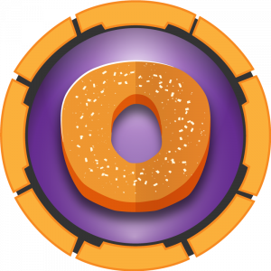</a>|$\textcolor{orange}{\textsf{Medium}}$|[Bagel](Boxes/linux/Retired/bagel/README.md)|[LFI](Boxes/linux/Retired/bagel/README.md#lfi) And [Reversing DLL](Boxes/linux/Retired/bagel/README.md#reversing-dll) And [DotNET Object Deserialization](Boxes/linux/Retired/bagel/README.md#dotnet-object-deserialization)|[dotnet with sudo](Boxes/linux/Retired/bagel/README.md#dotnet-with-sudo)|
|<a href="https://app.hackthebox.eu/machines/BountyHunter">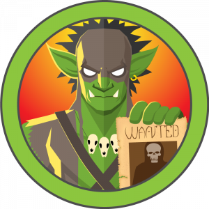</a>|$\textcolor{green}{\textsf{Easy}}$|[BountyHunter](Boxes/linux/Retired/bountyHunter/README.md)|[xxe](Boxes/linux/Retired/bountyHunter/README.md#xxe)|[python script logic](Boxes/linux/Retired/bountyHunter/README.md#python-script-logic)|
||$\textcolor{green}{\textsf{Easy}}$|[Cap](Boxes/linux/Retired/cap/README.md)|[Parameter Manipulation](Boxes/linux/Retired/cap/README.md#parameter-manipulation) And [PCAP file analysis](Boxes/linux/Retired/cap/README.md#pcap-file-analysis)|[python with `setuid` capability](Boxes/linux/Retired/cap/README.md#python-with-setuid-capability)|
||$\textcolor{yellow}{\textsf{INSANE}}$ :warning:|[CrossFitTwo](Boxes/linux/Retired/crossFitTwo/README.md)|[Websocket](Boxes/linux/Retired/crossFitTwo/README.md#websocket) And [SQL injection: blind/Union](Boxes/linux/Retired/crossFitTwo/README.md#sql-injection) And [DNS Hijacking](Boxes/linux/Retired/crossFitTwo/README.md#dns-hijacking) And [CSRF](Boxes/linux/Retired/crossFitTwo/README.md#csrf)|[Node module hijack](Boxes/linux/Retired/crossFitTwo/README.md#node-module-hijack) And [Yubikey](Boxes/linux/Retired/crossFitTwo/README.md#yubikey)|
||$\textcolor{red}{\textsf{Hard}}$|[Developer](Boxes/linux/Retired/developer/README.md)|[Reverse tab-nabbing](Boxes/linux/Retired/developer/README.md#reverse-tab-nabbing) And [Django Deserialization](Boxes/linux/Retired/developer/README.md#django-deserialization)|[Postgresql Enumeration](Boxes/linux/Retired/developer/README.md#postgresql-enumeration)|
||$\textcolor{orange}{\textsf{Medium}}$|[Devzat](Boxes/linux/Retired/devzat/README.md)|[Command Injection](Boxes/linux/Retired/devzat/README.md#command-injection)|[InfluxDB authentication bypass vulnerability](Boxes/linux/Retired/devzat/README.md#influxdb-authentication-bypass-vulnerability) And [lfi](Boxes/linux/Retired/devzat/README.md#lfi)|
||$\textcolor{orange}{\textsf{Medium}}$|[Dynstr](Boxes/linux/Retired/dynstr/README.md)|[ISC BIND DNSserver](Boxes/linux/Retired/dynstr/README.md#isc-bind-dnsserver) And [Command Injection in Bind API](Boxes/linux/Retired/dynstr/README.md#command-injection-in-dyn-api)|[DNS pointer record(PTR)](Boxes/linux/Retired/dynstr/README.md#dns-pointer-recordptr) And [Wildcard in `cp` Command](Boxes/linux/Retired/dynstr/README.md#wildcard-in-cp-command)|
||$\textcolor{orange}{\textsf{Medium}}$|[encoding](Boxes/linux/Retired/encoding/README.md)|[LFI](Boxes/linux/Retired/encoding/README.md#lfi) and [SSRF](Boxes/linux/Retired/encoding/README.md#ssrf) and [PHP filter chain](Boxes/linux/Retired/encoding/README.md#php-filter-chain) and [Git hooks](Boxes/linux/Retired/encoding/README.md#git-hooks)|[systemctl with sudo](Boxes/linux/Retired/encoding/README.md#systemctl-with-sudo)|
||$\textcolor{orange}{\textsf{Medium}}$|[Faculty](Boxes/linux/Retired/faculty/README.md)|[LFI](Boxes/linux/Retired/faculty/README.md#lfi)|[Command Injection](Boxes/linux/Retired/faculty/README.md#command-injection) and [gdb attach](Boxes/linux/Retired/faculty/README.md#gdb-attach-root)|
||$\textcolor{orange}{\textsf{Medium}}$|[Forge](Boxes/linux/Retired/forge/README.md)|[SSRF](Boxes/linux/Retired/forge/README.md#ssrf)|[Python pdb Module](Boxes/linux/Retired/forge/README.md#python-pdb-module)|
||$\textcolor{orange}{\textsf{Medium}}$|[GoodGames](Boxes/linux/Retired/goodGames/README.md)|[SQLi](Boxes/linux/Retired/goodGames/README.md#sqli) And [SSTI](Boxes/linux/Retired/goodGames/README.md#ssti)|[Docker escape: Password Reuse](Boxes/linux/Retired/goodGames/README.md#docker-escape) And [Host mount inside docker](Boxes/linux/Retired/goodGames/README.md#host-mount-inside-docker)|
|<a href="https://app.hackthebox.eu/machines/Horizontall">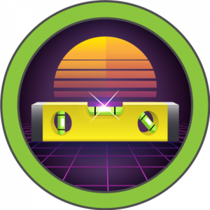</a>|$\textcolor{green}{\textsf{Easy}}$|[Horizontall](Boxes/linux/Retired/horizontall/README.md)|[Improper Access Control](Boxes/linux/Retired/horizontall/README.md#improper-access-control) And [Command Injection](Boxes/linux/Retired/horizontall/README.md#command-injection)|[Laravel <8.4.2 RCE](Boxes/linux/Retired/horizontall/README.md#laravel-842-debug-mode-with-ignition-252-rce)|
||$\textcolor{orange}{\textsf{Medium}}$|[Interface](Boxes/linux/Retired/interface/README.md)|[API fuzzing](Boxes/linux/Retired/interface/README.md#api-fuzzing) AND [dompdf CVE-2022-28368](Boxes/linux/Retired/interface/README.md#dompdf-cve-2022-28368)|[Shell Arithmetic Expansion Command Injection](Boxes/linux/Retired/interface/README.md#shell-arithmetic-expansion-command-injection)|
||$\textcolor{orange}{\textsf{Medium}}$|[Investigation](Boxes/linux/Retired/investigation/README.md)|[Exiftool CVE-2022-23935](Boxes/linux/Retired/investigation/README.md#exiftool-cve-2022-23935) And [Windows Event Log](Boxes/linux/Retired/investigation/README.md#windows-event-log)|[Reversing C binary](Boxes/linux/Retired/investigation/README.md#reversing-c-binary)|
||$\textcolor{green}{\textsf{Easy}}$|[Knife](Boxes/linux/Retired/knife/README.md)|[backdoor php Version](Boxes/linux/Retired/knife/README.md#backdoored-php-version)|[`knife` with sudo](Boxes/linux/Retired/knife/README.md#knife-command-with-sudo)|
||$\textcolor{green}{\textsf{Easy}}$|[Meta](Boxes/linux/Retired/meta/README.md)|[exiftool CVE-2021-22204](Boxes/linux/Retired/meta/README.md#exiftool-cve-2021-22204)|[ImageMagick PDF-parsing flaw](Boxes/linux/Retired/meta/README.md#imagemagick-pdf-parsing-flaw) And [sudo `neofetch` with XDG_CONFIG_HOME](Boxes/linux/Retired/meta/README.md#sudo-neofetch-with-xdg_config_home)|
||$\textcolor{green}{\textsf{Easy}}$|[MetaTwo](Boxes/linux/Retired/metaTwo/README.md)|[WP-Plugin SQLi CVE-2022-0739](Boxes/linux/Retired/metaTwo/README.md#wp-plugin-sqli-cve-2022-0739) And [WP XXE CVE-2021-29447](Boxes/linux/Retired/metaTwo/README.md#wp-xxe-cve-2021-29447)|[passpie cracking with john](Boxes/linux/Retired/metaTwo/README.md#passpie-cracking-with-john)|
||$\textcolor{red}{\textsf{Hard}}$|[Monitors](Boxes/linux/Retired/monitors/README.md)|[wp-plugin "Spritz" LFI](Boxes/linux/Retired/monitors/README.md#wp-plugin-spritz-lfi) And ["cacti" SQLi Stacked Queries to RCE](Boxes/linux/Retired/monitors/README.md#cacti-sqli-stacked-queries-to-rce)|[Socat Portforwarding](Boxes/linux/Retired/monitors/README.md#socat-portforwarding) And ["ofbiz" Deserialization RCE](Boxes/linux/Retired/monitors/README.md#ofbiz-deserialization-rce) And [Container with `SYS_MODULE` Capability](Boxes/linux/Retired/monitors/README.md#container-with-sys_module-capability)|
|<a href="https://app.hackthebox.eu/machines/Ophiuchi">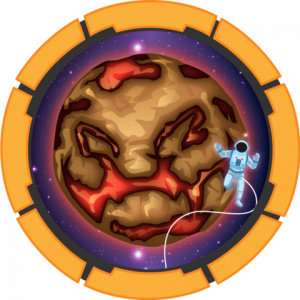</a>|$\textcolor{orange}{\textsf{Medium}}$|[ophiuchi](Boxes/linux/Retired/ophiuchi/README.md)|[SnakeYAML Deserilization](Boxes/linux/Retired/ophiuchi/README.md#snakeyaml-deserilization)|[wasm reversing](Boxes/linux/Retired/ophiuchi/README.md#wasm-reversing)|
||$\textcolor{green}{\textsf{Easy}}$|[Pandora](Boxes/linux/Retired/pandora/README.md)|[enumerating SNMP](Boxes/linux/Retired/pandora/README.md#enumerating-snmp) And [Pandora FMS - SQLi and file upload](Boxes/linux/Retired/pandora/README.md#pandora-fms---sqli-and-file-upload)|[`setresuid()` Restriction Bypass](Boxes/linux/Retired/pandora/README.md#setresuid-restriction-bypass)|
||$\textcolor{red}{\textsf{Hard}}$|[Pikaboo](Boxes/linux/Retired/pikaboo/README.md)|[URL parser logic in nginx server](Boxes/linux/Retired/pikaboo/README.md#url-parser-logicdirectory-traversal-in-nginx) And [lfi to RCE via ftp log](Boxes/linux/Retired/pikaboo/README.md#lfi)|[Perl jam: Command Injection](Boxes/linux/Retired/pikaboo/README.md#perl-command-injection)|
||$\textcolor{orange}{\textsf{Medium}}$|[Pit](Boxes/linux/Retired/pit/README.md)|[SNMP Enumeration](Boxes/linux/Retired/pit/README.md#snmp-enumeration) And [Login Form Bruteforce with hydra](Boxes/linux/Retired/pit/README.md#login-form-bruteforce-with-hydra) And [SeedDMS RCE](Boxes/linux/Retired/pit/README.md#seeddms-rce)|[Access control list(ACL)](Boxes/linux/Retired/pit/README.md#access-control-listacl) And [SNMP Extend Command](Boxes/linux/Retired/pit/README.md#snmp-extend-command)|
||$\textcolor{red}{\textsf{Hard}}$|[Pollution](Boxes/linux/Retired/pollution/README.md)|[Burp history logs](Boxes/linux/Retired/pollution/README.md#burp-history-logs) And [out-of-band XXE to exfiltrate data](Boxes/linux/Retired/pollution/README.md#out-of-band-xxe-to-exfiltrate-data) And [redis php session manipulation](Boxes/linux/Retired/pollution/README.md#redis-php-session-manipulation) And [PHP filter chain](Boxes/linux/Retired/pollution/README.md#php-filter-chain)|[php-fpm RCE](Boxes/linux/Retired/pollution/README.md#php-fpm-rce) And [lodash merge prototype pollution](Boxes/linux/Retired/pollution/README.md#lodash-merge-prototype-pollution)|
||$\textcolor{green}{\textsf{Easy}}$|[Precious](Boxes/linux/Retired/precious/README.md)|[pdfkit CVE-2022-25765](Boxes/linux/Retired/precious/README.md#pdfkit-cve-2022-25765)|[Ruby YAML deserialization](Boxes/linux/Retired/precious/README.md#ruby-yaml-deserialization)|
||$\textcolor{green}{\textsf{Easy}}$|[Previse](Boxes/linux/Retired/previse/README.md)|[Blind Command Injection](Boxes/linux/Retired/previse/README.md#blind-command-injection)|[Absolute Path Injection](Boxes/linux/Retired/previse/README.md#absolute-path-injection)|
||$\textcolor{orange}{\textsf{Medium}}$|[Ready](Boxes/linux/Retired/ready/README.md)|[gitlab <11.4.8 SSRF via IPv6](Boxes/linux/Retired/ready/README.md#gitlab-1148-ssrf-via-ipv6) And [redis server RCE](Boxes/linux/Retired/ready/README.md#new-line-injection-to-exploit-internal-redis-server)|[docker container with `--privileged`](Boxes/linux/Retired/ready/README.md#docker-container-with-privileged)|
||$\textcolor{green}{\textsf{Easy}}$|[RouterSpace](Boxes/linux/Retired/routerSpace/README.md)|[Android app dynamic analysis](Boxes/linux/Retired/routerSpace/README.md#android-app-dynamic-analysis)|[Sudoedit](Boxes/linux/Retired/routerSpace/README.md#sudoedit-exploit)|
||$\textcolor{orange}{\textsf{Medium}}$|[Schooled](Boxes/linux/Retired/schooled/README.md)|[Moodle LMS Enumeration](Boxes/linux/Retired/schooled/README.md#moodle-lms-enumeration) And [XSS in "Moodle"](Boxes/linux/Retired/schooled/README.md#xss-in-moodle) And [Privilege Escalation in "Moodle"](Boxes/linux/Retired/schooled/README.md#privilege-escalation-in-moodle) And [Moodle Admin RCE](Boxes/linux/Retired/schooled/README.md#moodle-admin-rce)|[`pkg` with sudo](Boxes/linux/Retired/schooled/README.md#pkg-with-sudo)|
||$\textcolor{green}{\textsf{Easy}}$|[scriptKiddie](Boxes/linux/Retired/scriptKiddie/README.md)|[command injection](Boxes/linux/Retired/scriptKiddie/README.md#command-injection)|[`msfconsole` with sudo](Boxes/linux/Retired/scriptKiddie/README.md#msfconsole-with-sudo)|
||$\textcolor{orange}{\textsf{Medium}}$|[Seal](Boxes/linux/Retired/seal/README.md)|[URL Parser Logic in Apache server](Boxes/linux/Retired/seal/README.md#server-url-parser-logic)|[`ansible-playbook` Command with sudo](Boxes/linux/Retired/seal/README.md#ansible-playbook-command-with-sudo)|
||$\textcolor{green}{\textsf{Easy}}$|[Secret](Boxes/linux/Retired/secret/README.md)|[Webapp source code review](Boxes/linux/Retired/secret/README.md#webapp-source-code-review) And [Command injection](Boxes/linux/Retired/secret/README.md#command-injection)|[Core Dump](Boxes/linux/Retired/secret/README.md#core-dump)|
||$\textcolor{orange}{\textsf{Medium}}$|[Shibboleth](Boxes/linux/Retired/shibboleth/README.md)|[ipmi](Boxes/linux/Retired/shibboleth/README.md#ipmi) And [zabbix](Boxes/linux/Retired/shibboleth/README.md#zabbix)|[mysql 'wsrep_provider' OS Command Execution](Boxes/linux/Retired/shibboleth/README.md#mysql-wsrepprovider-os-command-execution)|
||$\textcolor{yellow}{\textsf{INSANE}}$ :warning:|[Sink](Boxes/linux/Retired/sink/README.md)|[http Request Smuggling](Boxes/linux/Retired/sink/README.md#http-request-smuggling)|[AWS secretsmanager](Boxes/linux/Retired/sink/README.md#aws-secretsmanager) And [AWS kms decrypt](Boxes/linux/Retired/sink/README.md#aws-kms-decrypt)|
||$\textcolor{green}{\textsf{Easy}}$|[Soccer](Boxes/linux/Retired/soccer/README.md)|[Blind SQLi over websocket](Boxes/linux/Retired/soccer/README.md#blind-sqli-over-websocket)|[dstat with doas](Boxes/linux/Retired/soccer/README.md#dstat-with-doas)|
||$\textcolor{green}{\textsf{Easy}}$|[Spectra](Boxes/linux/Retired/spectra/README.md)|[wpadmin reverse shell](Boxes/linux/Retired/spectra/README.md#wpadmin-reverse-shell)|[`initctl` with sudo](Boxes/linux/Retired/spectra/README.md#initctl-with-sudo)|
|<a href="https://app.hackthebox.eu/machines/Spider">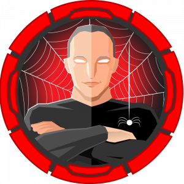</a>|$\textcolor{red}{\textsf{Hard}}$|[Spider](Boxes/linux/Retired/spider/README.md)|[SSTI](Boxes/linux/Retired/spider/README.md#ssti) And [SQLi in auth token](Boxes/linux/Retired/spider/README.md#sqli-in-auth-token) And [Blind restricted SSTI](Boxes/linux/Retired/spider/README.md#blind-restricted-ssti)|[XXE to inject payload in auth token](Boxes/linux/Retired/spider/README.md#xxe-to-inject-payload-in-auth-token)|
|<a href="https://app.hackthebox.eu/machines/Stocker">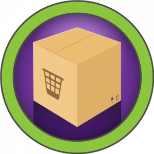</a>|$\textcolor{green}{\textsf{Easy}}$|[Stocker](Boxes/linux/Retired/stocker/README.md)|[NoSQLi with JSON](Boxes/linux/Retired/stocker/README.md#nosqli-with-json) And [PDF XSS](Boxes/linux/Retired/stocker/README.md#pdf-xss)|[Nodejs with sudo](Boxes/linux/Retired/stocker/README.md#nodejs-with-sudo)|
||$\textcolor{red}{\textsf{Hard}}$|[Tentacle](Boxes/linux/Retired/tentacle/README.md)|[DNS Enumeration](Boxes/linux/Retired/tentacle/README.md#dns-enumeration) And [squid proxy](Boxes/linux/Retired/tentacle/README.md#squid-proxy) And [ffuf with multi-proxy](Boxes/linux/Retired/tentacle/README.md#ffuf-with-multi-proxy) And [OpenSMTPD RCE](Boxes/linux/Retired/tentacle/README.md#opensmtpd-rce)|[ssh with kerberos token](Boxes/linux/Retired/tentacle/README.md#ssh-with-kerberos-token) And [k5login](Boxes/linux/Retired/tentacle/README.md#k5login) And [kadmin](Boxes/linux/Retired/tentacle/README.md#kadmin)|
|<a href="https://app.hackthebox.eu/machines/TheNotebook">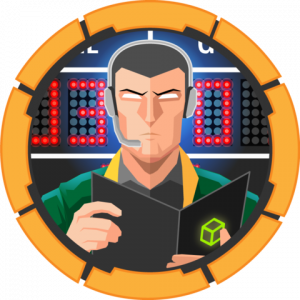</a>|$\textcolor{orange}{\textsf{Medium}}$|[theNotebook](Boxes/linux/Retired/theNotebook/README.md)|[jwt bypass](Boxes/linux/Retired/theNotebook/README.md#jwt-bypass)|[Breaking Docker via runC](Boxes/linux/Retired/theNotebook/README.md#breaking-docker-via-runc)|
|<a href="https://app.hackthebox.eu/machines/Timing">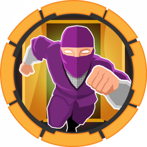</a>|$\textcolor{orange}{\textsf{Medium}}$|[Timing](Boxes/linux/Retired/timing/README.md)|[LFI](Boxes/linux/Retired/timing/README.md#lfi) And [Admin role impersonate](Boxes/linux/Retired/timing/README.md#admin-role-impersonate) And [File upload RCE](Boxes/linux/Retired/timing/README.md#file-upload-rce)|[wget and axel rc files](Boxes/linux/Retired/timing/README.md#wget-and-axel-rc-files)|
||$\textcolor{green}{\textsf{Easy}}$|[Trick](Boxes/linux/Retired/trick/README.md)|[LFI](Boxes/linux/Retired/trick/README.md#lfi)|[fail2ban Misconfiguration](Boxes/linux/Retired/trick/README.md#fail2ban-exploit)|
||$\textcolor{orange}{\textsf{Medium}}$|[Unicode](Boxes/linux/Retired/unicode/README.md)|[JWT jku bypass](Boxes/linux/Retired/unicode/README.md#jwt-jku-bypass) And [lfi](Boxes/linux/Retired/unicode/README.md#lfi)|[Python byte-codes decompile](Boxes/linux/Retired/unicode/README.md#python-byte-codes-decompile) And [Command injection](Boxes/linux/Retired/unicode/README.md#command-injection)|
||$\textcolor{red}{\textsf{Hard}}$|[Unobtainium](Boxes/linux/Retired/unobtainium/README.md)|[reversing Electron application deb package](Boxes/linux/Retired/unobtainium/README.md#reversing-electron-application-deb-package) And [Prototype Pollution](Boxes/linux/Retired/unobtainium/README.md#prototype-pollution) And [Command injection](Boxes/linux/Retired/unobtainium/README.md#command-injection)|[Kubernetes](Boxes/linux/Retired/unobtainium/README.md#kubernetes) And [Kubectl](Boxes/linux/Retired/unobtainium/README.md#kubectl) And [kubernetes admin](Boxes/linux/Retired/unobtainium/README.md#kubernetes-with-admin-token)|
||$\textcolor{orange}{\textsf{Medium}}$|[Writer](Boxes/linux/Retired/writer/README.md)|[UNION sqli TO file read](Boxes/linux/Retired/writer/README.md#union-sqli-to-file-read) And [RCE using SSRF with smb](Boxes/linux/Retired/writer/README.md#rce-using-ssrf-with-smb) And [Unintended: Command Injection via filename](Boxes/linux/Retired/writer/README.md#command-injection-via-filename)|[postfix automate scripts](Boxes/linux/Retired/writer/README.mdpostfix-automate-scripts) And [Invoke command with apt Configs](Boxes/linux/Retired/writer/README.md#invoke-command-with-apt-configs)|

##  Windows

|Box|Difficulty|Writeup|Foothold|Privesc|
|---|----------|-------|--------|-------|
||$\textcolor{orange}{\textsf{Medium}}$|[Atom](Boxes/windows/Retired/atom/README.md)|[Electron-Updater RCE](Boxes/windows/Retired/atom/README.md#electron-updater-rce)|[Kanban credentials Encryption Flaw](Boxes/windows/Retired/atom/README.md#kanban-credentials-encryption-flaw)|
|<a href="https://app.hackthebox.eu/machines/Breadcrumbs">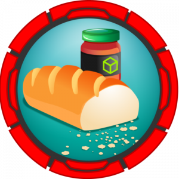</a>|$\textcolor{red}{\textsf{Hard}}$|[Breadcrumbs](Boxes/windows/Retired/breadcrumbs/README.md)|[LFI](Boxes/windows/Retired/breadcrumbs/README.md#lfi) And [File upload to RCE](Boxes/windows/Retired/breadcrumbs/README.md#file-upload-to-rce)|[Stickynotes backups](Boxes/windows/Retired/breadcrumbs/README.md#stickynotes-backups) And [sql injection: union](Boxes/windows/Retired/breadcrumbs/README.md#sql-injection)|
||$\textcolor{orange}{\textsf{Medium}}$|[Intelligence](Boxes/windows/Retired/intelligence/README.md)|[Enumeration](Boxes/windows/Retired/intelligence/README.md#enumeration) And [NTLM Relay Attack](Boxes/windows/Retired/intelligence/README.md#ntlm-relay-attack)|[BloodHound](Boxes/windows/Retired/intelligence/README.md#bloodhound) And [Reading GMSA Password](Boxes/windows/Retired/intelligence/README.md#reading-gmsa-password) And [Silver ticket Attack](Boxes/windows/Retired/intelligence/README.md#silver-ticket-attack)|
|<a href="https://app.hackthebox.eu/machines/Love">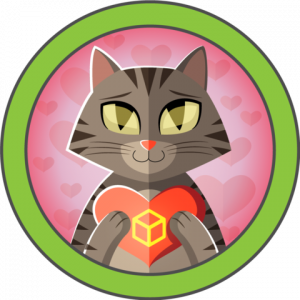</a>|$\textcolor{green}{\textsf{Easy}}$|[Love](Boxes/windows/Retired/love/README.md)|[File upload to RCE](Boxes/windows/Retired/love/README.md#file-upload-to-rce)|[abusing `AlwaysInstallElevated` policy](Boxes/windows/Retired/love/README.md#abusing-alwaysinstallelevated-policy)|
||$\textcolor{red}{\textsf{Hard}}$|[Proper](Boxes/windows/Retired/proper/README.md)|[sql injection: blind](Boxes/windows/Retired/proper/README.md#sql-injection) And [RFI via SMB](Boxes/windows/Retired/proper/README.md#smb-connect-via-remote-file-inclusion) And [Race condition with inotify](Boxes/windows/Retired/proper/README.md#race-condition-with-inotify)|[-](Boxes/windows/Retired/proper/README.md)|
||$\textcolor{green}{\textsf{Easy}}$|Timelapse <!--[Timelapse](Boxes/windows/Retired/timelapse/README.md)-->|||

##  Android

|Box|Difficulty|Writeup|Foothold|Privesc|
|---|----------|-------|--------|-------|
||$\textcolor{green}{\textsf{Easy}}$|[Explore](Boxes/android/Retired/explore/README.md)|[ES Explorer CVE-2019–6447](Boxes/android/Retired/explore/README.md#es-file-explorer-open-port-vulnerability)|[`adb` Root](Boxes/android/Retired/explore/README.md#adb-root)|

<strong>Old WriteUPs</strong>

<table>
<thead>
<tr>
<th align="left">Box</th>
<th align="center">Difficulty</th>
<th align="right">Writeup</th>
</tr>
</thead>
<tbody>
<tr>
<td align="left"></td>
<td align="center">Easy</td>
<td align="right"><a href="Boxes/linux/Retired/academy/README.md">Academy</a></td>
</tr>
<tr>
<td align="left"></td>
<td align="center">Easy</td>
<td align="right"><a href="Boxes/linux/Retired/admirer/README.md">Admirer</a></td>
</tr>
<tr>
<td align="left"></td>
<td align="center">Easy</td>
<td align="right"><a href="Boxes/linux/Retired/blunder/README.md">Blunder</a></td>
</tr>
<tr>
<td align="left"><a href="https://app.hackthebox.eu/machines/Bucket">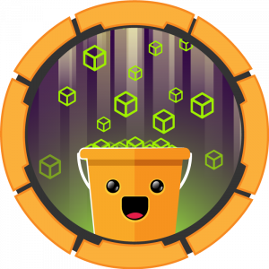</a></td>
<td align="center">Medium</td>
<td align="right"><a href="Boxes/linux/Retired/bucket/README.md">Bucket </a></td>
</tr>
<tr>
<td align="left"></td>
<td align="center">Medium</td>
<td align="right"><a href="Boxes/linux/Retired/cache/README.md">Cache</a></td>
</tr>
<tr>
<td align="left"></td>
<td align="center">Hard</td>
<td align="right"><a href="Boxes/linux/Retired/compromised/README.md">Compromised </a></td>
</tr>
<tr>
<td align="left"><a href="https://app.hackthebox.eu/machines/Delivery">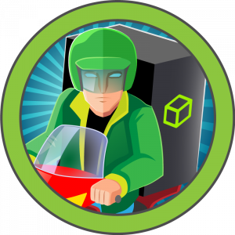</a></td>
<td align="center">Easy</td>
<td align="right"><a href="Boxes/linux/Retired/delivery/README.md">Delivery</a></td>
</tr>
<tr>
<td align="left"></td>
<td align="center">Easy</td>
<td align="right"><a href="Boxes/linux/Retired/doctor/README.md">Doctor</a></td>
</tr>
<tr>
<td align="left"></td>
<td align="center">Hard</td>
<td align="right"><a href="Boxes/linux/Retired/feline/README.md">Feline</a></td>
</tr>
<tr>
<td align="left"></td>
<td align="center">Medium</td>
<td align="right"><a href="Boxes/linux/Retired/jewel/README.md">Jewel</a></td>
</tr>
<tr>
<td align="left"></td>
<td align="center">Easy</td>
<td align="right"><a href="Boxes/linux/Retired/laboratory/README.md">Laboratory</a></td>
</tr>
<tr>
<td align="left"></td>
<td align="center">Easy</td>
<td align="right"><a href="Boxes/linux/Retired/luanne/README.md">Luanne</a></td>
</tr>
<tr>
<td align="left"><a href="https://app.hackthebox.eu/machines/OpenKeyS">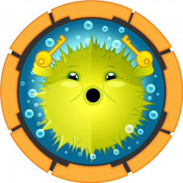</a></td>
<td align="center">Medium</td>
<td align="right"><a href="Boxes/linux/Retired/openkeyS/README.md">OpenKeyS</a></td>
</tr>
<tr>
<td align="left"></td>
<td align="center">Medium</td>
<td align="right"><a href="Boxes/linux/Retired/passage/README.md">passage</a></td>
</tr>
<tr>
<td align="left"></td>
<td align="center">Easy</td>
<td align="right"><a href="Boxes/linux/Retired/tabby/README.md">Tabby</a></td>
</tr>
<tr>
<td align="left"><a href="https://app.hackthebox.eu/machines/Tenet">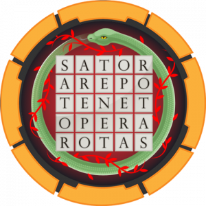</a></td>
<td align="center">Medium</td>
<td align="right"><a href="Boxes/linux/Retired/tenet/README.md">Tenet</a></td>
</tr>
<tr>
<td align="left"></td>
<td align="center">Medium</td>
<td align="right"><a href="Boxes/linux/Retired/time/README.md">Time</a></td>
</tr>
<tr>
<td align="left"></td>
<td align="center">Hard</td>
<td align="right"><a href="Boxes/linux/Retired/unbalanced/README.md">Unbalanced</a></td>
</tr>
</tbody>
</table>

 

