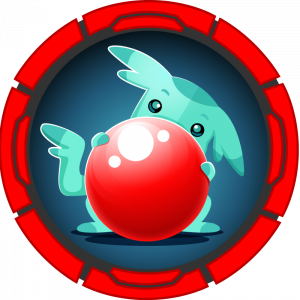

# HTB Write-ups

  
   
  

**New retired box:** [Horizontall](Boxes/linux/Retired/horizontall/README.md)

##  Android

|Box|Difficulty|Writeup|Foothold|Privesc|
|---|----------|-------|--------|-------|
||Easy|[Explore](Boxes/android/Retired/explore/README.md)|[ES Explorer CVE-2019–6447](Boxes/android/Retired/explore/README.md#es-file-explorer-open-port-vulnerability)|[`adb` Root](Boxes/android/Retired/explore/README.md#adb-root)|

## :penguin:*nix

|Box|Difficulty|Writeup|Foothold|Privesc|
|---|----------|-------|--------|-------|
||Easy|[armageddon](Boxes/linux/Retired/armageddon/README.md)|[Drupal property injection: Drupalgeddon 2](Boxes/linux/Retired/armageddon/README.md#drupal-property-injection-drupalgeddon-2)|[`snap install` with sudo](Boxes/linux/Retired/armageddon/README.md#snap-install-with-sudo)|
||Easy|[BountyHunter](Boxes/linux/Retired/bountyHunter/README.md)|[xxe](Boxes/linux/Retired/bountyHunter/README.md#xxe)|[python script logic](Boxes/linux/Retired/bountyHunter/README.md#python-script-logic)|
||Easy|[Cap](Boxes/linux/Retired/cap/README.md)|[Parameter Manipulation](Boxes/linux/Retired/cap/README.md#parameter-manipulation) And [PCAP file analysis](Boxes/linux/Retired/cap/README.md#pcap-file-analysis)|[python with `setuid` capability](Boxes/linux/Retired/cap/README.md#python-with-setuid-capability)|
||INSANE :warning:|[CrossFitTwo](Boxes/linux/Retired/crossFitTwo/README.md)|[Websocket](Boxes/linux/Retired/crossFitTwo/README.md#websocket) And [SQL injection: blind/Union](Boxes/linux/Retired/crossFitTwo/README.md#sql-injection) And [DNS Hijacking](Boxes/linux/Retired/crossFitTwo/README.md#dns-hijacking) And [CSRF](Boxes/linux/Retired/crossFitTwo/README.md#csrf)|[Node module hijack](Boxes/linux/Retired/crossFitTwo/README.md#node-module-hijack) And [Yubikey](Boxes/linux/Retired/crossFitTwo/README.md#yubikey)|
||Hard|[Developer](Boxes/linux/Retired/developer/README.md)|[Reverse tab-nabbing](Boxes/linux/Retired/developer/README.md#reverse-tab-nabbing) And [Django Deserialization](Boxes/linux/Retired/developer/README.md#django-deserialization)|[Postgresql Enumeration](Boxes/linux/Retired/developer/README.md#postgresql-enumeration)|
||Medium|[Dynstr](Boxes/linux/Retired/dynstr/README.md)|[ISC BIND DNSserver](Boxes/linux/Retired/dynstr/README.md#isc-bind-dnsserver) And [Command Injection in Bind API](Boxes/linux/Retired/dynstr/README.md#command-injection-in-dyn-api)|[DNS pointer record(PTR)](Boxes/linux/Retired/dynstr/README.md#dns-pointer-recordptr) And [Wildcard in `cp` Command](Boxes/linux/Retired/dynstr/README.md#wildcard-in-cp-command)|
||Medium|[Forge](Boxes/linux/Retired/forge/README.md)|[SSRF](Boxes/linux/Retired/forge/README.md#ssrf)|[Python pdb Module](Boxes/linux/Retired/forge/README.md#python-pdb-module)|
||Easy|[Horizontall](Boxes/linux/Retired/horizontall/README.md)|[Improper Access Control](Boxes/linux/Retired/horizontall/README.md#improper-access-control) And [Command Injection](Boxes/linux/Retired/horizontall/README.md#command-injection)|[Laravel <8.4.2 RCE](Boxes/linux/Retired/horizontall/README.md#laravel-842-debug-mode-with-ignition-252-rce)|
||Easy|[Knife](Boxes/linux/Retired/knife/README.md)|[backdoored php Version](Boxes/linux/Retired/knife/README.md#backdoored-php-version)|[`knife` with sudo](Boxes/linux/Retired/knife/README.md#knife-command-with-sudo)|
||Hard|[Monitors](Boxes/linux/Retired/monitors/README.md)|[wp-plugin "Spritz" LFI](Boxes/linux/Retired/monitors/README.md#wp-plugin-spritz-lfi) And ["cacti" SQLi Stacked Queries to RCE](Boxes/linux/Retired/monitors/README.md#cacti-sqli-stacked-queries-to-rce)|[Socat Portforwarding](Boxes/linux/Retired/monitors/README.md#socat-portforwarding) And ["ofbiz" Deserialization RCE](Boxes/linux/Retired/monitors/README.md#ofbiz-deserialization-rce) And [Container with `SYS_MODULE` Capability](Boxes/linux/Retired/monitors/README.md#container-with-sys_module-capability)|
||Medium|[ophiuchi](Boxes/linux/Retired/ophiuchi/README.md)|[SnakeYAML Deserilization](Boxes/linux/Retired/ophiuchi/README.md#snakeyaml-deserilization)|[wasm reversing](Boxes/linux/Retired/ophiuchi/README.md#wasm-reversing)|
||Hard|[Pikaboo](Boxes/linux/Retired/pikaboo/README.md)|[URL parser logic in nginx server](Boxes/linux/Retired/pikaboo/README.md#url-parser-logicdirectory-traversal-in-nginx) And [lfi to RCE via ftp log](Boxes/linux/Retired/pikaboo/README.md#lfi)|[Perl jam: Command Injection](Boxes/linux/Retired/pikaboo/README.md#perl-command-injection)|
||Medium|[Pit](Boxes/linux/Retired/pit/README.md)|[SNMP Enumeration](Boxes/linux/Retired/pit/README.md#snmp-enumeration) And [Login Form Bruteforce with hydra](Boxes/linux/Retired/pit/README.md#login-form-bruteforce-with-hydra) And [SeedDMS RCE](Boxes/linux/Retired/pit/README.md#seeddms-rce)|[Access control list(ACL)](Boxes/linux/Retired/pit/README.md#access-control-listacl) And [SNMP Extend Command](Boxes/linux/Retired/pit/README.md#snmp-extend-command)|
||Easy|[Previse](Boxes/linux/Retired/previse/README.md)|[Blind Command Injection](Boxes/linux/Retired/previse/README.md#blind-command-injection)|[Absolute Path Injection](Boxes/linux/Retired/previse/README.md#absolute-path-injection)|
||Medium|[Ready](Boxes/linux/Retired/ready/README.md)|[gitlab <11.4.8 SSRF via IPv6](Boxes/linux/Retired/ready/README.md#gitlab-1148-ssrf-via-ipv6) And [redis server RCE](Boxes/linux/Retired/ready/README.md#new-line-injection-to-exploit-internal-redis-server)|[docker container with `--privileged`](Boxes/linux/Retired/ready/README.md#docker-container-with-privileged)|
||Medium|[Schooled](Boxes/linux/Retired/schooled/README.md)|[Moodle LMS Enumeration](Boxes/linux/Retired/schooled/README.md#moodle-lms-enumeration) And [XSS in "Moodle"](Boxes/linux/Retired/schooled/README.md#xss-in-moodle) And [Privilege Escalation in "Moodle"](Boxes/linux/Retired/schooled/README.md#privilege-escalation-in-moodle) And [Moodle Admin RCE](Boxes/linux/Retired/schooled/README.md#moodle-admin-rce)|[`pkg` with sudo](Boxes/linux/Retired/schooled/README.md#pkg-with-sudo)|
||Easy|[scriptKiddie](Boxes/linux/Retired/scriptKiddie/README.md)|[command injection](Boxes/linux/Retired/scriptKiddie/README.md#command-injection)|[`msfconsole` with sudo](Boxes/linux/Retired/scriptKiddie/README.md#msfconsole-with-sudo)|
||Medium|[Seal](Boxes/linux/Retired/seal/README.md)|[URL Parser Logic in Apache server](Boxes/linux/Retired/seal/README.md#server-url-parser-logic)|[`ansible-playbook` Command with sudo](Boxes/linux/Retired/seal/README.md#ansible-playbook-command-with-sudo)|
||INSANE :warning:|[Sink](Boxes/linux/Retired/sink/README.md)|[http Request Smuggling](Boxes/linux/Retired/sink/README.md#http-request-smuggling)|[AWS secretsmanager](Boxes/linux/Retired/sink/README.md#aws-secretsmanager) And [AWS kms decrypt](Boxes/linux/Retired/sink/README.md#aws-kms-decrypt)|
||Easy|[Spectra](Boxes/linux/Retired/spectra/README.md)|[wpadmin reverse shell](Boxes/linux/Retired/spectra/README.md#wpadmin-reverse-shell)|[`initctl` with sudo](Boxes/linux/Retired/spectra/README.md#initctl-with-sudo)|
||HARD|[Spider](Boxes/linux/Retired/spider/README.md)|[SSTI](Boxes/linux/Retired/spider/README.md#ssti) And [SQLi in auth token](Boxes/linux/Retired/spider/README.md#sqli-in-auth-token) And [Blind restricted SSTI](Boxes/linux/Retired/spider/README.md#blind-restricted-ssti)|[XXE to inject payload in auth token](Boxes/linux/Retired/spider/README.md#xxe-to-inject-payload-in-auth-token)|
||Hard|[Tentacle](Boxes/linux/Retired/tentacle/README.md)|[DNS Enumeration](Boxes/linux/Retired/tentacle/README.md#dns-enumeration) And [squid proxy](Boxes/linux/Retired/tentacle/README.md#squid-proxy) And [ffuf with multi-proxy](Boxes/linux/Retired/tentacle/README.md#ffuf-with-multi-proxy) And [OpenSMTPD RCE](Boxes/linux/Retired/tentacle/README.md#opensmtpd-rce)|[ssh with kerberos token](Boxes/linux/Retired/tentacle/README.md#ssh-with-kerberos-token) And [k5login](Boxes/linux/Retired/tentacle/README.md#k5login) And [kadmin](Boxes/linux/Retired/tentacle/README.md#kadmin)|
||Medium|[theNotebook](Boxes/linux/Retired/theNotebook/README.md)|[jwt bypass](Boxes/linux/Retired/theNotebook/README.md#jwt-bypass)|[Breaking Docker via runC](Boxes/linux/Retired/theNotebook/README.md#breaking-docker-via-runc)|
||Hard|[Unobtainium](Boxes/linux/Retired/unobtainium/README.md)|[reversing Electron application deb package](Boxes/linux/Retired/unobtainium/README.md#reversing-electron-application-deb-package) And [Prototype Pollution](Boxes/linux/Retired/unobtainium/README.md#prototype-pollution) And [Command injection](Boxes/linux/Retired/unobtainium/README.md#command-injection)|[Kubernetes](Boxes/linux/Retired/unobtainium/README.md#kubernetes) And [Kubectl](Boxes/linux/Retired/unobtainium/README.md#kubectl) And [kubernetes admin](Boxes/linux/Retired/unobtainium/README.md#kubernetes-with-admin-token)|
||Medium|[Writer](Boxes/linux/Retired/writer/README.md)|[UNION sqli TO file read](Boxes/linux/Retired/writer/README.md#union-sqli-to-file-read) And [RCE using SSRF with smb](Boxes/linux/Retired/writer/README.md#rce-using-ssrf-with-smb) And [Unintended: Command Injection via filename](Boxes/linux/Retired/writer/README.md#command-injection-via-filename)|[postfix automate scripts](Boxes/linux/Retired/writer/README.mdpostfix-automate-scripts) And [Invoke command with apt Configs](Boxes/linux/Retired/writer/README.md#invoke-command-with-apt-configs)|
<!--||Hard|[Static](Boxes/linux/Retired/static/README.md)|||-->

##  Windows

|Box|Difficulty|Writeup|Foothold|Privesc|
|---|----------|-------|--------|-------|
||Medium|[Atom](Boxes/windows/Retired/atom/README.md)|[Electron-Updater RCE](Boxes/windows/Retired/atom/README.md#electron-updater-rce)|[Kanban credentials Encryption Flaw](Boxes/windows/Retired/atom/README.md#kanban-credentials-encryption-flaw)|
||Hard|[Breadcrumbs](Boxes/windows/Retired/breadcrumbs/README.md)|[LFI](Boxes/windows/Retired/breadcrumbs/README.md#lfi) And [File upload to RCE](Boxes/windows/Retired/breadcrumbs/README.md#file-upload-to-rce)|[Stickynotes backups](Boxes/windows/Retired/breadcrumbs/README.md#stickynotes-backups) And [sql injection: union](Boxes/windows/Retired/breadcrumbs/README.md#sql-injection)|
||Medium|[Intelligence](Boxes/windows/Retired/intelligence/README.md)|[Enumeration](Boxes/windows/Retired/intelligence/README.md#enumeration) And [NTLM Relay Attack](Boxes/windows/Retired/intelligence/README.md#ntlm-relay-attack)|[BloodHound](Boxes/windows/Retired/intelligence/README.md#bloodhound) And [Reading GMSA Password](Boxes/windows/Retired/intelligence/README.md#reading-gmsa-password) And [Silver ticket Attack](Boxes/windows/Retired/intelligence/README.md#silver-ticket-attack)|
||Easy|[Love](Boxes/windows/Retired/love/README.md)|[File upload to RCE](Boxes/windows/Retired/love/README.md#file-upload-to-rce)|[abusing `AlwaysInstallElevated` policy](Boxes/windows/Retired/love/README.md#abusing-alwaysinstallelevated-policy)|
||Hard|[Proper](Boxes/windows/Retired/proper/README.md)|[sql injection: blind](Boxes/windows/Retired/proper/README.md#sql-injection) And [RFI via SMB](Boxes/windows/Retired/proper/README.md#smb-connect-via-remote-file-inclusion) And [Race condition with inotify](Boxes/windows/Retired/proper/README.md#race-condition-with-inotify)||
<!--
||INSANE :warning:|[Pivotapi](Boxes/windows/Retired/pivotapi/README.md)|||
-->

<strong>Old WriteUPs</strong>

<table>
<thead>
<tr>
<th align="left">Box</th>
<th align="center">Difficulty</th>
<th align="right">Writeup</th>
</tr>
</thead>
<tbody>
<tr>
<td align="left"></td>
<td align="center">Easy</td>
<td align="right"><a href="Boxes/linux/Retired/academy/README.md">Academy</a></td>
</tr>
<tr>
<td align="left"></td>
<td align="center">Easy</td>
<td align="right"><a href="Boxes/linux/Retired/admirer/README.md">Admirer</a></td>
</tr>
<tr>
<td align="left"></td>
<td align="center">Easy</td>
<td align="right"><a href="Boxes/linux/Retired/blunder/README.md">Blunder</a></td>
</tr>
<tr>
<td align="left"></td>
<td align="center">Medium</td>
<td align="right"><a href="Boxes/linux/Retired/bucket/README.md">Bucket </a></td>
</tr>
<tr>
<td align="left"></td>
<td align="center">Medium</td>
<td align="right"><a href="Boxes/linux/Retired/cache/README.md">Cache</a></td>
</tr>
<tr>
<td align="left"></td>
<td align="center">Hard</td>
<td align="right"><a href="Boxes/linux/Retired/compromised/README.md">Compromised </a></td>
</tr>
<tr>
<td align="left"></td>
<td align="center">Easy</td>
<td align="right"><a href="Boxes/linux/Retired/delivery/README.md">Delivery</a></td>
</tr>
<tr>
<td align="left"></td>
<td align="center">Easy</td>
<td align="right"><a href="Boxes/linux/Retired/doctor/README.md">Doctor</a></td>
</tr>
<tr>
<td align="left"></td>
<td align="center">Hard</td>
<td align="right"><a href="Boxes/linux/Retired/feline/README.md">Feline</a></td>
</tr>
<tr>
<td align="left"></td>
<td align="center">Medium</td>
<td align="right"><a href="Boxes/linux/Retired/jewel/README.md">Jewel</a></td>
</tr>
<tr>
<td align="left"></td>
<td align="center">Easy</td>
<td align="right"><a href="Boxes/linux/Retired/laboratory/README.md">Laboratory</a></td>
</tr>
<tr>
<td align="left"></td>
<td align="center">Easy</td>
<td align="right"><a href="Boxes/linux/Retired/luanne/README.md">Luanne</a></td>
</tr>
<tr>
<td align="left"></td>
<td align="center">Medium</td>
<td align="right"><a href="Boxes/linux/Retired/openkeyS/README.md">OpenKeyS</a></td>
</tr>
<tr>
<td align="left"></td>
<td align="center">Medium</td>
<td align="right"><a href="Boxes/linux/Retired/passage/README.md">passage</a></td>
</tr>
<tr>
<td align="left"></td>
<td align="center">Easy</td>
<td align="right"><a href="Boxes/linux/Retired/tabby/README.md">Tabby</a></td>
</tr>
<tr>
<td align="left"></td>
<td align="center">Medium</td>
<td align="right"><a href="Boxes/linux/Retired/tenet/README.md">Tenet</a></td>
</tr>
<tr>
<td align="left"></td>
<td align="center">Medium</td>
<td align="right"><a href="Boxes/linux/Retired/time/README.md">Time</a></td>
</tr>
<tr>
<td align="left"></td>
<td align="center">Hard</td>
<td align="right"><a href="Boxes/linux/Retired/unbalanced/README.md">Unbalanced</a></td>
</tr>
</tbody>
</table>

## Disclaimer

* These write up are based on someone's learning processes, who's constantly learning.
* Grammatical/Spelling mistakes.