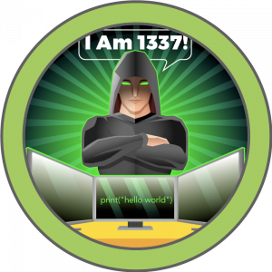

# HTB Write-ups

  

## :penguin:*nix

|Box|Difficulty|Writeup|Foothold|Privesc|
|---|----------|-------|--------|-------|
||Easy|[armageddon](Boxes/linux/Retired/armageddon/README.md)|[Drupal: drupalgeddon2](Boxes/linux/Retired/armageddon/README.md#FootholdDrupal_drupalgeddon2)|[`snap install` with sudo](Boxes/linux/Retired/armageddon/README.md#Privescsnap_install_with_sudo)|
||Medium|[ophiuchi](Boxes/linux/Retired/ophiuchi/README.md)|[SnakeYAML Deserilization exploit](Boxes/linux/Retired/ophiuchi/README.md#FootholdSnakeYAML_Deserilization_exploit)|[wasm reversing](Boxes/linux/Retired/ophiuchi/README.md#Privescwasm_reversing)|
||Medium|[Ready](Boxes/linux/Retired/ready/README.md)|[SSRF in gitlab 11.4.7](Boxes/linux/Retired/ready/README.md#Footholdgitlab_1147_ssrf)|[Docker Privileged Mode](Boxes/linux/Retired/ready/README.md#Privescdocker_privileged_mode)|
||Easy|[scriptKiddie](Boxes/linux/Retired/scriptKiddie/README.md)|[command_injection in msfvenom](Boxes/linux/Retired/scriptKiddie/README.md#Footholdcommand_injection)|[`msfconsole` with sudo](Boxes/linux/Retired/scriptKiddie/README.md#Privescmsfconsole_with_sudo)|
||Easy|[Spectra](Boxes/linux/Retired/spectra/README.md)|[wordpress admin rev_shell](Boxes/linux/Retired/spectra/README.md#Footholdwordpress_admin_rev_shell)|[`initctl` with sudo](Boxes/linux/Retired/spectra/README.md#Privescinitctl_with_sudo)|
||Hard|[Tentacle](Boxes/linux/Retired/tentacle/README.md)|[OpenSMTPD RCE](Boxes/linux/Retired/tentacle/README.md#FootholdOpenSMTPD_RCE)|[Everything kerberos](Boxes/linux/Retired/tentacle/README.md#Privesceverything_kerberos)|
||Medium|[theNotebook](Boxes/linux/Retired/theNotebook/README.md)|[jwt bypass](Boxes/linux/Retired/theNotebook/README.md#Footholdjwt_bypass)|[Docker: CVE-2019-5736](Boxes/linux/Retired/theNotebook/README.md#PrivescCVE-2019-5736)|

##  Windows

|Box|Difficulty|Writeup|Foothold|Privesc|
|---|----------|-------|--------|-------|
||Medium|[Atom](Boxes/windows/Retired/atom/README.md)|[Electron-Updater RCE](Boxes/windows/Retired/atom/README.md#FootholdElectron_Updater-RCE)|[Kanban Decrypt](Boxes/windows/Retired/atom/README.md#PrivescKanban_decrypt)|
||Hard|[Breadcrumbs](Boxes/windows/Retired/breadcrumbs/README.md)|[File_upload to RCE](Boxes/windows/Retired/breadcrumbs/README.md#FootholdFile_upload_to_RCE)|[Horizontal Privesc](Boxes/windows/Retired/breadcrumbs/README.md#PrivescHorizontal)|

__Old WriteUPs, no screenshots (maybe some of them have some)__

|Box|Difficulty|Writeup|
|---|----------|-------|
||Easy|[Academy](Boxes/linux/Retired/academy/README.md)|
||Easy|[Admirer](Boxes/linux/Retired/admirer/README.md)|
||Easy|[Blunder](Boxes/linux/Retired/blunder/README.md)|
||Easy|[Bucket ](Boxes/linux/Retired/bucket/README.md)|
||Medium|[Cache](Boxes/linux/Retired/cache/README.md)|
||Hard|[Compromised ](Boxes/linux/Retired/compromised/README.md)|
||Easy|[Delivery](Boxes/linux/Retired/delivery/README.md)|
||Easy|[Doctor](Boxes/linux/Retired/doctor/README.md)|
||Hard|[Feline](Boxes/linux/Retired/feline/README.md)|
||Medium|[Jewel](Boxes/linux/Retired/jewel/README.md)|
||Easy|[Laboratory](Boxes/linux/Retired/laboratory/README.md)|
||Easy|[Luanne](Boxes/linux/Retired/luanne/README.md)|
||Medium|[OpenKeyS](Boxes/linux/Retired/openkeyS/README.md)|
||Medium|[passage](Boxes/linux/Retired/passage/README.md)|
||Easy|[Tabby](Boxes/linux/Retired/tabby/README.md)|
||Medium|[Time](Boxes/linux/Retired/time/README.md)|
||Medium|[Tenet](Boxes/linux/Retired/tenet/README.md)|
||Hard|[Unbalanced](Boxes/linux/Retired/unbalanced/README.md)|

